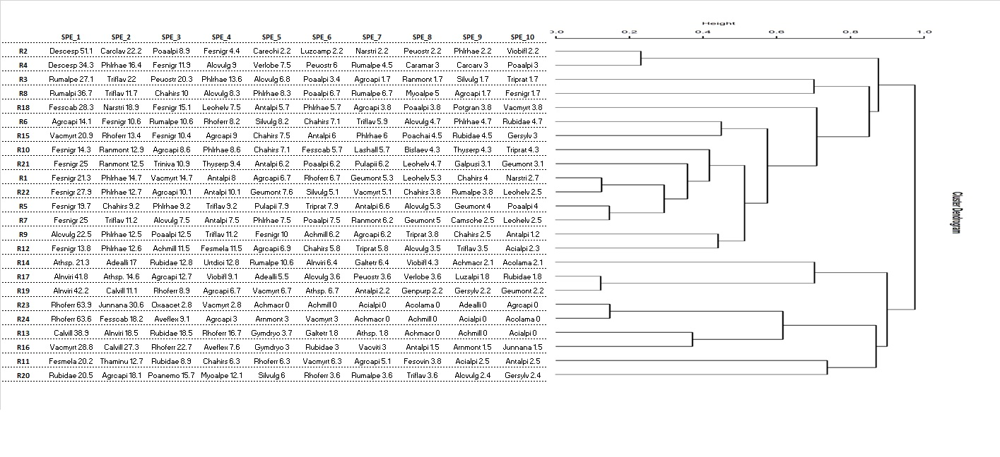

<!-- README.md is generated from README.Rmd. Please edit that file -->

```{r, include = FALSE}
knitr::opts_chunk$set(
  collapse = TRUE,
  comment = "#>",
  fig.path = "man/figures/README-",
  out.width = "100%"
)

library(knitr)
library(kableExtra)
library(iPastoralist)
```
  
# **iPastoralist** 
<font size="4"> _Management, conversion, and analyses of vegetation data derived from phytosociological and point-quadrat method surveys_ </font>

<!-- badges: start -->
<!-- badges: end -->

## **1. When to use it**

Botanical composition was surveyed either with **phytosociological** or **point-quadrat / pinpoint (or point‐intercept) method** (plant species are recorded at fixed interval along a *linear transect*, Daget and Poissonet 1971). 

If botanical composition was surveyed with the **point-quadrat / pinpoint (or point‐intercept) method**, *iPastoralist* works also when the list of all other plant species included within a buffer area around the transect line (i.e. **vegetation plot**) has been done. Indeed, the point-intercept method often miss rare species.

## **2. What it does**

### **2.1. Point-quadrat / pinpoint (or point‐intercept) method**

*iPastoralist* allows you to:

1. Transform **Frequency of occurrences (FO)** of species identified along a linear transect (either with or without occasional species) to: 
    + **Species relative abundance (SRA)** : ratio between frequency of occurrence and the sum of frequency of occurrences values for all species in the transect, then multiplied by 100;
    + **Species percentage cover (%SC)**: conversion of frequency of occurrence to 100 measurements (e.g. if a species had a FO= 20 measurements out of 50 total measurements along the transect line, the FO will be multiplied by 2). To all  occasional species (i.e. species found within vegetation plots but not along the linear transects) a %SC value = 0.3% is attributed.
    More details are provided in the **vegetation_abundance** function, which process FO data with the following workflow: 

  

2. Compute:
    + **Biodiversity indexes**: Species richness, Shannon diversity index (log2), Effective Number of Species,Shannon max, Equitability. (see "**biodiversity**" function)
    + **Forage Pastoral Value (PV)** (see "**pastoral_value**" function)
    + **Ecological indexes**: Landolt, Ellenberg (either weighted or not weighted with plant species abundance and either considering or not considering occasional species). (see "**ecological_indexes**" function)
 
3. Extract for each survey the firt ten species, ordered decreasingly by their abundance (useful with dendrograms). (see "**first_ten_species**" function)


### **2.2. Phytosociological method**

With the '**PhytoCover**' function, *iPastoralist* allows you to transform species cover visually estimated in a phytosociological survey to:

 * Braun-Blanquet cover-abundance scale (Braun-Blanquet,1932) 
 * Van Der Maarel cover-abundance scale (Van Der Maarel, 1978)
 * Dominance percentage (Tasser and Tappeiner, 2005)
 
 **Conversion table**
 
| Visually estimated cover (%)| Braun Blanquet | Van Der Maarel  | Tasser and Tappeiner (%)|
 | :-------------------: |:-------:| :------:|:------:|
 | 0| 0 | 0 | 0 |
 | <1|+| 2 | 0.3 |
 |1 - 5|  1 | 3 | 2.8 |
 | 6 -15| 2a  | 5 | 10 |
 |16-25| 2b | 5 | 20.5 |
 |26-50| 3 |7  | 38  |
 |51-75| 4  | 8 | 63 |
 |76-100| 5  | 9  | 88 |
 

* Braun-Blanquet J (1932) Plant sociology. The study of plant communi- ties. GD Fuller and HS Conard (Eds.). Authorized English translations of 'Pflanzensoziologie'. 1st ed. Printed in the United States of America. New York and London: McGraw-Hill Book Co. Inc.\cr
* Van der Maarel, E. (1979). Transformation of cover-abundance values in phytosociology and its effects on community similarity. Vegetatio, 39(2), 97-114.\cr
* Tasser E, Tappeiner U (2005) New model to predict rooting in diverse plant community compositions. Ecological Modelling 185:195-211.\cr


## **3. Installation**

You can install the development version of *iPastoralist* by running the following code:

```
install.packages("devtools")
library(devtools)
install_github("MarcoPittarello/iPastoralist",build_vignettes = TRUE)
```

## **4. Data input format**

* **Rows**: species
* **Columns**: surveys
* **Values** are Frequency of occurrence (FO)
* **Occasional species** are coded as 999
* Leave other cells empty (i.e NA) 
* database class MUST BE a **dataframe**


Species | Survey_1 | Survey_2 | Survey_3 | ...
---------- | -------- | -------- | -------- |
species_1 |12 | 1| |
species_2 | | 3| |
species_3 | | | 4|
species_4 | 9| 18|999 |
... | | | |


## **5. Examples**

The dataframe setting should looks like the below one:


**FIGURE 1**

* Columns in GREEN are the Landolt indicator values of each plant species
* Column in BLUE contains the Index of Specific Quality (ISQ) for each species.
* Column named Rxx are the vegetation survey codes 

In this database, the total number of measurements along the transect line is **25**.


We can import the dataframe in R environment:
```
data <- read_excel("~/yourdata.xlsx")
View(data)
```
```{r echo=FALSE, warning=FALSE}
load(file = "data/data.RData")
kable(head(data),align = 'c')%>%
  kable_styling(font_size = 12)
```


Important note: make sure that the database class is **data.frame**. If not convert it as shown:
```{r}
data<-as.data.frame(data)
```

From the whole database, the columns related to plant species names and all surveys are selected, i.e. as specified in "Data input format" section
```{r echo=TRUE}
vegetation<-data[,c(2,7:30)]

```
```{r echo=FALSE}
kable(head(vegetation),align = 'c')%>%
  kable_styling(font_size = 12)
```


### Example 1
Suppose we want to convert Frequency of occurrence (FO) to Species percentage cover (%SC), considering also occasional species. As the %SC for each survey will (likely) be greater than 100, we want to rescale %SC of each species per each survey to obtain a sum of 100 (i.e. a proportion of %SC).
As the total measurements per transect was 25, FO should be multiplied by **4** so that they refer to 100 measurements.
```{r}
library(iPastoralist)
vegetation.sc<-vegetation_abundance(database = vegetation,
                                    species.cover.coefficient = 4,
                                    method = "SRA_SC.fo.occ")
```
```
head(vegetation.sc)
```
```{r echo=FALSE}
kable(head(vegetation.sc),align = 'c')%>%
  kable_styling(font_size = 12)
```

we can check that the sum of %SC for each survey is 100
```{r}
colSums(vegetation.sc)
```

### Example 2
In this case we want to compute the average Landolt indicator values for each survey, weighted with species abundance. 

If the occasional species are not considered, the SRA will be used. 
Conversely, if we would like to keep into account also occasional species, the SRA will be calculated with the %SC rescaled to 100 (more detail in "vegetation_abundance" function).

In this case we will consider also occasional species.

The input database is the one with the Frequency of occurrences, i.e. the dataframe used in this tutorial named "vegetation".

```{r}
ec.index<-ecological_indexes(database.vegetation = vegetation,
                             database.indexes = data[,c("F_Landolt","R_Landolt","N_Landolt")],
                             occasional.species = TRUE,
                             species.cover.coefficient = 4,
                             weight = TRUE)
```

Notes about the "ecological_indexes" function:

* **database.indexes** = database with Ecological indicators, without the column of species names. NA values must indicated as 999
* **occasional.species** = Logical. TRUE if you want to take into account occasional species.
* **species.cover.coefficient** = only if "occasional.species=TRUE". Coefficient that multiplies FO so that the number of total touches refer to 100
* **weight**: Logical. TRUE if you want to weight Ecological indicators with abundance.

the output will be as follow:

```{r}
ec.index
```


### Example 3 
The aim of this example is to generate a cluster analysis of vegetation data, with associated to the dendrogram the species of each survey ordered by their abundance. This approach would help where to cut the dendrogram.

From a dataset like the one shown in FIGURE 1, we first need to compute the Species Relative Abundance from the 'vegetation' dataset generated before

```{r}
sra<-vegetation_abundance(database = vegetation,method = "SRA_fo")
```

```
head(sra)
```
```{r echo=FALSE}
kable(head(sra),align = 'c')%>%
  kable_styling(font_size = 12)
```

Now we can generate a dendrogram using the **hclust** function of the R 'stats' base package.

```{r}
db.dendro<-t(sra)#for the cluster analysis the database has to be transposed so to have surveys on rows and species on columns

library(amap)#package for computing a distance matrix
d <- Dist(db.dendro, method = "correlation")#distance matrix
cluster <- hclust(d, method="average") # clustering method

#plotting the dendrogram
par(cex=0.5, mar=c(5, 8, 4, 1))#set label size
plot(cluster,cex=0.8,hang =-1,
     main=paste0("dMatrix: Correlation","---","clustMet: UPGMA"))

```


To extract the first ten species ordered decreasingly by their SRA for each survey, we can run the **'first_ten_species'** function:

```{r}
firstTenSpecies<-first_ten_species(data_SRA_SC = sra ,#database with species abundance. In this example is the 'sra' database 
                                   join.dendrogram = TRUE,#LOGICAL. TRUE if species abundance need to be joined with a dendrogram
                                   cluster.hclust = cluster)# object of containing the output from 'hclust' function of 'stats' package


```

```{r echo=FALSE}
kable(head(firstTenSpecies,15),align='c')%>%
  kable_styling(font_size = 12)
```
This output can be graphically merged with the dendrogram:




From this view, it can be easier to identify survey groups based on their vegetation composition and abundance. Suppose here to identify 8 groups, that can be visually shown with the following base plotting functions:

```{r}
plot(cluster,cex=0.8,hang =-1)
rect.hclust(cluster,k=8,border="red")

```

Now, for each group it would be helful to compute the average composition. First of all we can extract the ID group for each survey with the **'clustOrder'** function:

```{r}
group.id<-clustOrder(cluster.hclust = cluster,# object of containing the output from 'hclust' function of 'stats' package
                      cluster.group = T, #Logical. TRUE if you want to specify the number of groups of the dendrogram. 
                      cluster.number = 8) # Specify the number of groups. 
```

```{r echo=FALSE}
kable(head(group.id,10),align='c')%>%
  kable_styling(font_size = 12)
```

The 'cluster' column is the one according to which the vegetation surveys will be pooled together. Therefore, we first need to add this column to the database with the abundances used as input of the dendrogram (i.e. 'db.dendro' dataset)

```{r}
dendro.merge<-merge(group.id,db.dendro,by.x = "Survey",by.y = "row.names")
row.names(dendro.merge)<-dendro.merge[,1]#renaming dataset rows
dendro.merge1<-dendro.merge[,-c(1,3)]#deleting useless columns
```

```{r echo=FALSE}
kable(head(dendro.merge1,10),align='c')%>%
  kable_styling(font_size = 12)
```

Lastly, with the **'clustGroupAggregate'** function, the average composition for each group can be computed:

```{r}
aggregate<-clustGroupAggregate(dendro.merge1)
```

```{r echo=FALSE}
kable(head(aggregate,10),align='c')%>%
  kable_styling(font_size = 12)
```

