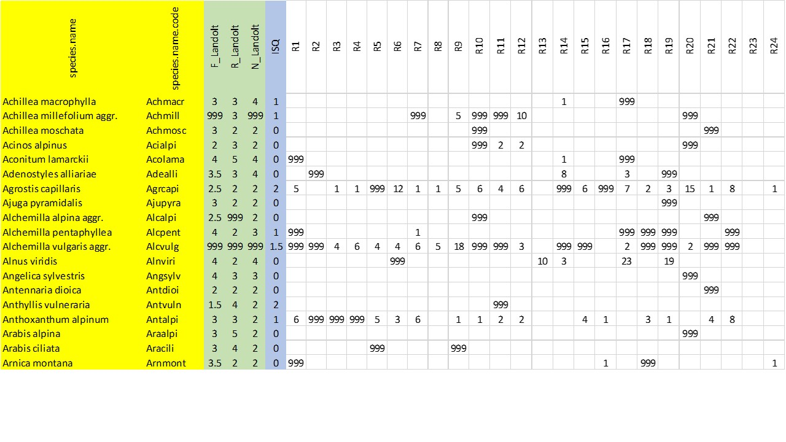

<!-- README.md is generated from README.Rmd. Please edit that file -->

```{r, include = FALSE}
knitr::opts_chunk$set(
  collapse = TRUE,
  comment = "#>",
  fig.path = "man/figures/README-",
  out.width = "100%"
)

library(knitr)
```

# iPastoralist

<!-- badges: start -->
<!-- badges: end -->

## What it does

iPastoralist allows you to:

1. Transform **Frequency of occurrences (FO)** of species identified along a linear transect (either with or without occasional species) to: 
    + **Species relative abundance (SRA)** : ratio between frequency of occurrence and the sum of frequency of                                                     occurrences values for all species in the transect, then multiplied by 100
    + **Species percentage cover (%SC)**: conversion of frequency of occurrence to 100 measurements (e.g. if a                                                 species had a FO= 20 measurements out of 50 total measurements along                                                 the transect line, the FO will be multiplied by 2). To all                                                            occasional species (i.e. species found within vegetation plots but                                                 not along the linear transects) a %SC value = 0.3% is attributed.

2. Compute:
    + **Biodiversity indexes**: Species richness, Shannon diversity index, Shannon max, Equitability
    + **Forage Pastoral Value (PV)**
    + **Ecological indexes**: Landolt, Ellenberg (either weighted or not weighted with plant species abundance)
 
3. Sort species descendingly  each survey First ten species 


## Installation

You can install the development version of iPastoralist from [GitHub](https://github.com/) with:

``` r
# install.packages("devtools")
devtools::install_github("MarcoPittarello/iPastoralist")
```


## Data input format

* **Rows**: species
* **Columns**: surveys
* **Values** are Frequency of occurrence (FO)
* **Occasional species** are coded as 999
* Leave other cells empty (i.e NA) 


Species | Survey_1 | Survey_2 | Survey_3 | ...
---------- | -------- | -------- | -------- |
species_1 |12 | 1| |
species_2 | | 3| |
species_3 | | | 4|
species_4 | 9| 18|999 |
... | | | |


## Example

The dataframe setting should looks like the below one:



Then import the dataframe in R environment 

```{r eval=FALSE}
'data <- read_excel("~/yourdata.xlsx")
View(data)'
```
```{r echo=FALSE, warning=FALSE}
load(file = "data/data.RData")
kable(head(data),align = 'c')
```

In this database example, the total number of measurements along the transect line was **25**.

Now we can select extract from the whole database only the columns with plant species names and surveys, i.e. as specified in "Data input format" section

```{r echo=TRUE}
vegetation<-data[,c(2,7:30)]
kable(head(vegetation),align = 'c')


```

Suppose we want to convert Frequency of occurrence (FO) to Species percentage cover (%SC), considering also occasional species.
As the total measurements per transect was 25, FO should be multiplied by **4** so that they refer to 100 measurements

```{r}
library(iPastoralist)
vegetation.sc<-vegetation_abundance(database = vegetation,
                                    species.cover.coefficient = 4,
                                    method = "SC_fo_occ",
                                    export = F)
                                    
```


