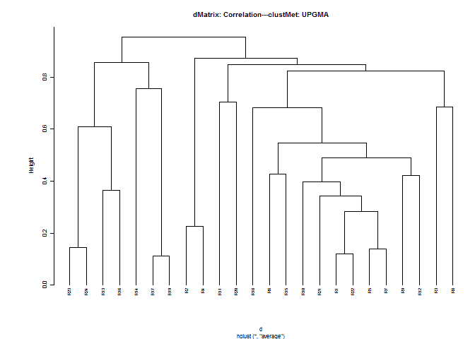
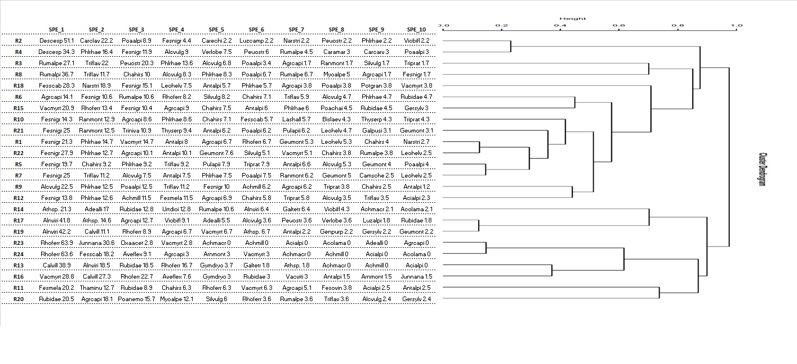
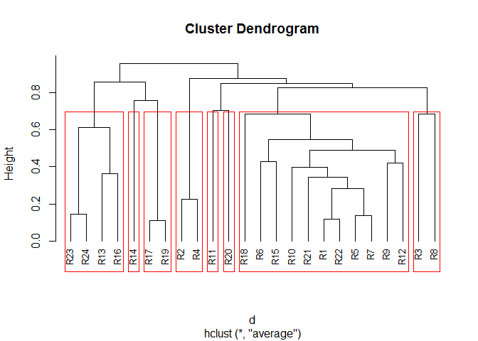

<!-- README.md is generated from README.Rmd. Please edit that file -->

# **iPastoralist**

<font size="4"> *Management, conversion, and analyses of vegetation data
derived from phytosociological and point-quadrat method surveys* </font>

<!-- badges: start -->
<!-- badges: end -->

## **1. When to use it**

Botanical composition was surveyed either with **phytosociological** or
**point-quadrat / pinpoint (or point‐intercept) method** (plant species
are recorded at fixed interval along a *linear transect*, Daget and
Poissonet 1971).

If botanical composition was surveyed with the **point-quadrat /
pinpoint (or point‐intercept) method**, *iPastoralist* works also when
the list of all other plant species included within a buffer area around
the transect line (i.e. **vegetation plot**) has been done. Indeed, the
point-intercept method often miss rare species.

## **2. What it does**

### **2.1. Point-quadrat / pinpoint (or point‐intercept) method**

*iPastoralist* allows you to:

1.  Transform **Frequency of occurrences (FO)** of species identified
    along a linear transect (either with or without occasional species)
    to:
    -   **Species relative abundance (SRA)** : ratio between frequency
        of occurrence and the sum of frequency of occurrences values for
        all species in the transect, then multiplied by 100;
    -   **Species percentage cover (%SC)**: conversion of frequency of
        occurrence to 100 measurements (e.g. if a species had a FO= 20
        measurements out of 50 total measurements along the transect
        line, the FO will be multiplied by 2). To all occasional species
        (i.e. species found within vegetation plots but not along the
        linear transects) a %SC value = 0.3% is attributed. More details
        are provided in the **vegetation\_abundance** function, which
        process FO data with the following workflow:


2.  Compute:
    -   **Biodiversity indexes**: Species richness, Shannon diversity
        index (log2), Effective Number of Species,Shannon max,
        Equitability. (see “**biodiversity**” function)
    -   **Forage Pastoral Value (PV)** (see “**pastoral\_value**”
        function)
    -   **Ecological indexes**: Landolt, Ellenberg (either weighted or
        not weighted with plant species abundance and either considering
        or not considering occasional species). (see
        “**ecological\_indexes**” function)
3.  Extract for each survey the firt ten species, ordered decreasingly
    by their abundance (useful with dendrograms). (see
    “**first\_ten\_species**” function)

### **2.2. Phytosociological method**

With the ‘**PhytoCover**’ function, *iPastoralist* allows you to
transform species cover visually estimated in a phytosociological survey
to:

-   Braun-Blanquet cover-abundance scale (Braun-Blanquet,1932)
-   Van Der Maarel cover-abundance scale (Van Der Maarel, 1978)
-   Dominance percentage (Tasser and Tappeiner, 2005)

**Conversion table**

| Visually estimated cover (%) | Braun Blanquet | Van Der Maarel | Tasser and Tappeiner (%) |
|:----------------------------:|:--------------:|:--------------:|:------------------------:|
|              0               |       0        |       0        |            0             |
|            &lt;1             |       \+       |       2        |           0.3            |
|            1 - 5             |       1        |       3        |           2.8            |
|            6 -15             |       2a       |       5        |            10            |
|            16-25             |       2b       |       5        |           20.5           |
|            26-50             |       3        |       7        |            38            |
|            51-75             |       4        |       8        |            63            |
|            76-100            |       5        |       9        |            88            |

-   Braun-Blanquet J (1932) Plant sociology. The study of plant communi-
    ties. GD Fuller and HS Conard (Eds.). Authorized English
    translations of ‘Pflanzensoziologie’. 1st ed. Printed in the United
    States of America. New York and London: McGraw-Hill Book Co. Inc.
-   Van der Maarel, E. (1979). Transformation of cover-abundance values
    in phytosociology and its effects on community similarity.
    Vegetatio, 39(2), 97-114.
-   Tasser E, Tappeiner U (2005) New model to predict rooting in diverse
    plant community compositions. Ecological Modelling 185:195-211.

## **3. Installation**

You can install the development version of *iPastoralist* by running the
following code:

    install.packages("devtools")
    library(devtools)
    install_github("MarcoPittarello/iPastoralist",build_vignettes = TRUE)

## **4. Data input format**

-   **Rows**: species
-   **Columns**: surveys
-   **Values** are Frequency of occurrence (FO)
-   **Occasional species** are coded as 999
-   Leave other cells empty (i.e NA)
-   database class MUST BE a **dataframe**

| Species    | Survey\_1 | Survey\_2 | Survey\_3 |
|------------|-----------|-----------|-----------|
| species\_1 | 12        | 1         |           |
| species\_2 |           | 3         |           |
| species\_3 |           |           | 4         |
| species\_4 | 9         | 18        | 999       |
| …          |           |           |           |

## **5. Examples**

The dataframe setting should looks like the below one:

 **FIGURE 1**

-   Columns in GREEN are the Landolt indicator values of each plant
    species
-   Column in BLUE contains the Index of Specific Quality (ISQ) for each
    species.
-   Column named Rxx are the vegetation survey codes

In this database, the total number of measurements along the transect
line is **25**.

We can import the dataframe in R environment:

    data <- read_excel("~/yourdata.xlsx")
    View(data)

<table class="table" style="font-size: 12px; margin-left: auto; margin-right: auto;">
<thead>
<tr>
<th style="text-align:center;">
species.name
</th>
<th style="text-align:center;">
species.name.code
</th>
<th style="text-align:center;">
F\_Landolt
</th>
<th style="text-align:center;">
R\_Landolt
</th>
<th style="text-align:center;">
N\_Landolt
</th>
<th style="text-align:center;">
ISQ
</th>
<th style="text-align:center;">
R1
</th>
<th style="text-align:center;">
R2
</th>
<th style="text-align:center;">
R3
</th>
<th style="text-align:center;">
R4
</th>
<th style="text-align:center;">
R5
</th>
<th style="text-align:center;">
R6
</th>
<th style="text-align:center;">
R7
</th>
<th style="text-align:center;">
R8
</th>
<th style="text-align:center;">
R9
</th>
<th style="text-align:center;">
R10
</th>
<th style="text-align:center;">
R11
</th>
<th style="text-align:center;">
R12
</th>
<th style="text-align:center;">
R13
</th>
<th style="text-align:center;">
R14
</th>
<th style="text-align:center;">
R15
</th>
<th style="text-align:center;">
R16
</th>
<th style="text-align:center;">
R17
</th>
<th style="text-align:center;">
R18
</th>
<th style="text-align:center;">
R19
</th>
<th style="text-align:center;">
R20
</th>
<th style="text-align:center;">
R21
</th>
<th style="text-align:center;">
R22
</th>
<th style="text-align:center;">
R23
</th>
<th style="text-align:center;">
R24
</th>
</tr>
</thead>
<tbody>
<tr>
<td style="text-align:center;">
Achillea macrophylla
</td>
<td style="text-align:center;">
Achmacr
</td>
<td style="text-align:center;">
3.0
</td>
<td style="text-align:center;">
3
</td>
<td style="text-align:center;">
4
</td>
<td style="text-align:center;">
1
</td>
<td style="text-align:center;">
NA
</td>
<td style="text-align:center;">
NA
</td>
<td style="text-align:center;">
NA
</td>
<td style="text-align:center;">
NA
</td>
<td style="text-align:center;">
NA
</td>
<td style="text-align:center;">
NA
</td>
<td style="text-align:center;">
NA
</td>
<td style="text-align:center;">
NA
</td>
<td style="text-align:center;">
NA
</td>
<td style="text-align:center;">
NA
</td>
<td style="text-align:center;">
NA
</td>
<td style="text-align:center;">
NA
</td>
<td style="text-align:center;">
NA
</td>
<td style="text-align:center;">
1
</td>
<td style="text-align:center;">
NA
</td>
<td style="text-align:center;">
NA
</td>
<td style="text-align:center;">
999
</td>
<td style="text-align:center;">
NA
</td>
<td style="text-align:center;">
NA
</td>
<td style="text-align:center;">
NA
</td>
<td style="text-align:center;">
NA
</td>
<td style="text-align:center;">
NA
</td>
<td style="text-align:center;">
NA
</td>
<td style="text-align:center;">
NA
</td>
</tr>
<tr>
<td style="text-align:center;">
Achillea millefolium aggr.
</td>
<td style="text-align:center;">
Achmill
</td>
<td style="text-align:center;">
999.0
</td>
<td style="text-align:center;">
3
</td>
<td style="text-align:center;">
999
</td>
<td style="text-align:center;">
1
</td>
<td style="text-align:center;">
NA
</td>
<td style="text-align:center;">
NA
</td>
<td style="text-align:center;">
NA
</td>
<td style="text-align:center;">
NA
</td>
<td style="text-align:center;">
NA
</td>
<td style="text-align:center;">
NA
</td>
<td style="text-align:center;">
999
</td>
<td style="text-align:center;">
NA
</td>
<td style="text-align:center;">
5
</td>
<td style="text-align:center;">
999
</td>
<td style="text-align:center;">
999
</td>
<td style="text-align:center;">
10
</td>
<td style="text-align:center;">
NA
</td>
<td style="text-align:center;">
NA
</td>
<td style="text-align:center;">
NA
</td>
<td style="text-align:center;">
NA
</td>
<td style="text-align:center;">
NA
</td>
<td style="text-align:center;">
NA
</td>
<td style="text-align:center;">
NA
</td>
<td style="text-align:center;">
999
</td>
<td style="text-align:center;">
NA
</td>
<td style="text-align:center;">
NA
</td>
<td style="text-align:center;">
NA
</td>
<td style="text-align:center;">
NA
</td>
</tr>
<tr>
<td style="text-align:center;">
Achillea moschata
</td>
<td style="text-align:center;">
Achmosc
</td>
<td style="text-align:center;">
3.0
</td>
<td style="text-align:center;">
2
</td>
<td style="text-align:center;">
2
</td>
<td style="text-align:center;">
0
</td>
<td style="text-align:center;">
NA
</td>
<td style="text-align:center;">
NA
</td>
<td style="text-align:center;">
NA
</td>
<td style="text-align:center;">
NA
</td>
<td style="text-align:center;">
NA
</td>
<td style="text-align:center;">
NA
</td>
<td style="text-align:center;">
NA
</td>
<td style="text-align:center;">
NA
</td>
<td style="text-align:center;">
NA
</td>
<td style="text-align:center;">
999
</td>
<td style="text-align:center;">
NA
</td>
<td style="text-align:center;">
NA
</td>
<td style="text-align:center;">
NA
</td>
<td style="text-align:center;">
NA
</td>
<td style="text-align:center;">
NA
</td>
<td style="text-align:center;">
NA
</td>
<td style="text-align:center;">
NA
</td>
<td style="text-align:center;">
NA
</td>
<td style="text-align:center;">
NA
</td>
<td style="text-align:center;">
NA
</td>
<td style="text-align:center;">
999
</td>
<td style="text-align:center;">
NA
</td>
<td style="text-align:center;">
NA
</td>
<td style="text-align:center;">
NA
</td>
</tr>
<tr>
<td style="text-align:center;">
Acinos alpinus
</td>
<td style="text-align:center;">
Acialpi
</td>
<td style="text-align:center;">
2.0
</td>
<td style="text-align:center;">
3
</td>
<td style="text-align:center;">
2
</td>
<td style="text-align:center;">
0
</td>
<td style="text-align:center;">
NA
</td>
<td style="text-align:center;">
NA
</td>
<td style="text-align:center;">
NA
</td>
<td style="text-align:center;">
NA
</td>
<td style="text-align:center;">
NA
</td>
<td style="text-align:center;">
NA
</td>
<td style="text-align:center;">
NA
</td>
<td style="text-align:center;">
NA
</td>
<td style="text-align:center;">
NA
</td>
<td style="text-align:center;">
999
</td>
<td style="text-align:center;">
2
</td>
<td style="text-align:center;">
2
</td>
<td style="text-align:center;">
NA
</td>
<td style="text-align:center;">
NA
</td>
<td style="text-align:center;">
NA
</td>
<td style="text-align:center;">
NA
</td>
<td style="text-align:center;">
NA
</td>
<td style="text-align:center;">
NA
</td>
<td style="text-align:center;">
NA
</td>
<td style="text-align:center;">
999
</td>
<td style="text-align:center;">
NA
</td>
<td style="text-align:center;">
NA
</td>
<td style="text-align:center;">
NA
</td>
<td style="text-align:center;">
NA
</td>
</tr>
<tr>
<td style="text-align:center;">
Aconitum lamarckii
</td>
<td style="text-align:center;">
Acolama
</td>
<td style="text-align:center;">
4.0
</td>
<td style="text-align:center;">
5
</td>
<td style="text-align:center;">
4
</td>
<td style="text-align:center;">
0
</td>
<td style="text-align:center;">
999
</td>
<td style="text-align:center;">
NA
</td>
<td style="text-align:center;">
NA
</td>
<td style="text-align:center;">
NA
</td>
<td style="text-align:center;">
NA
</td>
<td style="text-align:center;">
NA
</td>
<td style="text-align:center;">
NA
</td>
<td style="text-align:center;">
NA
</td>
<td style="text-align:center;">
NA
</td>
<td style="text-align:center;">
NA
</td>
<td style="text-align:center;">
NA
</td>
<td style="text-align:center;">
NA
</td>
<td style="text-align:center;">
NA
</td>
<td style="text-align:center;">
1
</td>
<td style="text-align:center;">
NA
</td>
<td style="text-align:center;">
NA
</td>
<td style="text-align:center;">
999
</td>
<td style="text-align:center;">
NA
</td>
<td style="text-align:center;">
NA
</td>
<td style="text-align:center;">
NA
</td>
<td style="text-align:center;">
NA
</td>
<td style="text-align:center;">
NA
</td>
<td style="text-align:center;">
NA
</td>
<td style="text-align:center;">
NA
</td>
</tr>
<tr>
<td style="text-align:center;">
Adenostyles alliariae
</td>
<td style="text-align:center;">
Adealli
</td>
<td style="text-align:center;">
3.5
</td>
<td style="text-align:center;">
3
</td>
<td style="text-align:center;">
4
</td>
<td style="text-align:center;">
0
</td>
<td style="text-align:center;">
NA
</td>
<td style="text-align:center;">
999
</td>
<td style="text-align:center;">
NA
</td>
<td style="text-align:center;">
NA
</td>
<td style="text-align:center;">
NA
</td>
<td style="text-align:center;">
NA
</td>
<td style="text-align:center;">
NA
</td>
<td style="text-align:center;">
NA
</td>
<td style="text-align:center;">
NA
</td>
<td style="text-align:center;">
NA
</td>
<td style="text-align:center;">
NA
</td>
<td style="text-align:center;">
NA
</td>
<td style="text-align:center;">
NA
</td>
<td style="text-align:center;">
8
</td>
<td style="text-align:center;">
NA
</td>
<td style="text-align:center;">
NA
</td>
<td style="text-align:center;">
3
</td>
<td style="text-align:center;">
NA
</td>
<td style="text-align:center;">
999
</td>
<td style="text-align:center;">
NA
</td>
<td style="text-align:center;">
NA
</td>
<td style="text-align:center;">
NA
</td>
<td style="text-align:center;">
NA
</td>
<td style="text-align:center;">
NA
</td>
</tr>
</tbody>
</table>

Important note: make sure that the database class is **data.frame**. If
not convert it as shown:

``` r
data<-as.data.frame(data)
```

From the whole database, the columns related to plant species names and
all surveys are selected, i.e. as specified in “Data input format”
section

``` r
vegetation<-data[,c(2,7:30)]
```

<table class="table" style="font-size: 12px; margin-left: auto; margin-right: auto;">
<thead>
<tr>
<th style="text-align:center;">
species.name.code
</th>
<th style="text-align:center;">
R1
</th>
<th style="text-align:center;">
R2
</th>
<th style="text-align:center;">
R3
</th>
<th style="text-align:center;">
R4
</th>
<th style="text-align:center;">
R5
</th>
<th style="text-align:center;">
R6
</th>
<th style="text-align:center;">
R7
</th>
<th style="text-align:center;">
R8
</th>
<th style="text-align:center;">
R9
</th>
<th style="text-align:center;">
R10
</th>
<th style="text-align:center;">
R11
</th>
<th style="text-align:center;">
R12
</th>
<th style="text-align:center;">
R13
</th>
<th style="text-align:center;">
R14
</th>
<th style="text-align:center;">
R15
</th>
<th style="text-align:center;">
R16
</th>
<th style="text-align:center;">
R17
</th>
<th style="text-align:center;">
R18
</th>
<th style="text-align:center;">
R19
</th>
<th style="text-align:center;">
R20
</th>
<th style="text-align:center;">
R21
</th>
<th style="text-align:center;">
R22
</th>
<th style="text-align:center;">
R23
</th>
<th style="text-align:center;">
R24
</th>
</tr>
</thead>
<tbody>
<tr>
<td style="text-align:center;">
Achmacr
</td>
<td style="text-align:center;">
NA
</td>
<td style="text-align:center;">
NA
</td>
<td style="text-align:center;">
NA
</td>
<td style="text-align:center;">
NA
</td>
<td style="text-align:center;">
NA
</td>
<td style="text-align:center;">
NA
</td>
<td style="text-align:center;">
NA
</td>
<td style="text-align:center;">
NA
</td>
<td style="text-align:center;">
NA
</td>
<td style="text-align:center;">
NA
</td>
<td style="text-align:center;">
NA
</td>
<td style="text-align:center;">
NA
</td>
<td style="text-align:center;">
NA
</td>
<td style="text-align:center;">
1
</td>
<td style="text-align:center;">
NA
</td>
<td style="text-align:center;">
NA
</td>
<td style="text-align:center;">
999
</td>
<td style="text-align:center;">
NA
</td>
<td style="text-align:center;">
NA
</td>
<td style="text-align:center;">
NA
</td>
<td style="text-align:center;">
NA
</td>
<td style="text-align:center;">
NA
</td>
<td style="text-align:center;">
NA
</td>
<td style="text-align:center;">
NA
</td>
</tr>
<tr>
<td style="text-align:center;">
Achmill
</td>
<td style="text-align:center;">
NA
</td>
<td style="text-align:center;">
NA
</td>
<td style="text-align:center;">
NA
</td>
<td style="text-align:center;">
NA
</td>
<td style="text-align:center;">
NA
</td>
<td style="text-align:center;">
NA
</td>
<td style="text-align:center;">
999
</td>
<td style="text-align:center;">
NA
</td>
<td style="text-align:center;">
5
</td>
<td style="text-align:center;">
999
</td>
<td style="text-align:center;">
999
</td>
<td style="text-align:center;">
10
</td>
<td style="text-align:center;">
NA
</td>
<td style="text-align:center;">
NA
</td>
<td style="text-align:center;">
NA
</td>
<td style="text-align:center;">
NA
</td>
<td style="text-align:center;">
NA
</td>
<td style="text-align:center;">
NA
</td>
<td style="text-align:center;">
NA
</td>
<td style="text-align:center;">
999
</td>
<td style="text-align:center;">
NA
</td>
<td style="text-align:center;">
NA
</td>
<td style="text-align:center;">
NA
</td>
<td style="text-align:center;">
NA
</td>
</tr>
<tr>
<td style="text-align:center;">
Achmosc
</td>
<td style="text-align:center;">
NA
</td>
<td style="text-align:center;">
NA
</td>
<td style="text-align:center;">
NA
</td>
<td style="text-align:center;">
NA
</td>
<td style="text-align:center;">
NA
</td>
<td style="text-align:center;">
NA
</td>
<td style="text-align:center;">
NA
</td>
<td style="text-align:center;">
NA
</td>
<td style="text-align:center;">
NA
</td>
<td style="text-align:center;">
999
</td>
<td style="text-align:center;">
NA
</td>
<td style="text-align:center;">
NA
</td>
<td style="text-align:center;">
NA
</td>
<td style="text-align:center;">
NA
</td>
<td style="text-align:center;">
NA
</td>
<td style="text-align:center;">
NA
</td>
<td style="text-align:center;">
NA
</td>
<td style="text-align:center;">
NA
</td>
<td style="text-align:center;">
NA
</td>
<td style="text-align:center;">
NA
</td>
<td style="text-align:center;">
999
</td>
<td style="text-align:center;">
NA
</td>
<td style="text-align:center;">
NA
</td>
<td style="text-align:center;">
NA
</td>
</tr>
<tr>
<td style="text-align:center;">
Acialpi
</td>
<td style="text-align:center;">
NA
</td>
<td style="text-align:center;">
NA
</td>
<td style="text-align:center;">
NA
</td>
<td style="text-align:center;">
NA
</td>
<td style="text-align:center;">
NA
</td>
<td style="text-align:center;">
NA
</td>
<td style="text-align:center;">
NA
</td>
<td style="text-align:center;">
NA
</td>
<td style="text-align:center;">
NA
</td>
<td style="text-align:center;">
999
</td>
<td style="text-align:center;">
2
</td>
<td style="text-align:center;">
2
</td>
<td style="text-align:center;">
NA
</td>
<td style="text-align:center;">
NA
</td>
<td style="text-align:center;">
NA
</td>
<td style="text-align:center;">
NA
</td>
<td style="text-align:center;">
NA
</td>
<td style="text-align:center;">
NA
</td>
<td style="text-align:center;">
NA
</td>
<td style="text-align:center;">
999
</td>
<td style="text-align:center;">
NA
</td>
<td style="text-align:center;">
NA
</td>
<td style="text-align:center;">
NA
</td>
<td style="text-align:center;">
NA
</td>
</tr>
<tr>
<td style="text-align:center;">
Acolama
</td>
<td style="text-align:center;">
999
</td>
<td style="text-align:center;">
NA
</td>
<td style="text-align:center;">
NA
</td>
<td style="text-align:center;">
NA
</td>
<td style="text-align:center;">
NA
</td>
<td style="text-align:center;">
NA
</td>
<td style="text-align:center;">
NA
</td>
<td style="text-align:center;">
NA
</td>
<td style="text-align:center;">
NA
</td>
<td style="text-align:center;">
NA
</td>
<td style="text-align:center;">
NA
</td>
<td style="text-align:center;">
NA
</td>
<td style="text-align:center;">
NA
</td>
<td style="text-align:center;">
1
</td>
<td style="text-align:center;">
NA
</td>
<td style="text-align:center;">
NA
</td>
<td style="text-align:center;">
999
</td>
<td style="text-align:center;">
NA
</td>
<td style="text-align:center;">
NA
</td>
<td style="text-align:center;">
NA
</td>
<td style="text-align:center;">
NA
</td>
<td style="text-align:center;">
NA
</td>
<td style="text-align:center;">
NA
</td>
<td style="text-align:center;">
NA
</td>
</tr>
<tr>
<td style="text-align:center;">
Adealli
</td>
<td style="text-align:center;">
NA
</td>
<td style="text-align:center;">
999
</td>
<td style="text-align:center;">
NA
</td>
<td style="text-align:center;">
NA
</td>
<td style="text-align:center;">
NA
</td>
<td style="text-align:center;">
NA
</td>
<td style="text-align:center;">
NA
</td>
<td style="text-align:center;">
NA
</td>
<td style="text-align:center;">
NA
</td>
<td style="text-align:center;">
NA
</td>
<td style="text-align:center;">
NA
</td>
<td style="text-align:center;">
NA
</td>
<td style="text-align:center;">
NA
</td>
<td style="text-align:center;">
8
</td>
<td style="text-align:center;">
NA
</td>
<td style="text-align:center;">
NA
</td>
<td style="text-align:center;">
3
</td>
<td style="text-align:center;">
NA
</td>
<td style="text-align:center;">
999
</td>
<td style="text-align:center;">
NA
</td>
<td style="text-align:center;">
NA
</td>
<td style="text-align:center;">
NA
</td>
<td style="text-align:center;">
NA
</td>
<td style="text-align:center;">
NA
</td>
</tr>
</tbody>
</table>

### Example 1

Suppose we want to convert Frequency of occurrence (FO) to Species
percentage cover (%SC), considering also occasional species. As the %SC
for each survey will (likely) be greater than 100, we want to rescale
%SC of each species per each survey to obtain a sum of 100 (i.e. a
proportion of %SC). As the total measurements per transect was 25, FO
should be multiplied by **4** so that they refer to 100 measurements.

``` r
library(iPastoralist)
vegetation.sc<-vegetation_abundance(database = vegetation,
                                    species.cover.coefficient = 4,
                                    method = "SRA_SC.fo.occ")
```

    head(vegetation.sc)

<table class="table" style="font-size: 12px; margin-left: auto; margin-right: auto;">
<thead>
<tr>
<th style="text-align:left;">
</th>
<th style="text-align:center;">
R1
</th>
<th style="text-align:center;">
R2
</th>
<th style="text-align:center;">
R3
</th>
<th style="text-align:center;">
R4
</th>
<th style="text-align:center;">
R5
</th>
<th style="text-align:center;">
R6
</th>
<th style="text-align:center;">
R7
</th>
<th style="text-align:center;">
R8
</th>
<th style="text-align:center;">
R9
</th>
<th style="text-align:center;">
R10
</th>
<th style="text-align:center;">
R11
</th>
<th style="text-align:center;">
R12
</th>
<th style="text-align:center;">
R13
</th>
<th style="text-align:center;">
R14
</th>
<th style="text-align:center;">
R15
</th>
<th style="text-align:center;">
R16
</th>
<th style="text-align:center;">
R17
</th>
<th style="text-align:center;">
R18
</th>
<th style="text-align:center;">
R19
</th>
<th style="text-align:center;">
R20
</th>
<th style="text-align:center;">
R21
</th>
<th style="text-align:center;">
R22
</th>
<th style="text-align:center;">
R23
</th>
<th style="text-align:center;">
R24
</th>
</tr>
</thead>
<tbody>
<tr>
<td style="text-align:left;">
Achmacr
</td>
<td style="text-align:center;">
0.0000000
</td>
<td style="text-align:center;">
0.0000000
</td>
<td style="text-align:center;">
0
</td>
<td style="text-align:center;">
0
</td>
<td style="text-align:center;">
0
</td>
<td style="text-align:center;">
0
</td>
<td style="text-align:center;">
0.0000000
</td>
<td style="text-align:center;">
0
</td>
<td style="text-align:center;">
0.000000
</td>
<td style="text-align:center;">
0.000000
</td>
<td style="text-align:center;">
0.0000000
</td>
<td style="text-align:center;">
0.000000
</td>
<td style="text-align:center;">
0
</td>
<td style="text-align:center;">
2.643754
</td>
<td style="text-align:center;">
0
</td>
<td style="text-align:center;">
0
</td>
<td style="text-align:center;">
0.1544004
</td>
<td style="text-align:center;">
0
</td>
<td style="text-align:center;">
0.000000
</td>
<td style="text-align:center;">
0.0000000
</td>
<td style="text-align:center;">
0.0000000
</td>
<td style="text-align:center;">
0
</td>
<td style="text-align:center;">
0
</td>
<td style="text-align:center;">
0
</td>
</tr>
<tr>
<td style="text-align:left;">
Achmill
</td>
<td style="text-align:center;">
0.0000000
</td>
<td style="text-align:center;">
0.0000000
</td>
<td style="text-align:center;">
0
</td>
<td style="text-align:center;">
0
</td>
<td style="text-align:center;">
0
</td>
<td style="text-align:center;">
0
</td>
<td style="text-align:center;">
0.0918555
</td>
<td style="text-align:center;">
0
</td>
<td style="text-align:center;">
6.118079
</td>
<td style="text-align:center;">
0.103484
</td>
<td style="text-align:center;">
0.0927357
</td>
<td style="text-align:center;">
11.289867
</td>
<td style="text-align:center;">
0
</td>
<td style="text-align:center;">
0.000000
</td>
<td style="text-align:center;">
0
</td>
<td style="text-align:center;">
0
</td>
<td style="text-align:center;">
0.0000000
</td>
<td style="text-align:center;">
0
</td>
<td style="text-align:center;">
0.000000
</td>
<td style="text-align:center;">
0.0884434
</td>
<td style="text-align:center;">
0.0000000
</td>
<td style="text-align:center;">
0
</td>
<td style="text-align:center;">
0
</td>
<td style="text-align:center;">
0
</td>
</tr>
<tr>
<td style="text-align:left;">
Achmosc
</td>
<td style="text-align:center;">
0.0000000
</td>
<td style="text-align:center;">
0.0000000
</td>
<td style="text-align:center;">
0
</td>
<td style="text-align:center;">
0
</td>
<td style="text-align:center;">
0
</td>
<td style="text-align:center;">
0
</td>
<td style="text-align:center;">
0.0000000
</td>
<td style="text-align:center;">
0
</td>
<td style="text-align:center;">
0.000000
</td>
<td style="text-align:center;">
0.103484
</td>
<td style="text-align:center;">
0.0000000
</td>
<td style="text-align:center;">
0.000000
</td>
<td style="text-align:center;">
0
</td>
<td style="text-align:center;">
0.000000
</td>
<td style="text-align:center;">
0
</td>
<td style="text-align:center;">
0
</td>
<td style="text-align:center;">
0.0000000
</td>
<td style="text-align:center;">
0
</td>
<td style="text-align:center;">
0.000000
</td>
<td style="text-align:center;">
0.0000000
</td>
<td style="text-align:center;">
0.1133359
</td>
<td style="text-align:center;">
0
</td>
<td style="text-align:center;">
0
</td>
<td style="text-align:center;">
0
</td>
</tr>
<tr>
<td style="text-align:left;">
Acialpi
</td>
<td style="text-align:center;">
0.0000000
</td>
<td style="text-align:center;">
0.0000000
</td>
<td style="text-align:center;">
0
</td>
<td style="text-align:center;">
0
</td>
<td style="text-align:center;">
0
</td>
<td style="text-align:center;">
0
</td>
<td style="text-align:center;">
0.0000000
</td>
<td style="text-align:center;">
0
</td>
<td style="text-align:center;">
0.000000
</td>
<td style="text-align:center;">
0.103484
</td>
<td style="text-align:center;">
2.4729521
</td>
<td style="text-align:center;">
2.257973
</td>
<td style="text-align:center;">
0
</td>
<td style="text-align:center;">
0.000000
</td>
<td style="text-align:center;">
0
</td>
<td style="text-align:center;">
0
</td>
<td style="text-align:center;">
0.0000000
</td>
<td style="text-align:center;">
0
</td>
<td style="text-align:center;">
0.000000
</td>
<td style="text-align:center;">
0.0884434
</td>
<td style="text-align:center;">
0.0000000
</td>
<td style="text-align:center;">
0
</td>
<td style="text-align:center;">
0
</td>
<td style="text-align:center;">
0
</td>
</tr>
<tr>
<td style="text-align:left;">
Acolama
</td>
<td style="text-align:center;">
0.0971817
</td>
<td style="text-align:center;">
0.0000000
</td>
<td style="text-align:center;">
0
</td>
<td style="text-align:center;">
0
</td>
<td style="text-align:center;">
0
</td>
<td style="text-align:center;">
0
</td>
<td style="text-align:center;">
0.0000000
</td>
<td style="text-align:center;">
0
</td>
<td style="text-align:center;">
0.000000
</td>
<td style="text-align:center;">
0.000000
</td>
<td style="text-align:center;">
0.0000000
</td>
<td style="text-align:center;">
0.000000
</td>
<td style="text-align:center;">
0
</td>
<td style="text-align:center;">
2.643754
</td>
<td style="text-align:center;">
0
</td>
<td style="text-align:center;">
0
</td>
<td style="text-align:center;">
0.1544004
</td>
<td style="text-align:center;">
0
</td>
<td style="text-align:center;">
0.000000
</td>
<td style="text-align:center;">
0.0000000
</td>
<td style="text-align:center;">
0.0000000
</td>
<td style="text-align:center;">
0
</td>
<td style="text-align:center;">
0
</td>
<td style="text-align:center;">
0
</td>
</tr>
<tr>
<td style="text-align:left;">
Adealli
</td>
<td style="text-align:center;">
0.0000000
</td>
<td style="text-align:center;">
0.1612903
</td>
<td style="text-align:center;">
0
</td>
<td style="text-align:center;">
0
</td>
<td style="text-align:center;">
0
</td>
<td style="text-align:center;">
0
</td>
<td style="text-align:center;">
0.0000000
</td>
<td style="text-align:center;">
0
</td>
<td style="text-align:center;">
0.000000
</td>
<td style="text-align:center;">
0.000000
</td>
<td style="text-align:center;">
0.0000000
</td>
<td style="text-align:center;">
0.000000
</td>
<td style="text-align:center;">
0
</td>
<td style="text-align:center;">
21.150033
</td>
<td style="text-align:center;">
0
</td>
<td style="text-align:center;">
0
</td>
<td style="text-align:center;">
6.1760165
</td>
<td style="text-align:center;">
0
</td>
<td style="text-align:center;">
0.172117
</td>
<td style="text-align:center;">
0.0000000
</td>
<td style="text-align:center;">
0.0000000
</td>
<td style="text-align:center;">
0
</td>
<td style="text-align:center;">
0
</td>
<td style="text-align:center;">
0
</td>
</tr>
</tbody>
</table>

we can check that the sum of %SC for each survey is 100

``` r
colSums(vegetation.sc)
#>  R1  R2  R3  R4  R5  R6  R7  R8  R9 R10 R11 R12 R13 R14 R15 R16 R17 R18 R19 R20 
#> 100 100 100 100 100 100 100 100 100 100 100 100 100 100 100 100 100 100 100 100 
#> R21 R22 R23 R24 
#> 100 100 100 100
```

### Example 2

In this case we want to compute the average Landolt indicator values for
each survey, weighted with species abundance.

If the occasional species are not considered, the SRA will be used.
Conversely, if we would like to keep into account also occasional
species, the SRA will be calculated with the %SC rescaled to 100 (more
detail in “vegetation\_abundance” function).

In this case we will consider also occasional species.

The input database is the one with the Frequency of occurrences,
i.e. the dataframe used in this tutorial named “vegetation”.

``` r
ec.index<-ecological_indexes(database.vegetation = vegetation,
                             database.indexes = data[,c("F_Landolt","R_Landolt","N_Landolt")],
                             occasional.species = TRUE,
                             species.cover.coefficient = 4,
                             weight = TRUE)
#> [1] "INDEX WEIGHTED WITH OCCASIONAL SPECIES"
```

Notes about the “ecological\_indexes” function:

-   **database.indexes** = database with Ecological indicators, without
    the column of species names. NA values must indicated as 999
-   **occasional.species** = Logical. TRUE if you want to take into
    account occasional species.
-   **species.cover.coefficient** = only if “occasional.species=TRUE”.
    Coefficient that multiplies FO so that the number of total touches
    refer to 100
-   **weight**: Logical. TRUE if you want to weight Ecological
    indicators with abundance.

the output will be as follow:

``` r
ec.index
#>    survey F_Landolt R_Landolt N_Landolt
#> 1      R1  2.971600  2.253535  2.649474
#> 2      R2  3.716373  3.265993  2.867099
#> 3      R3  3.215537  2.981710  3.898948
#> 4      R4  3.537678  2.765013  3.392741
#> 5      R5  2.943190  2.734974  3.177504
#> 6      R6  2.926874  2.671846  2.978367
#> 7      R7  2.970695  2.635527  3.145236
#> 8      R8  3.362342  3.126754  4.306474
#> 9      R9  3.071611  2.824006  3.469644
#> 10    R10  2.612803  2.806719  2.820766
#> 11    R11  2.519994  2.808848  2.687676
#> 12    R12  2.812606  2.856213  3.017767
#> 13    R13  3.386566  2.210897  2.851104
#> 14    R14  3.417881  2.941060  4.184106
#> 15    R15  2.996712  2.227660  2.680000
#> 16    R16  3.073070  1.668550  2.091525
#> 17    R17  3.597692  2.285484  3.584541
#> 18    R18  2.464270  2.142214  2.375730
#> 19    R19  3.519828  2.043754  3.045977
#> 20    R20  2.802508  2.937901  3.024198
#> 21    R21  2.739275  2.523727  2.727625
#> 22    R22  2.895071  2.384567  2.791045
#> 23    R23  2.695533  2.274914  2.006186
#> 24    R24  2.683857  1.880419  2.004484
```

### Example 3

The aim of this example is to generate a cluster analysis of vegetation
data, with associated to the dendrogram the species of each survey
ordered by their abundance. This approach would help where to cut the
dendrogram.

From a dataset like the one shown in FIGURE 1, we first need to compute
the Species Relative Abundance from the ‘vegetation’ dataset generated
before

``` r
sra<-vegetation_abundance(database = vegetation,method = "SRA_fo")
```

    head(sra)

<table class="table" style="font-size: 12px; margin-left: auto; margin-right: auto;">
<thead>
<tr>
<th style="text-align:left;">
</th>
<th style="text-align:center;">
R1
</th>
<th style="text-align:center;">
R2
</th>
<th style="text-align:center;">
R3
</th>
<th style="text-align:center;">
R4
</th>
<th style="text-align:center;">
R5
</th>
<th style="text-align:center;">
R6
</th>
<th style="text-align:center;">
R7
</th>
<th style="text-align:center;">
R8
</th>
<th style="text-align:center;">
R9
</th>
<th style="text-align:center;">
R10
</th>
<th style="text-align:center;">
R11
</th>
<th style="text-align:center;">
R12
</th>
<th style="text-align:center;">
R13
</th>
<th style="text-align:center;">
R14
</th>
<th style="text-align:center;">
R15
</th>
<th style="text-align:center;">
R16
</th>
<th style="text-align:center;">
R17
</th>
<th style="text-align:center;">
R18
</th>
<th style="text-align:center;">
R19
</th>
<th style="text-align:center;">
R20
</th>
<th style="text-align:center;">
R21
</th>
<th style="text-align:center;">
R22
</th>
<th style="text-align:center;">
R23
</th>
<th style="text-align:center;">
R24
</th>
</tr>
</thead>
<tbody>
<tr>
<td style="text-align:left;">
Achmacr
</td>
<td style="text-align:center;">
0
</td>
<td style="text-align:center;">
0
</td>
<td style="text-align:center;">
0
</td>
<td style="text-align:center;">
0
</td>
<td style="text-align:center;">
0
</td>
<td style="text-align:center;">
0
</td>
<td style="text-align:center;">
0
</td>
<td style="text-align:center;">
0
</td>
<td style="text-align:center;">
0.00
</td>
<td style="text-align:center;">
0
</td>
<td style="text-align:center;">
0.000000
</td>
<td style="text-align:center;">
0.000000
</td>
<td style="text-align:center;">
0
</td>
<td style="text-align:center;">
2.702703
</td>
<td style="text-align:center;">
0
</td>
<td style="text-align:center;">
0
</td>
<td style="text-align:center;">
0.000000
</td>
<td style="text-align:center;">
0
</td>
<td style="text-align:center;">
0
</td>
<td style="text-align:center;">
0
</td>
<td style="text-align:center;">
0
</td>
<td style="text-align:center;">
0
</td>
<td style="text-align:center;">
0
</td>
<td style="text-align:center;">
0
</td>
</tr>
<tr>
<td style="text-align:left;">
Achmill
</td>
<td style="text-align:center;">
0
</td>
<td style="text-align:center;">
0
</td>
<td style="text-align:center;">
0
</td>
<td style="text-align:center;">
0
</td>
<td style="text-align:center;">
0
</td>
<td style="text-align:center;">
0
</td>
<td style="text-align:center;">
0
</td>
<td style="text-align:center;">
0
</td>
<td style="text-align:center;">
6.25
</td>
<td style="text-align:center;">
0
</td>
<td style="text-align:center;">
0.000000
</td>
<td style="text-align:center;">
11.494253
</td>
<td style="text-align:center;">
0
</td>
<td style="text-align:center;">
0.000000
</td>
<td style="text-align:center;">
0
</td>
<td style="text-align:center;">
0
</td>
<td style="text-align:center;">
0.000000
</td>
<td style="text-align:center;">
0
</td>
<td style="text-align:center;">
0
</td>
<td style="text-align:center;">
0
</td>
<td style="text-align:center;">
0
</td>
<td style="text-align:center;">
0
</td>
<td style="text-align:center;">
0
</td>
<td style="text-align:center;">
0
</td>
</tr>
<tr>
<td style="text-align:left;">
Achmosc
</td>
<td style="text-align:center;">
0
</td>
<td style="text-align:center;">
0
</td>
<td style="text-align:center;">
0
</td>
<td style="text-align:center;">
0
</td>
<td style="text-align:center;">
0
</td>
<td style="text-align:center;">
0
</td>
<td style="text-align:center;">
0
</td>
<td style="text-align:center;">
0
</td>
<td style="text-align:center;">
0.00
</td>
<td style="text-align:center;">
0
</td>
<td style="text-align:center;">
0.000000
</td>
<td style="text-align:center;">
0.000000
</td>
<td style="text-align:center;">
0
</td>
<td style="text-align:center;">
0.000000
</td>
<td style="text-align:center;">
0
</td>
<td style="text-align:center;">
0
</td>
<td style="text-align:center;">
0.000000
</td>
<td style="text-align:center;">
0
</td>
<td style="text-align:center;">
0
</td>
<td style="text-align:center;">
0
</td>
<td style="text-align:center;">
0
</td>
<td style="text-align:center;">
0
</td>
<td style="text-align:center;">
0
</td>
<td style="text-align:center;">
0
</td>
</tr>
<tr>
<td style="text-align:left;">
Acialpi
</td>
<td style="text-align:center;">
0
</td>
<td style="text-align:center;">
0
</td>
<td style="text-align:center;">
0
</td>
<td style="text-align:center;">
0
</td>
<td style="text-align:center;">
0
</td>
<td style="text-align:center;">
0
</td>
<td style="text-align:center;">
0
</td>
<td style="text-align:center;">
0
</td>
<td style="text-align:center;">
0.00
</td>
<td style="text-align:center;">
0
</td>
<td style="text-align:center;">
2.531646
</td>
<td style="text-align:center;">
2.298851
</td>
<td style="text-align:center;">
0
</td>
<td style="text-align:center;">
0.000000
</td>
<td style="text-align:center;">
0
</td>
<td style="text-align:center;">
0
</td>
<td style="text-align:center;">
0.000000
</td>
<td style="text-align:center;">
0
</td>
<td style="text-align:center;">
0
</td>
<td style="text-align:center;">
0
</td>
<td style="text-align:center;">
0
</td>
<td style="text-align:center;">
0
</td>
<td style="text-align:center;">
0
</td>
<td style="text-align:center;">
0
</td>
</tr>
<tr>
<td style="text-align:left;">
Acolama
</td>
<td style="text-align:center;">
0
</td>
<td style="text-align:center;">
0
</td>
<td style="text-align:center;">
0
</td>
<td style="text-align:center;">
0
</td>
<td style="text-align:center;">
0
</td>
<td style="text-align:center;">
0
</td>
<td style="text-align:center;">
0
</td>
<td style="text-align:center;">
0
</td>
<td style="text-align:center;">
0.00
</td>
<td style="text-align:center;">
0
</td>
<td style="text-align:center;">
0.000000
</td>
<td style="text-align:center;">
0.000000
</td>
<td style="text-align:center;">
0
</td>
<td style="text-align:center;">
2.702703
</td>
<td style="text-align:center;">
0
</td>
<td style="text-align:center;">
0
</td>
<td style="text-align:center;">
0.000000
</td>
<td style="text-align:center;">
0
</td>
<td style="text-align:center;">
0
</td>
<td style="text-align:center;">
0
</td>
<td style="text-align:center;">
0
</td>
<td style="text-align:center;">
0
</td>
<td style="text-align:center;">
0
</td>
<td style="text-align:center;">
0
</td>
</tr>
<tr>
<td style="text-align:left;">
Adealli
</td>
<td style="text-align:center;">
0
</td>
<td style="text-align:center;">
0
</td>
<td style="text-align:center;">
0
</td>
<td style="text-align:center;">
0
</td>
<td style="text-align:center;">
0
</td>
<td style="text-align:center;">
0
</td>
<td style="text-align:center;">
0
</td>
<td style="text-align:center;">
0
</td>
<td style="text-align:center;">
0.00
</td>
<td style="text-align:center;">
0
</td>
<td style="text-align:center;">
0.000000
</td>
<td style="text-align:center;">
0.000000
</td>
<td style="text-align:center;">
0
</td>
<td style="text-align:center;">
21.621622
</td>
<td style="text-align:center;">
0
</td>
<td style="text-align:center;">
0
</td>
<td style="text-align:center;">
6.382979
</td>
<td style="text-align:center;">
0
</td>
<td style="text-align:center;">
0
</td>
<td style="text-align:center;">
0
</td>
<td style="text-align:center;">
0
</td>
<td style="text-align:center;">
0
</td>
<td style="text-align:center;">
0
</td>
<td style="text-align:center;">
0
</td>
</tr>
</tbody>
</table>

Now we can generate a dendrogram using the **hclust** function of the R
‘stats’ base package.

``` r
db.dendro<-t(sra)#for the cluster analysis the database has to be transposed so to have surveys on rows and species on columns

library(amap)#package for computing a distance matrix
d <- Dist(db.dendro, method = "correlation")#distance matrix
cluster <- hclust(d, method="average") # clustering method

#plotting the dendrogram
par(cex=0.5, mar=c(5, 8, 4, 1))#set label size
plot(cluster,cex=0.8,hang =-1,
     main=paste0("dMatrix: Correlation","---","clustMet: UPGMA"))
```



To extract the first ten species ordered decreasingly by their SRA for
each survey, we can run the **‘first\_ten\_species’** function:

``` r
firstTenSpecies<-first_ten_species(data_SRA_SC = sra ,#database with species abundance. In this example is the 'sra' database 
                                   join.dendrogram = TRUE,#LOGICAL. TRUE if species abundance need to be joined with a dendrogram
                                   cluster.hclust = cluster)# object of containing the output from 'hclust' function of 'stats' package
```

<table class="table" style="font-size: 12px; margin-left: auto; margin-right: auto;">
<thead>
<tr>
<th style="text-align:left;">
</th>
<th style="text-align:center;">
Survey
</th>
<th style="text-align:center;">
Survey.order
</th>
<th style="text-align:center;">
V1
</th>
<th style="text-align:center;">
V2
</th>
<th style="text-align:center;">
V3
</th>
<th style="text-align:center;">
V4
</th>
<th style="text-align:center;">
V5
</th>
<th style="text-align:center;">
V6
</th>
<th style="text-align:center;">
V7
</th>
<th style="text-align:center;">
V8
</th>
<th style="text-align:center;">
V9
</th>
<th style="text-align:center;">
V10
</th>
<th style="text-align:center;">
V11
</th>
<th style="text-align:center;">
V12
</th>
<th style="text-align:center;">
V13
</th>
<th style="text-align:center;">
V14
</th>
<th style="text-align:center;">
V15
</th>
<th style="text-align:center;">
V16
</th>
<th style="text-align:center;">
V17
</th>
<th style="text-align:center;">
V18
</th>
<th style="text-align:center;">
V19
</th>
<th style="text-align:center;">
V20
</th>
<th style="text-align:center;">
V21
</th>
<th style="text-align:center;">
V22
</th>
<th style="text-align:center;">
V23
</th>
<th style="text-align:center;">
V24
</th>
<th style="text-align:center;">
V25
</th>
<th style="text-align:center;">
V26
</th>
<th style="text-align:center;">
V27
</th>
<th style="text-align:center;">
V28
</th>
<th style="text-align:center;">
V29
</th>
<th style="text-align:center;">
V30
</th>
<th style="text-align:center;">
V31
</th>
<th style="text-align:center;">
V32
</th>
<th style="text-align:center;">
V33
</th>
<th style="text-align:center;">
V34
</th>
<th style="text-align:center;">
V35
</th>
<th style="text-align:center;">
V36
</th>
<th style="text-align:center;">
V37
</th>
<th style="text-align:center;">
V38
</th>
<th style="text-align:center;">
V39
</th>
<th style="text-align:center;">
V40
</th>
<th style="text-align:center;">
V41
</th>
<th style="text-align:center;">
V42
</th>
<th style="text-align:center;">
V43
</th>
<th style="text-align:center;">
V44
</th>
<th style="text-align:center;">
V45
</th>
<th style="text-align:center;">
V46
</th>
<th style="text-align:center;">
V47
</th>
<th style="text-align:center;">
V48
</th>
<th style="text-align:center;">
V49
</th>
<th style="text-align:center;">
V50
</th>
<th style="text-align:center;">
V51
</th>
<th style="text-align:center;">
V52
</th>
<th style="text-align:center;">
V53
</th>
<th style="text-align:center;">
V54
</th>
<th style="text-align:center;">
V55
</th>
<th style="text-align:center;">
V56
</th>
<th style="text-align:center;">
V57
</th>
<th style="text-align:center;">
V58
</th>
<th style="text-align:center;">
V59
</th>
<th style="text-align:center;">
V60
</th>
<th style="text-align:center;">
V61
</th>
<th style="text-align:center;">
V62
</th>
<th style="text-align:center;">
V63
</th>
<th style="text-align:center;">
V64
</th>
<th style="text-align:center;">
V65
</th>
<th style="text-align:center;">
V66
</th>
<th style="text-align:center;">
V67
</th>
<th style="text-align:center;">
V68
</th>
<th style="text-align:center;">
V69
</th>
<th style="text-align:center;">
V70
</th>
<th style="text-align:center;">
V71
</th>
<th style="text-align:center;">
V72
</th>
<th style="text-align:center;">
V73
</th>
<th style="text-align:center;">
V74
</th>
<th style="text-align:center;">
V75
</th>
<th style="text-align:center;">
V76
</th>
<th style="text-align:center;">
V77
</th>
<th style="text-align:center;">
V78
</th>
<th style="text-align:center;">
V79
</th>
<th style="text-align:center;">
V80
</th>
<th style="text-align:center;">
V81
</th>
<th style="text-align:center;">
V82
</th>
<th style="text-align:center;">
V83
</th>
<th style="text-align:center;">
V84
</th>
<th style="text-align:center;">
V85
</th>
<th style="text-align:center;">
V86
</th>
<th style="text-align:center;">
V87
</th>
<th style="text-align:center;">
V88
</th>
<th style="text-align:center;">
V89
</th>
<th style="text-align:center;">
V90
</th>
<th style="text-align:center;">
V91
</th>
<th style="text-align:center;">
V92
</th>
<th style="text-align:center;">
V93
</th>
<th style="text-align:center;">
V94
</th>
<th style="text-align:center;">
V95
</th>
<th style="text-align:center;">
V96
</th>
<th style="text-align:center;">
V97
</th>
<th style="text-align:center;">
V98
</th>
<th style="text-align:center;">
V99
</th>
<th style="text-align:center;">
V100
</th>
<th style="text-align:center;">
V101
</th>
<th style="text-align:center;">
V102
</th>
<th style="text-align:center;">
V103
</th>
<th style="text-align:center;">
V104
</th>
<th style="text-align:center;">
V105
</th>
<th style="text-align:center;">
V106
</th>
<th style="text-align:center;">
V107
</th>
<th style="text-align:center;">
V108
</th>
<th style="text-align:center;">
V109
</th>
<th style="text-align:center;">
V110
</th>
<th style="text-align:center;">
V111
</th>
<th style="text-align:center;">
V112
</th>
<th style="text-align:center;">
V113
</th>
<th style="text-align:center;">
V114
</th>
<th style="text-align:center;">
V115
</th>
<th style="text-align:center;">
V116
</th>
<th style="text-align:center;">
V117
</th>
<th style="text-align:center;">
V118
</th>
<th style="text-align:center;">
V119
</th>
<th style="text-align:center;">
V120
</th>
<th style="text-align:center;">
V121
</th>
<th style="text-align:center;">
V122
</th>
<th style="text-align:center;">
V123
</th>
<th style="text-align:center;">
V124
</th>
<th style="text-align:center;">
V125
</th>
<th style="text-align:center;">
V126
</th>
<th style="text-align:center;">
V127
</th>
<th style="text-align:center;">
V128
</th>
<th style="text-align:center;">
V129
</th>
<th style="text-align:center;">
V130
</th>
<th style="text-align:center;">
V131
</th>
<th style="text-align:center;">
V132
</th>
<th style="text-align:center;">
V133
</th>
<th style="text-align:center;">
V134
</th>
<th style="text-align:center;">
V135
</th>
<th style="text-align:center;">
V136
</th>
<th style="text-align:center;">
V137
</th>
<th style="text-align:center;">
V138
</th>
<th style="text-align:center;">
V139
</th>
<th style="text-align:center;">
V140
</th>
<th style="text-align:center;">
V141
</th>
<th style="text-align:center;">
V142
</th>
<th style="text-align:center;">
V143
</th>
<th style="text-align:center;">
V144
</th>
<th style="text-align:center;">
V145
</th>
<th style="text-align:center;">
V146
</th>
<th style="text-align:center;">
V147
</th>
<th style="text-align:center;">
V148
</th>
<th style="text-align:center;">
V149
</th>
<th style="text-align:center;">
V150
</th>
<th style="text-align:center;">
V151
</th>
<th style="text-align:center;">
V152
</th>
</tr>
</thead>
<tbody>
<tr>
<td style="text-align:left;">
16
</td>
<td style="text-align:center;">
R23
</td>
<td style="text-align:center;">
1
</td>
<td style="text-align:center;">
Rhoferr 63.9
</td>
<td style="text-align:center;">
Junnana 30.6
</td>
<td style="text-align:center;">
Oxaacet 2.8
</td>
<td style="text-align:center;">
Vacmyrt 2.8
</td>
<td style="text-align:center;">
Achmacr 0
</td>
<td style="text-align:center;">
Achmill 0
</td>
<td style="text-align:center;">
Achmosc 0
</td>
<td style="text-align:center;">
Acialpi 0
</td>
<td style="text-align:center;">
Acolama 0
</td>
<td style="text-align:center;">
Adealli 0
</td>
<td style="text-align:center;">
Agrcapi 0
</td>
<td style="text-align:center;">
Ajupyra 0
</td>
<td style="text-align:center;">
Alcalpi 0
</td>
<td style="text-align:center;">
Alcpent 0
</td>
<td style="text-align:center;">
Alcvulg 0
</td>
<td style="text-align:center;">
Alnviri 0
</td>
<td style="text-align:center;">
Angsylv 0
</td>
<td style="text-align:center;">
Antdioi 0
</td>
<td style="text-align:center;">
Antvuln 0
</td>
<td style="text-align:center;">
Antalpi 0
</td>
<td style="text-align:center;">
Araalpi 0
</td>
<td style="text-align:center;">
Aracili 0
</td>
<td style="text-align:center;">
Arnmont 0
</td>
<td style="text-align:center;">
Astmino 0
</td>
<td style="text-align:center;">
Aveflex 0
</td>
<td style="text-align:center;">
Bislaev 0
</td>
<td style="text-align:center;">
Botluna 0
</td>
<td style="text-align:center;">
Calvill 0
</td>
<td style="text-align:center;">
Camsche 0
</td>
<td style="text-align:center;">
Capburs 0
</td>
<td style="text-align:center;">
Caramar 0
</td>
<td style="text-align:center;">
Carrese 0
</td>
<td style="text-align:center;">
Cardefl 0
</td>
<td style="text-align:center;">
Carclav 0
</td>
<td style="text-align:center;">
Carechi 0
</td>
<td style="text-align:center;">
Carorni 0
</td>
<td style="text-align:center;">
Carpall 0
</td>
<td style="text-align:center;">
Carsemp 0
</td>
<td style="text-align:center;">
Carcarv 0
</td>
<td style="text-align:center;">
Cennerv 0
</td>
<td style="text-align:center;">
Cerarve 0
</td>
<td style="text-align:center;">
Cervulg 0
</td>
<td style="text-align:center;">
Chahirs 0
</td>
<td style="text-align:center;">
Chebonu 0
</td>
<td style="text-align:center;">
Coeviri 0
</td>
<td style="text-align:center;">
Croalbi 0
</td>
<td style="text-align:center;">
Crycris 0
</td>
<td style="text-align:center;">
Cusepit 0
</td>
<td style="text-align:center;">
Dapmeze 0
</td>
<td style="text-align:center;">
Descesp 0
</td>
<td style="text-align:center;">
Dryaffi 0
</td>
<td style="text-align:center;">
Epialpe 0
</td>
<td style="text-align:center;">
Epiangu 0
</td>
<td style="text-align:center;">
Epicoll 0
</td>
<td style="text-align:center;">
Erialpi 0
</td>
<td style="text-align:center;">
Eupcypa 0
</td>
<td style="text-align:center;">
Eupmini 0
</td>
<td style="text-align:center;">
Fesovin 0
</td>
<td style="text-align:center;">
Fesmela 0
</td>
<td style="text-align:center;">
Fesnigr 0
</td>
<td style="text-align:center;">
Fesscab 0
</td>
<td style="text-align:center;">
Foualpi 0
</td>
<td style="text-align:center;">
Gallada 0
</td>
<td style="text-align:center;">
Galtetr 0
</td>
<td style="text-align:center;">
Galpusi 0
</td>
<td style="text-align:center;">
Genacau 0
</td>
<td style="text-align:center;">
Genpurp 0
</td>
<td style="text-align:center;">
Genramo 0
</td>
<td style="text-align:center;">
Gersylv 0
</td>
<td style="text-align:center;">
Geumont 0
</td>
<td style="text-align:center;">
Geuriva 0
</td>
<td style="text-align:center;">
Gymdryo 0
</td>
<td style="text-align:center;">
Hielact 0
</td>
<td style="text-align:center;">
Hievill 0
</td>
<td style="text-align:center;">
Hiemuro 0
</td>
<td style="text-align:center;">
Hipcomo 0
</td>
<td style="text-align:center;">
Homalpi 0
</td>
<td style="text-align:center;">
Junmona 0
</td>
<td style="text-align:center;">
Lardeci 0
</td>
<td style="text-align:center;">
Lashall 0
</td>
<td style="text-align:center;">
Leohelv 0
</td>
<td style="text-align:center;">
Leuvulg 0
</td>
<td style="text-align:center;">
Lilmart 0
</td>
<td style="text-align:center;">
Lotalpi 0
</td>
<td style="text-align:center;">
Luzalpi 0
</td>
<td style="text-align:center;">
Luzcamp 0
</td>
<td style="text-align:center;">
Luzsylv 0
</td>
<td style="text-align:center;">
Molarun 0
</td>
<td style="text-align:center;">
Myoalpe 0
</td>
<td style="text-align:center;">
Narstri 0
</td>
<td style="text-align:center;">
Parlili 0
</td>
<td style="text-align:center;">
Pedtube 0
</td>
<td style="text-align:center;">
Peuostr 0
</td>
<td style="text-align:center;">
Pheconn 0
</td>
<td style="text-align:center;">
Phlrhae 0
</td>
<td style="text-align:center;">
Phybeto 0
</td>
<td style="text-align:center;">
Phyhemi 0
</td>
<td style="text-align:center;">
Poaalpi 0
</td>
<td style="text-align:center;">
Poachai 0
</td>
<td style="text-align:center;">
Poanemo 0
</td>
<td style="text-align:center;">
Poaprat 0
</td>
<td style="text-align:center;">
Pollonc 0
</td>
<td style="text-align:center;">
Potaure 0
</td>
<td style="text-align:center;">
Potgran 0
</td>
<td style="text-align:center;">
Prihirs 0
</td>
<td style="text-align:center;">
Psealbi 0
</td>
<td style="text-align:center;">
Pulapii 0
</td>
<td style="text-align:center;">
Ranmont 0
</td>
<td style="text-align:center;">
Rhialec 0
</td>
<td style="text-align:center;">
Rhorose 0
</td>
<td style="text-align:center;">
Rospend 0
</td>
<td style="text-align:center;">
Rubidae 0
</td>
<td style="text-align:center;">
Rumalpe 0
</td>
<td style="text-align:center;">
Rumalpi 0
</td>
<td style="text-align:center;">
Rumscut 0
</td>
<td style="text-align:center;">
Saxaspe 0
</td>
<td style="text-align:center;">
Saxrotu 0
</td>
<td style="text-align:center;">
Saxstel 0
</td>
<td style="text-align:center;">
Scacolu 0
</td>
<td style="text-align:center;">
Sedanac 0
</td>
<td style="text-align:center;">
Semarac 0
</td>
<td style="text-align:center;">
Semgran 0
</td>
<td style="text-align:center;">
Semmont 0
</td>
<td style="text-align:center;">
Sendoro 0
</td>
<td style="text-align:center;">
Senovat 0
</td>
<td style="text-align:center;">
Sesliba 0
</td>
<td style="text-align:center;">
Silnuta 0
</td>
<td style="text-align:center;">
Silrupe 0
</td>
<td style="text-align:center;">
Silvulg 0
</td>
<td style="text-align:center;">
Solalpi 0
</td>
<td style="text-align:center;">
Solminu 0
</td>
<td style="text-align:center;">
Soraucu 0
</td>
<td style="text-align:center;">
Taroffi 0
</td>
<td style="text-align:center;">
Thafoet 0
</td>
<td style="text-align:center;">
Thaminu 0
</td>
<td style="text-align:center;">
Thealpi 0
</td>
<td style="text-align:center;">
Thyserp 0
</td>
<td style="text-align:center;">
Trialpi 0
</td>
<td style="text-align:center;">
Tribadi 0
</td>
<td style="text-align:center;">
Triniva 0
</td>
<td style="text-align:center;">
Tripall 0
</td>
<td style="text-align:center;">
Triprat 0
</td>
<td style="text-align:center;">
Trirepe 0
</td>
<td style="text-align:center;">
Triflav 0
</td>
<td style="text-align:center;">
Troeuro 0
</td>
<td style="text-align:center;">
Urtdioi 0
</td>
<td style="text-align:center;">
Vacgaul 0
</td>
<td style="text-align:center;">
Vacviti 0
</td>
<td style="text-align:center;">
Verlobe 0
</td>
<td style="text-align:center;">
Vercham 0
</td>
<td style="text-align:center;">
Verserp 0
</td>
<td style="text-align:center;">
Viobifl 0
</td>
</tr>
<tr>
<td style="text-align:left;">
17
</td>
<td style="text-align:center;">
R24
</td>
<td style="text-align:center;">
2
</td>
<td style="text-align:center;">
Rhoferr 63.6
</td>
<td style="text-align:center;">
Fesscab 18.2
</td>
<td style="text-align:center;">
Aveflex 9.1
</td>
<td style="text-align:center;">
Agrcapi 3
</td>
<td style="text-align:center;">
Arnmont 3
</td>
<td style="text-align:center;">
Vacmyrt 3
</td>
<td style="text-align:center;">
Achmacr 0
</td>
<td style="text-align:center;">
Achmill 0
</td>
<td style="text-align:center;">
Achmosc 0
</td>
<td style="text-align:center;">
Acialpi 0
</td>
<td style="text-align:center;">
Acolama 0
</td>
<td style="text-align:center;">
Adealli 0
</td>
<td style="text-align:center;">
Ajupyra 0
</td>
<td style="text-align:center;">
Alcalpi 0
</td>
<td style="text-align:center;">
Alcpent 0
</td>
<td style="text-align:center;">
Alcvulg 0
</td>
<td style="text-align:center;">
Alnviri 0
</td>
<td style="text-align:center;">
Angsylv 0
</td>
<td style="text-align:center;">
Antdioi 0
</td>
<td style="text-align:center;">
Antvuln 0
</td>
<td style="text-align:center;">
Antalpi 0
</td>
<td style="text-align:center;">
Araalpi 0
</td>
<td style="text-align:center;">
Aracili 0
</td>
<td style="text-align:center;">
Astmino 0
</td>
<td style="text-align:center;">
Bislaev 0
</td>
<td style="text-align:center;">
Botluna 0
</td>
<td style="text-align:center;">
Calvill 0
</td>
<td style="text-align:center;">
Camsche 0
</td>
<td style="text-align:center;">
Capburs 0
</td>
<td style="text-align:center;">
Caramar 0
</td>
<td style="text-align:center;">
Carrese 0
</td>
<td style="text-align:center;">
Cardefl 0
</td>
<td style="text-align:center;">
Carclav 0
</td>
<td style="text-align:center;">
Carechi 0
</td>
<td style="text-align:center;">
Carorni 0
</td>
<td style="text-align:center;">
Carpall 0
</td>
<td style="text-align:center;">
Carsemp 0
</td>
<td style="text-align:center;">
Carcarv 0
</td>
<td style="text-align:center;">
Cennerv 0
</td>
<td style="text-align:center;">
Cerarve 0
</td>
<td style="text-align:center;">
Cervulg 0
</td>
<td style="text-align:center;">
Chahirs 0
</td>
<td style="text-align:center;">
Chebonu 0
</td>
<td style="text-align:center;">
Coeviri 0
</td>
<td style="text-align:center;">
Croalbi 0
</td>
<td style="text-align:center;">
Crycris 0
</td>
<td style="text-align:center;">
Cusepit 0
</td>
<td style="text-align:center;">
Dapmeze 0
</td>
<td style="text-align:center;">
Descesp 0
</td>
<td style="text-align:center;">
Dryaffi 0
</td>
<td style="text-align:center;">
Epialpe 0
</td>
<td style="text-align:center;">
Epiangu 0
</td>
<td style="text-align:center;">
Epicoll 0
</td>
<td style="text-align:center;">
Erialpi 0
</td>
<td style="text-align:center;">
Eupcypa 0
</td>
<td style="text-align:center;">
Eupmini 0
</td>
<td style="text-align:center;">
Fesovin 0
</td>
<td style="text-align:center;">
Fesmela 0
</td>
<td style="text-align:center;">
Fesnigr 0
</td>
<td style="text-align:center;">
Foualpi 0
</td>
<td style="text-align:center;">
Gallada 0
</td>
<td style="text-align:center;">
Galtetr 0
</td>
<td style="text-align:center;">
Galpusi 0
</td>
<td style="text-align:center;">
Genacau 0
</td>
<td style="text-align:center;">
Genpurp 0
</td>
<td style="text-align:center;">
Genramo 0
</td>
<td style="text-align:center;">
Gersylv 0
</td>
<td style="text-align:center;">
Geumont 0
</td>
<td style="text-align:center;">
Geuriva 0
</td>
<td style="text-align:center;">
Gymdryo 0
</td>
<td style="text-align:center;">
Hielact 0
</td>
<td style="text-align:center;">
Hievill 0
</td>
<td style="text-align:center;">
Hiemuro 0
</td>
<td style="text-align:center;">
Hipcomo 0
</td>
<td style="text-align:center;">
Homalpi 0
</td>
<td style="text-align:center;">
Junmona 0
</td>
<td style="text-align:center;">
Junnana 0
</td>
<td style="text-align:center;">
Lardeci 0
</td>
<td style="text-align:center;">
Lashall 0
</td>
<td style="text-align:center;">
Leohelv 0
</td>
<td style="text-align:center;">
Leuvulg 0
</td>
<td style="text-align:center;">
Lilmart 0
</td>
<td style="text-align:center;">
Lotalpi 0
</td>
<td style="text-align:center;">
Luzalpi 0
</td>
<td style="text-align:center;">
Luzcamp 0
</td>
<td style="text-align:center;">
Luzsylv 0
</td>
<td style="text-align:center;">
Molarun 0
</td>
<td style="text-align:center;">
Myoalpe 0
</td>
<td style="text-align:center;">
Narstri 0
</td>
<td style="text-align:center;">
Oxaacet 0
</td>
<td style="text-align:center;">
Parlili 0
</td>
<td style="text-align:center;">
Pedtube 0
</td>
<td style="text-align:center;">
Peuostr 0
</td>
<td style="text-align:center;">
Pheconn 0
</td>
<td style="text-align:center;">
Phlrhae 0
</td>
<td style="text-align:center;">
Phybeto 0
</td>
<td style="text-align:center;">
Phyhemi 0
</td>
<td style="text-align:center;">
Poaalpi 0
</td>
<td style="text-align:center;">
Poachai 0
</td>
<td style="text-align:center;">
Poanemo 0
</td>
<td style="text-align:center;">
Poaprat 0
</td>
<td style="text-align:center;">
Pollonc 0
</td>
<td style="text-align:center;">
Potaure 0
</td>
<td style="text-align:center;">
Potgran 0
</td>
<td style="text-align:center;">
Prihirs 0
</td>
<td style="text-align:center;">
Psealbi 0
</td>
<td style="text-align:center;">
Pulapii 0
</td>
<td style="text-align:center;">
Ranmont 0
</td>
<td style="text-align:center;">
Rhialec 0
</td>
<td style="text-align:center;">
Rhorose 0
</td>
<td style="text-align:center;">
Rospend 0
</td>
<td style="text-align:center;">
Rubidae 0
</td>
<td style="text-align:center;">
Rumalpe 0
</td>
<td style="text-align:center;">
Rumalpi 0
</td>
<td style="text-align:center;">
Rumscut 0
</td>
<td style="text-align:center;">
Saxaspe 0
</td>
<td style="text-align:center;">
Saxrotu 0
</td>
<td style="text-align:center;">
Saxstel 0
</td>
<td style="text-align:center;">
Scacolu 0
</td>
<td style="text-align:center;">
Sedanac 0
</td>
<td style="text-align:center;">
Semarac 0
</td>
<td style="text-align:center;">
Semgran 0
</td>
<td style="text-align:center;">
Semmont 0
</td>
<td style="text-align:center;">
Sendoro 0
</td>
<td style="text-align:center;">
Senovat 0
</td>
<td style="text-align:center;">
Sesliba 0
</td>
<td style="text-align:center;">
Silnuta 0
</td>
<td style="text-align:center;">
Silrupe 0
</td>
<td style="text-align:center;">
Silvulg 0
</td>
<td style="text-align:center;">
Solalpi 0
</td>
<td style="text-align:center;">
Solminu 0
</td>
<td style="text-align:center;">
Soraucu 0
</td>
<td style="text-align:center;">
Taroffi 0
</td>
<td style="text-align:center;">
Thafoet 0
</td>
<td style="text-align:center;">
Thaminu 0
</td>
<td style="text-align:center;">
Thealpi 0
</td>
<td style="text-align:center;">
Thyserp 0
</td>
<td style="text-align:center;">
Trialpi 0
</td>
<td style="text-align:center;">
Tribadi 0
</td>
<td style="text-align:center;">
Triniva 0
</td>
<td style="text-align:center;">
Tripall 0
</td>
<td style="text-align:center;">
Triprat 0
</td>
<td style="text-align:center;">
Trirepe 0
</td>
<td style="text-align:center;">
Triflav 0
</td>
<td style="text-align:center;">
Troeuro 0
</td>
<td style="text-align:center;">
Urtdioi 0
</td>
<td style="text-align:center;">
Vacgaul 0
</td>
<td style="text-align:center;">
Vacviti 0
</td>
<td style="text-align:center;">
Verlobe 0
</td>
<td style="text-align:center;">
Vercham 0
</td>
<td style="text-align:center;">
Verserp 0
</td>
<td style="text-align:center;">
Viobifl 0
</td>
</tr>
<tr>
<td style="text-align:left;">
5
</td>
<td style="text-align:center;">
R13
</td>
<td style="text-align:center;">
3
</td>
<td style="text-align:center;">
Calvill 39.6
</td>
<td style="text-align:center;">
Alnviri 18.9
</td>
<td style="text-align:center;">
Rubidae 18.9
</td>
<td style="text-align:center;">
Rhoferr 17
</td>
<td style="text-align:center;">
Gymdryo 3.8
</td>
<td style="text-align:center;">
Galtetr 1.9
</td>
<td style="text-align:center;">
Achmacr 0
</td>
<td style="text-align:center;">
Achmill 0
</td>
<td style="text-align:center;">
Achmosc 0
</td>
<td style="text-align:center;">
Acialpi 0
</td>
<td style="text-align:center;">
Acolama 0
</td>
<td style="text-align:center;">
Adealli 0
</td>
<td style="text-align:center;">
Agrcapi 0
</td>
<td style="text-align:center;">
Ajupyra 0
</td>
<td style="text-align:center;">
Alcalpi 0
</td>
<td style="text-align:center;">
Alcpent 0
</td>
<td style="text-align:center;">
Alcvulg 0
</td>
<td style="text-align:center;">
Angsylv 0
</td>
<td style="text-align:center;">
Antdioi 0
</td>
<td style="text-align:center;">
Antvuln 0
</td>
<td style="text-align:center;">
Antalpi 0
</td>
<td style="text-align:center;">
Araalpi 0
</td>
<td style="text-align:center;">
Aracili 0
</td>
<td style="text-align:center;">
Arnmont 0
</td>
<td style="text-align:center;">
Astmino 0
</td>
<td style="text-align:center;">
Aveflex 0
</td>
<td style="text-align:center;">
Bislaev 0
</td>
<td style="text-align:center;">
Botluna 0
</td>
<td style="text-align:center;">
Camsche 0
</td>
<td style="text-align:center;">
Capburs 0
</td>
<td style="text-align:center;">
Caramar 0
</td>
<td style="text-align:center;">
Carrese 0
</td>
<td style="text-align:center;">
Cardefl 0
</td>
<td style="text-align:center;">
Carclav 0
</td>
<td style="text-align:center;">
Carechi 0
</td>
<td style="text-align:center;">
Carorni 0
</td>
<td style="text-align:center;">
Carpall 0
</td>
<td style="text-align:center;">
Carsemp 0
</td>
<td style="text-align:center;">
Carcarv 0
</td>
<td style="text-align:center;">
Cennerv 0
</td>
<td style="text-align:center;">
Cerarve 0
</td>
<td style="text-align:center;">
Cervulg 0
</td>
<td style="text-align:center;">
Chahirs 0
</td>
<td style="text-align:center;">
Chebonu 0
</td>
<td style="text-align:center;">
Coeviri 0
</td>
<td style="text-align:center;">
Croalbi 0
</td>
<td style="text-align:center;">
Crycris 0
</td>
<td style="text-align:center;">
Cusepit 0
</td>
<td style="text-align:center;">
Dapmeze 0
</td>
<td style="text-align:center;">
Descesp 0
</td>
<td style="text-align:center;">
Dryaffi 0
</td>
<td style="text-align:center;">
Epialpe 0
</td>
<td style="text-align:center;">
Epiangu 0
</td>
<td style="text-align:center;">
Epicoll 0
</td>
<td style="text-align:center;">
Erialpi 0
</td>
<td style="text-align:center;">
Eupcypa 0
</td>
<td style="text-align:center;">
Eupmini 0
</td>
<td style="text-align:center;">
Fesovin 0
</td>
<td style="text-align:center;">
Fesmela 0
</td>
<td style="text-align:center;">
Fesnigr 0
</td>
<td style="text-align:center;">
Fesscab 0
</td>
<td style="text-align:center;">
Foualpi 0
</td>
<td style="text-align:center;">
Gallada 0
</td>
<td style="text-align:center;">
Galpusi 0
</td>
<td style="text-align:center;">
Genacau 0
</td>
<td style="text-align:center;">
Genpurp 0
</td>
<td style="text-align:center;">
Genramo 0
</td>
<td style="text-align:center;">
Gersylv 0
</td>
<td style="text-align:center;">
Geumont 0
</td>
<td style="text-align:center;">
Geuriva 0
</td>
<td style="text-align:center;">
Hielact 0
</td>
<td style="text-align:center;">
Hievill 0
</td>
<td style="text-align:center;">
Hiemuro 0
</td>
<td style="text-align:center;">
Hipcomo 0
</td>
<td style="text-align:center;">
Homalpi 0
</td>
<td style="text-align:center;">
Junmona 0
</td>
<td style="text-align:center;">
Junnana 0
</td>
<td style="text-align:center;">
Lardeci 0
</td>
<td style="text-align:center;">
Lashall 0
</td>
<td style="text-align:center;">
Leohelv 0
</td>
<td style="text-align:center;">
Leuvulg 0
</td>
<td style="text-align:center;">
Lilmart 0
</td>
<td style="text-align:center;">
Lotalpi 0
</td>
<td style="text-align:center;">
Luzalpi 0
</td>
<td style="text-align:center;">
Luzcamp 0
</td>
<td style="text-align:center;">
Luzsylv 0
</td>
<td style="text-align:center;">
Molarun 0
</td>
<td style="text-align:center;">
Myoalpe 0
</td>
<td style="text-align:center;">
Narstri 0
</td>
<td style="text-align:center;">
Oxaacet 0
</td>
<td style="text-align:center;">
Parlili 0
</td>
<td style="text-align:center;">
Pedtube 0
</td>
<td style="text-align:center;">
Peuostr 0
</td>
<td style="text-align:center;">
Pheconn 0
</td>
<td style="text-align:center;">
Phlrhae 0
</td>
<td style="text-align:center;">
Phybeto 0
</td>
<td style="text-align:center;">
Phyhemi 0
</td>
<td style="text-align:center;">
Poaalpi 0
</td>
<td style="text-align:center;">
Poachai 0
</td>
<td style="text-align:center;">
Poanemo 0
</td>
<td style="text-align:center;">
Poaprat 0
</td>
<td style="text-align:center;">
Pollonc 0
</td>
<td style="text-align:center;">
Potaure 0
</td>
<td style="text-align:center;">
Potgran 0
</td>
<td style="text-align:center;">
Prihirs 0
</td>
<td style="text-align:center;">
Psealbi 0
</td>
<td style="text-align:center;">
Pulapii 0
</td>
<td style="text-align:center;">
Ranmont 0
</td>
<td style="text-align:center;">
Rhialec 0
</td>
<td style="text-align:center;">
Rhorose 0
</td>
<td style="text-align:center;">
Rospend 0
</td>
<td style="text-align:center;">
Rumalpe 0
</td>
<td style="text-align:center;">
Rumalpi 0
</td>
<td style="text-align:center;">
Rumscut 0
</td>
<td style="text-align:center;">
Saxaspe 0
</td>
<td style="text-align:center;">
Saxrotu 0
</td>
<td style="text-align:center;">
Saxstel 0
</td>
<td style="text-align:center;">
Scacolu 0
</td>
<td style="text-align:center;">
Sedanac 0
</td>
<td style="text-align:center;">
Semarac 0
</td>
<td style="text-align:center;">
Semgran 0
</td>
<td style="text-align:center;">
Semmont 0
</td>
<td style="text-align:center;">
Sendoro 0
</td>
<td style="text-align:center;">
Senovat 0
</td>
<td style="text-align:center;">
Sesliba 0
</td>
<td style="text-align:center;">
Silnuta 0
</td>
<td style="text-align:center;">
Silrupe 0
</td>
<td style="text-align:center;">
Silvulg 0
</td>
<td style="text-align:center;">
Solalpi 0
</td>
<td style="text-align:center;">
Solminu 0
</td>
<td style="text-align:center;">
Soraucu 0
</td>
<td style="text-align:center;">
Taroffi 0
</td>
<td style="text-align:center;">
Thafoet 0
</td>
<td style="text-align:center;">
Thaminu 0
</td>
<td style="text-align:center;">
Thealpi 0
</td>
<td style="text-align:center;">
Thyserp 0
</td>
<td style="text-align:center;">
Trialpi 0
</td>
<td style="text-align:center;">
Tribadi 0
</td>
<td style="text-align:center;">
Triniva 0
</td>
<td style="text-align:center;">
Tripall 0
</td>
<td style="text-align:center;">
Triprat 0
</td>
<td style="text-align:center;">
Trirepe 0
</td>
<td style="text-align:center;">
Triflav 0
</td>
<td style="text-align:center;">
Troeuro 0
</td>
<td style="text-align:center;">
Urtdioi 0
</td>
<td style="text-align:center;">
Vacgaul 0
</td>
<td style="text-align:center;">
Vacmyrt 0
</td>
<td style="text-align:center;">
Vacviti 0
</td>
<td style="text-align:center;">
Verlobe 0
</td>
<td style="text-align:center;">
Vercham 0
</td>
<td style="text-align:center;">
Verserp 0
</td>
<td style="text-align:center;">
Viobifl 0
</td>
</tr>
<tr>
<td style="text-align:left;">
8
</td>
<td style="text-align:center;">
R16
</td>
<td style="text-align:center;">
4
</td>
<td style="text-align:center;">
Vacmyrt 28.8
</td>
<td style="text-align:center;">
Calvill 27.3
</td>
<td style="text-align:center;">
Rhoferr 22.7
</td>
<td style="text-align:center;">
Aveflex 7.6
</td>
<td style="text-align:center;">
Gymdryo 3
</td>
<td style="text-align:center;">
Rubidae 3
</td>
<td style="text-align:center;">
Vacviti 3
</td>
<td style="text-align:center;">
Antalpi 1.5
</td>
<td style="text-align:center;">
Arnmont 1.5
</td>
<td style="text-align:center;">
Junnana 1.5
</td>
<td style="text-align:center;">
Achmacr 0
</td>
<td style="text-align:center;">
Achmill 0
</td>
<td style="text-align:center;">
Achmosc 0
</td>
<td style="text-align:center;">
Acialpi 0
</td>
<td style="text-align:center;">
Acolama 0
</td>
<td style="text-align:center;">
Adealli 0
</td>
<td style="text-align:center;">
Agrcapi 0
</td>
<td style="text-align:center;">
Ajupyra 0
</td>
<td style="text-align:center;">
Alcalpi 0
</td>
<td style="text-align:center;">
Alcpent 0
</td>
<td style="text-align:center;">
Alcvulg 0
</td>
<td style="text-align:center;">
Alnviri 0
</td>
<td style="text-align:center;">
Angsylv 0
</td>
<td style="text-align:center;">
Antdioi 0
</td>
<td style="text-align:center;">
Antvuln 0
</td>
<td style="text-align:center;">
Araalpi 0
</td>
<td style="text-align:center;">
Aracili 0
</td>
<td style="text-align:center;">
Astmino 0
</td>
<td style="text-align:center;">
Bislaev 0
</td>
<td style="text-align:center;">
Botluna 0
</td>
<td style="text-align:center;">
Camsche 0
</td>
<td style="text-align:center;">
Capburs 0
</td>
<td style="text-align:center;">
Caramar 0
</td>
<td style="text-align:center;">
Carrese 0
</td>
<td style="text-align:center;">
Cardefl 0
</td>
<td style="text-align:center;">
Carclav 0
</td>
<td style="text-align:center;">
Carechi 0
</td>
<td style="text-align:center;">
Carorni 0
</td>
<td style="text-align:center;">
Carpall 0
</td>
<td style="text-align:center;">
Carsemp 0
</td>
<td style="text-align:center;">
Carcarv 0
</td>
<td style="text-align:center;">
Cennerv 0
</td>
<td style="text-align:center;">
Cerarve 0
</td>
<td style="text-align:center;">
Cervulg 0
</td>
<td style="text-align:center;">
Chahirs 0
</td>
<td style="text-align:center;">
Chebonu 0
</td>
<td style="text-align:center;">
Coeviri 0
</td>
<td style="text-align:center;">
Croalbi 0
</td>
<td style="text-align:center;">
Crycris 0
</td>
<td style="text-align:center;">
Cusepit 0
</td>
<td style="text-align:center;">
Dapmeze 0
</td>
<td style="text-align:center;">
Descesp 0
</td>
<td style="text-align:center;">
Dryaffi 0
</td>
<td style="text-align:center;">
Epialpe 0
</td>
<td style="text-align:center;">
Epiangu 0
</td>
<td style="text-align:center;">
Epicoll 0
</td>
<td style="text-align:center;">
Erialpi 0
</td>
<td style="text-align:center;">
Eupcypa 0
</td>
<td style="text-align:center;">
Eupmini 0
</td>
<td style="text-align:center;">
Fesovin 0
</td>
<td style="text-align:center;">
Fesmela 0
</td>
<td style="text-align:center;">
Fesnigr 0
</td>
<td style="text-align:center;">
Fesscab 0
</td>
<td style="text-align:center;">
Foualpi 0
</td>
<td style="text-align:center;">
Gallada 0
</td>
<td style="text-align:center;">
Galtetr 0
</td>
<td style="text-align:center;">
Galpusi 0
</td>
<td style="text-align:center;">
Genacau 0
</td>
<td style="text-align:center;">
Genpurp 0
</td>
<td style="text-align:center;">
Genramo 0
</td>
<td style="text-align:center;">
Gersylv 0
</td>
<td style="text-align:center;">
Geumont 0
</td>
<td style="text-align:center;">
Geuriva 0
</td>
<td style="text-align:center;">
Hielact 0
</td>
<td style="text-align:center;">
Hievill 0
</td>
<td style="text-align:center;">
Hiemuro 0
</td>
<td style="text-align:center;">
Hipcomo 0
</td>
<td style="text-align:center;">
Homalpi 0
</td>
<td style="text-align:center;">
Junmona 0
</td>
<td style="text-align:center;">
Lardeci 0
</td>
<td style="text-align:center;">
Lashall 0
</td>
<td style="text-align:center;">
Leohelv 0
</td>
<td style="text-align:center;">
Leuvulg 0
</td>
<td style="text-align:center;">
Lilmart 0
</td>
<td style="text-align:center;">
Lotalpi 0
</td>
<td style="text-align:center;">
Luzalpi 0
</td>
<td style="text-align:center;">
Luzcamp 0
</td>
<td style="text-align:center;">
Luzsylv 0
</td>
<td style="text-align:center;">
Molarun 0
</td>
<td style="text-align:center;">
Myoalpe 0
</td>
<td style="text-align:center;">
Narstri 0
</td>
<td style="text-align:center;">
Oxaacet 0
</td>
<td style="text-align:center;">
Parlili 0
</td>
<td style="text-align:center;">
Pedtube 0
</td>
<td style="text-align:center;">
Peuostr 0
</td>
<td style="text-align:center;">
Pheconn 0
</td>
<td style="text-align:center;">
Phlrhae 0
</td>
<td style="text-align:center;">
Phybeto 0
</td>
<td style="text-align:center;">
Phyhemi 0
</td>
<td style="text-align:center;">
Poaalpi 0
</td>
<td style="text-align:center;">
Poachai 0
</td>
<td style="text-align:center;">
Poanemo 0
</td>
<td style="text-align:center;">
Poaprat 0
</td>
<td style="text-align:center;">
Pollonc 0
</td>
<td style="text-align:center;">
Potaure 0
</td>
<td style="text-align:center;">
Potgran 0
</td>
<td style="text-align:center;">
Prihirs 0
</td>
<td style="text-align:center;">
Psealbi 0
</td>
<td style="text-align:center;">
Pulapii 0
</td>
<td style="text-align:center;">
Ranmont 0
</td>
<td style="text-align:center;">
Rhialec 0
</td>
<td style="text-align:center;">
Rhorose 0
</td>
<td style="text-align:center;">
Rospend 0
</td>
<td style="text-align:center;">
Rumalpe 0
</td>
<td style="text-align:center;">
Rumalpi 0
</td>
<td style="text-align:center;">
Rumscut 0
</td>
<td style="text-align:center;">
Saxaspe 0
</td>
<td style="text-align:center;">
Saxrotu 0
</td>
<td style="text-align:center;">
Saxstel 0
</td>
<td style="text-align:center;">
Scacolu 0
</td>
<td style="text-align:center;">
Sedanac 0
</td>
<td style="text-align:center;">
Semarac 0
</td>
<td style="text-align:center;">
Semgran 0
</td>
<td style="text-align:center;">
Semmont 0
</td>
<td style="text-align:center;">
Sendoro 0
</td>
<td style="text-align:center;">
Senovat 0
</td>
<td style="text-align:center;">
Sesliba 0
</td>
<td style="text-align:center;">
Silnuta 0
</td>
<td style="text-align:center;">
Silrupe 0
</td>
<td style="text-align:center;">
Silvulg 0
</td>
<td style="text-align:center;">
Solalpi 0
</td>
<td style="text-align:center;">
Solminu 0
</td>
<td style="text-align:center;">
Soraucu 0
</td>
<td style="text-align:center;">
Taroffi 0
</td>
<td style="text-align:center;">
Thafoet 0
</td>
<td style="text-align:center;">
Thaminu 0
</td>
<td style="text-align:center;">
Thealpi 0
</td>
<td style="text-align:center;">
Thyserp 0
</td>
<td style="text-align:center;">
Trialpi 0
</td>
<td style="text-align:center;">
Tribadi 0
</td>
<td style="text-align:center;">
Triniva 0
</td>
<td style="text-align:center;">
Tripall 0
</td>
<td style="text-align:center;">
Triprat 0
</td>
<td style="text-align:center;">
Trirepe 0
</td>
<td style="text-align:center;">
Triflav 0
</td>
<td style="text-align:center;">
Troeuro 0
</td>
<td style="text-align:center;">
Urtdioi 0
</td>
<td style="text-align:center;">
Vacgaul 0
</td>
<td style="text-align:center;">
Verlobe 0
</td>
<td style="text-align:center;">
Vercham 0
</td>
<td style="text-align:center;">
Verserp 0
</td>
<td style="text-align:center;">
Viobifl 0
</td>
</tr>
<tr>
<td style="text-align:left;">
6
</td>
<td style="text-align:center;">
R14
</td>
<td style="text-align:center;">
5
</td>
<td style="text-align:center;">
Adealli 21.6
</td>
<td style="text-align:center;">
Rubidae 16.2
</td>
<td style="text-align:center;">
Urtdioi 16.2
</td>
<td style="text-align:center;">
Rumalpe 13.5
</td>
<td style="text-align:center;">
Alnviri 8.1
</td>
<td style="text-align:center;">
Galtetr 8.1
</td>
<td style="text-align:center;">
Viobifl 5.4
</td>
<td style="text-align:center;">
Achmacr 2.7
</td>
<td style="text-align:center;">
Acolama 2.7
</td>
<td style="text-align:center;">
Fesnigr 2.7
</td>
<td style="text-align:center;">
Saxrotu 2.7
</td>
<td style="text-align:center;">
Achmill 0
</td>
<td style="text-align:center;">
Achmosc 0
</td>
<td style="text-align:center;">
Acialpi 0
</td>
<td style="text-align:center;">
Agrcapi 0
</td>
<td style="text-align:center;">
Ajupyra 0
</td>
<td style="text-align:center;">
Alcalpi 0
</td>
<td style="text-align:center;">
Alcpent 0
</td>
<td style="text-align:center;">
Alcvulg 0
</td>
<td style="text-align:center;">
Angsylv 0
</td>
<td style="text-align:center;">
Antdioi 0
</td>
<td style="text-align:center;">
Antvuln 0
</td>
<td style="text-align:center;">
Antalpi 0
</td>
<td style="text-align:center;">
Araalpi 0
</td>
<td style="text-align:center;">
Aracili 0
</td>
<td style="text-align:center;">
Arnmont 0
</td>
<td style="text-align:center;">
Astmino 0
</td>
<td style="text-align:center;">
Aveflex 0
</td>
<td style="text-align:center;">
Bislaev 0
</td>
<td style="text-align:center;">
Botluna 0
</td>
<td style="text-align:center;">
Calvill 0
</td>
<td style="text-align:center;">
Camsche 0
</td>
<td style="text-align:center;">
Capburs 0
</td>
<td style="text-align:center;">
Caramar 0
</td>
<td style="text-align:center;">
Carrese 0
</td>
<td style="text-align:center;">
Cardefl 0
</td>
<td style="text-align:center;">
Carclav 0
</td>
<td style="text-align:center;">
Carechi 0
</td>
<td style="text-align:center;">
Carorni 0
</td>
<td style="text-align:center;">
Carpall 0
</td>
<td style="text-align:center;">
Carsemp 0
</td>
<td style="text-align:center;">
Carcarv 0
</td>
<td style="text-align:center;">
Cennerv 0
</td>
<td style="text-align:center;">
Cerarve 0
</td>
<td style="text-align:center;">
Cervulg 0
</td>
<td style="text-align:center;">
Chahirs 0
</td>
<td style="text-align:center;">
Chebonu 0
</td>
<td style="text-align:center;">
Coeviri 0
</td>
<td style="text-align:center;">
Croalbi 0
</td>
<td style="text-align:center;">
Crycris 0
</td>
<td style="text-align:center;">
Cusepit 0
</td>
<td style="text-align:center;">
Dapmeze 0
</td>
<td style="text-align:center;">
Descesp 0
</td>
<td style="text-align:center;">
Dryaffi 0
</td>
<td style="text-align:center;">
Epialpe 0
</td>
<td style="text-align:center;">
Epiangu 0
</td>
<td style="text-align:center;">
Epicoll 0
</td>
<td style="text-align:center;">
Erialpi 0
</td>
<td style="text-align:center;">
Eupcypa 0
</td>
<td style="text-align:center;">
Eupmini 0
</td>
<td style="text-align:center;">
Fesovin 0
</td>
<td style="text-align:center;">
Fesmela 0
</td>
<td style="text-align:center;">
Fesscab 0
</td>
<td style="text-align:center;">
Foualpi 0
</td>
<td style="text-align:center;">
Gallada 0
</td>
<td style="text-align:center;">
Galpusi 0
</td>
<td style="text-align:center;">
Genacau 0
</td>
<td style="text-align:center;">
Genpurp 0
</td>
<td style="text-align:center;">
Genramo 0
</td>
<td style="text-align:center;">
Gersylv 0
</td>
<td style="text-align:center;">
Geumont 0
</td>
<td style="text-align:center;">
Geuriva 0
</td>
<td style="text-align:center;">
Gymdryo 0
</td>
<td style="text-align:center;">
Hielact 0
</td>
<td style="text-align:center;">
Hievill 0
</td>
<td style="text-align:center;">
Hiemuro 0
</td>
<td style="text-align:center;">
Hipcomo 0
</td>
<td style="text-align:center;">
Homalpi 0
</td>
<td style="text-align:center;">
Junmona 0
</td>
<td style="text-align:center;">
Junnana 0
</td>
<td style="text-align:center;">
Lardeci 0
</td>
<td style="text-align:center;">
Lashall 0
</td>
<td style="text-align:center;">
Leohelv 0
</td>
<td style="text-align:center;">
Leuvulg 0
</td>
<td style="text-align:center;">
Lilmart 0
</td>
<td style="text-align:center;">
Lotalpi 0
</td>
<td style="text-align:center;">
Luzalpi 0
</td>
<td style="text-align:center;">
Luzcamp 0
</td>
<td style="text-align:center;">
Luzsylv 0
</td>
<td style="text-align:center;">
Molarun 0
</td>
<td style="text-align:center;">
Myoalpe 0
</td>
<td style="text-align:center;">
Narstri 0
</td>
<td style="text-align:center;">
Oxaacet 0
</td>
<td style="text-align:center;">
Parlili 0
</td>
<td style="text-align:center;">
Pedtube 0
</td>
<td style="text-align:center;">
Peuostr 0
</td>
<td style="text-align:center;">
Pheconn 0
</td>
<td style="text-align:center;">
Phlrhae 0
</td>
<td style="text-align:center;">
Phybeto 0
</td>
<td style="text-align:center;">
Phyhemi 0
</td>
<td style="text-align:center;">
Poaalpi 0
</td>
<td style="text-align:center;">
Poachai 0
</td>
<td style="text-align:center;">
Poanemo 0
</td>
<td style="text-align:center;">
Poaprat 0
</td>
<td style="text-align:center;">
Pollonc 0
</td>
<td style="text-align:center;">
Potaure 0
</td>
<td style="text-align:center;">
Potgran 0
</td>
<td style="text-align:center;">
Prihirs 0
</td>
<td style="text-align:center;">
Psealbi 0
</td>
<td style="text-align:center;">
Pulapii 0
</td>
<td style="text-align:center;">
Ranmont 0
</td>
<td style="text-align:center;">
Rhialec 0
</td>
<td style="text-align:center;">
Rhorose 0
</td>
<td style="text-align:center;">
Rhoferr 0
</td>
<td style="text-align:center;">
Rospend 0
</td>
<td style="text-align:center;">
Rumalpi 0
</td>
<td style="text-align:center;">
Rumscut 0
</td>
<td style="text-align:center;">
Saxaspe 0
</td>
<td style="text-align:center;">
Saxstel 0
</td>
<td style="text-align:center;">
Scacolu 0
</td>
<td style="text-align:center;">
Sedanac 0
</td>
<td style="text-align:center;">
Semarac 0
</td>
<td style="text-align:center;">
Semgran 0
</td>
<td style="text-align:center;">
Semmont 0
</td>
<td style="text-align:center;">
Sendoro 0
</td>
<td style="text-align:center;">
Senovat 0
</td>
<td style="text-align:center;">
Sesliba 0
</td>
<td style="text-align:center;">
Silnuta 0
</td>
<td style="text-align:center;">
Silrupe 0
</td>
<td style="text-align:center;">
Silvulg 0
</td>
<td style="text-align:center;">
Solalpi 0
</td>
<td style="text-align:center;">
Solminu 0
</td>
<td style="text-align:center;">
Soraucu 0
</td>
<td style="text-align:center;">
Taroffi 0
</td>
<td style="text-align:center;">
Thafoet 0
</td>
<td style="text-align:center;">
Thaminu 0
</td>
<td style="text-align:center;">
Thealpi 0
</td>
<td style="text-align:center;">
Thyserp 0
</td>
<td style="text-align:center;">
Trialpi 0
</td>
<td style="text-align:center;">
Tribadi 0
</td>
<td style="text-align:center;">
Triniva 0
</td>
<td style="text-align:center;">
Tripall 0
</td>
<td style="text-align:center;">
Triprat 0
</td>
<td style="text-align:center;">
Trirepe 0
</td>
<td style="text-align:center;">
Triflav 0
</td>
<td style="text-align:center;">
Troeuro 0
</td>
<td style="text-align:center;">
Vacgaul 0
</td>
<td style="text-align:center;">
Vacmyrt 0
</td>
<td style="text-align:center;">
Vacviti 0
</td>
<td style="text-align:center;">
Verlobe 0
</td>
<td style="text-align:center;">
Vercham 0
</td>
<td style="text-align:center;">
Verserp 0
</td>
</tr>
<tr>
<td style="text-align:left;">
9
</td>
<td style="text-align:center;">
R17
</td>
<td style="text-align:center;">
6
</td>
<td style="text-align:center;">
Alnviri 48.9
</td>
<td style="text-align:center;">
Agrcapi 14.9
</td>
<td style="text-align:center;">
Viobifl 10.6
</td>
<td style="text-align:center;">
Adealli 6.4
</td>
<td style="text-align:center;">
Alcvulg 4.3
</td>
<td style="text-align:center;">
Peuostr 4.3
</td>
<td style="text-align:center;">
Verlobe 4.3
</td>
<td style="text-align:center;">
Luzalpi 2.1
</td>
<td style="text-align:center;">
Rubidae 2.1
</td>
<td style="text-align:center;">
Vacmyrt 2.1
</td>
<td style="text-align:center;">
Achmacr 0
</td>
<td style="text-align:center;">
Achmill 0
</td>
<td style="text-align:center;">
Achmosc 0
</td>
<td style="text-align:center;">
Acialpi 0
</td>
<td style="text-align:center;">
Acolama 0
</td>
<td style="text-align:center;">
Ajupyra 0
</td>
<td style="text-align:center;">
Alcalpi 0
</td>
<td style="text-align:center;">
Alcpent 0
</td>
<td style="text-align:center;">
Angsylv 0
</td>
<td style="text-align:center;">
Antdioi 0
</td>
<td style="text-align:center;">
Antvuln 0
</td>
<td style="text-align:center;">
Antalpi 0
</td>
<td style="text-align:center;">
Araalpi 0
</td>
<td style="text-align:center;">
Aracili 0
</td>
<td style="text-align:center;">
Arnmont 0
</td>
<td style="text-align:center;">
Astmino 0
</td>
<td style="text-align:center;">
Aveflex 0
</td>
<td style="text-align:center;">
Bislaev 0
</td>
<td style="text-align:center;">
Botluna 0
</td>
<td style="text-align:center;">
Calvill 0
</td>
<td style="text-align:center;">
Camsche 0
</td>
<td style="text-align:center;">
Capburs 0
</td>
<td style="text-align:center;">
Caramar 0
</td>
<td style="text-align:center;">
Carrese 0
</td>
<td style="text-align:center;">
Cardefl 0
</td>
<td style="text-align:center;">
Carclav 0
</td>
<td style="text-align:center;">
Carechi 0
</td>
<td style="text-align:center;">
Carorni 0
</td>
<td style="text-align:center;">
Carpall 0
</td>
<td style="text-align:center;">
Carsemp 0
</td>
<td style="text-align:center;">
Carcarv 0
</td>
<td style="text-align:center;">
Cennerv 0
</td>
<td style="text-align:center;">
Cerarve 0
</td>
<td style="text-align:center;">
Cervulg 0
</td>
<td style="text-align:center;">
Chahirs 0
</td>
<td style="text-align:center;">
Chebonu 0
</td>
<td style="text-align:center;">
Coeviri 0
</td>
<td style="text-align:center;">
Croalbi 0
</td>
<td style="text-align:center;">
Crycris 0
</td>
<td style="text-align:center;">
Cusepit 0
</td>
<td style="text-align:center;">
Dapmeze 0
</td>
<td style="text-align:center;">
Descesp 0
</td>
<td style="text-align:center;">
Dryaffi 0
</td>
<td style="text-align:center;">
Epialpe 0
</td>
<td style="text-align:center;">
Epiangu 0
</td>
<td style="text-align:center;">
Epicoll 0
</td>
<td style="text-align:center;">
Erialpi 0
</td>
<td style="text-align:center;">
Eupcypa 0
</td>
<td style="text-align:center;">
Eupmini 0
</td>
<td style="text-align:center;">
Fesovin 0
</td>
<td style="text-align:center;">
Fesmela 0
</td>
<td style="text-align:center;">
Fesnigr 0
</td>
<td style="text-align:center;">
Fesscab 0
</td>
<td style="text-align:center;">
Foualpi 0
</td>
<td style="text-align:center;">
Gallada 0
</td>
<td style="text-align:center;">
Galtetr 0
</td>
<td style="text-align:center;">
Galpusi 0
</td>
<td style="text-align:center;">
Genacau 0
</td>
<td style="text-align:center;">
Genpurp 0
</td>
<td style="text-align:center;">
Genramo 0
</td>
<td style="text-align:center;">
Gersylv 0
</td>
<td style="text-align:center;">
Geumont 0
</td>
<td style="text-align:center;">
Geuriva 0
</td>
<td style="text-align:center;">
Gymdryo 0
</td>
<td style="text-align:center;">
Hielact 0
</td>
<td style="text-align:center;">
Hievill 0
</td>
<td style="text-align:center;">
Hiemuro 0
</td>
<td style="text-align:center;">
Hipcomo 0
</td>
<td style="text-align:center;">
Homalpi 0
</td>
<td style="text-align:center;">
Junmona 0
</td>
<td style="text-align:center;">
Junnana 0
</td>
<td style="text-align:center;">
Lardeci 0
</td>
<td style="text-align:center;">
Lashall 0
</td>
<td style="text-align:center;">
Leohelv 0
</td>
<td style="text-align:center;">
Leuvulg 0
</td>
<td style="text-align:center;">
Lilmart 0
</td>
<td style="text-align:center;">
Lotalpi 0
</td>
<td style="text-align:center;">
Luzcamp 0
</td>
<td style="text-align:center;">
Luzsylv 0
</td>
<td style="text-align:center;">
Molarun 0
</td>
<td style="text-align:center;">
Myoalpe 0
</td>
<td style="text-align:center;">
Narstri 0
</td>
<td style="text-align:center;">
Oxaacet 0
</td>
<td style="text-align:center;">
Parlili 0
</td>
<td style="text-align:center;">
Pedtube 0
</td>
<td style="text-align:center;">
Pheconn 0
</td>
<td style="text-align:center;">
Phlrhae 0
</td>
<td style="text-align:center;">
Phybeto 0
</td>
<td style="text-align:center;">
Phyhemi 0
</td>
<td style="text-align:center;">
Poaalpi 0
</td>
<td style="text-align:center;">
Poachai 0
</td>
<td style="text-align:center;">
Poanemo 0
</td>
<td style="text-align:center;">
Poaprat 0
</td>
<td style="text-align:center;">
Pollonc 0
</td>
<td style="text-align:center;">
Potaure 0
</td>
<td style="text-align:center;">
Potgran 0
</td>
<td style="text-align:center;">
Prihirs 0
</td>
<td style="text-align:center;">
Psealbi 0
</td>
<td style="text-align:center;">
Pulapii 0
</td>
<td style="text-align:center;">
Ranmont 0
</td>
<td style="text-align:center;">
Rhialec 0
</td>
<td style="text-align:center;">
Rhorose 0
</td>
<td style="text-align:center;">
Rhoferr 0
</td>
<td style="text-align:center;">
Rospend 0
</td>
<td style="text-align:center;">
Rumalpe 0
</td>
<td style="text-align:center;">
Rumalpi 0
</td>
<td style="text-align:center;">
Rumscut 0
</td>
<td style="text-align:center;">
Saxaspe 0
</td>
<td style="text-align:center;">
Saxrotu 0
</td>
<td style="text-align:center;">
Saxstel 0
</td>
<td style="text-align:center;">
Scacolu 0
</td>
<td style="text-align:center;">
Sedanac 0
</td>
<td style="text-align:center;">
Semarac 0
</td>
<td style="text-align:center;">
Semgran 0
</td>
<td style="text-align:center;">
Semmont 0
</td>
<td style="text-align:center;">
Sendoro 0
</td>
<td style="text-align:center;">
Senovat 0
</td>
<td style="text-align:center;">
Sesliba 0
</td>
<td style="text-align:center;">
Silnuta 0
</td>
<td style="text-align:center;">
Silrupe 0
</td>
<td style="text-align:center;">
Silvulg 0
</td>
<td style="text-align:center;">
Solalpi 0
</td>
<td style="text-align:center;">
Solminu 0
</td>
<td style="text-align:center;">
Soraucu 0
</td>
<td style="text-align:center;">
Taroffi 0
</td>
<td style="text-align:center;">
Thafoet 0
</td>
<td style="text-align:center;">
Thaminu 0
</td>
<td style="text-align:center;">
Thealpi 0
</td>
<td style="text-align:center;">
Thyserp 0
</td>
<td style="text-align:center;">
Trialpi 0
</td>
<td style="text-align:center;">
Tribadi 0
</td>
<td style="text-align:center;">
Triniva 0
</td>
<td style="text-align:center;">
Tripall 0
</td>
<td style="text-align:center;">
Triprat 0
</td>
<td style="text-align:center;">
Trirepe 0
</td>
<td style="text-align:center;">
Triflav 0
</td>
<td style="text-align:center;">
Troeuro 0
</td>
<td style="text-align:center;">
Urtdioi 0
</td>
<td style="text-align:center;">
Vacgaul 0
</td>
<td style="text-align:center;">
Vacviti 0
</td>
<td style="text-align:center;">
Vercham 0
</td>
<td style="text-align:center;">
Verserp 0
</td>
</tr>
<tr>
<td style="text-align:left;">
11
</td>
<td style="text-align:center;">
R19
</td>
<td style="text-align:center;">
7
</td>
<td style="text-align:center;">
Alnviri 45.2
</td>
<td style="text-align:center;">
Calvill 11.9
</td>
<td style="text-align:center;">
Rhoferr 9.5
</td>
<td style="text-align:center;">
Agrcapi 7.1
</td>
<td style="text-align:center;">
Vacmyrt 7.1
</td>
<td style="text-align:center;">
Antalpi 2.4
</td>
<td style="text-align:center;">
Genpurp 2.4
</td>
<td style="text-align:center;">
Gersylv 2.4
</td>
<td style="text-align:center;">
Geumont 2.4
</td>
<td style="text-align:center;">
Luzalpi 2.4
</td>
<td style="text-align:center;">
Luzsylv 2.4
</td>
<td style="text-align:center;">
Poaalpi 2.4
</td>
<td style="text-align:center;">
Rumalpe 2.4
</td>
<td style="text-align:center;">
Achmacr 0
</td>
<td style="text-align:center;">
Achmill 0
</td>
<td style="text-align:center;">
Achmosc 0
</td>
<td style="text-align:center;">
Acialpi 0
</td>
<td style="text-align:center;">
Acolama 0
</td>
<td style="text-align:center;">
Adealli 0
</td>
<td style="text-align:center;">
Ajupyra 0
</td>
<td style="text-align:center;">
Alcalpi 0
</td>
<td style="text-align:center;">
Alcpent 0
</td>
<td style="text-align:center;">
Alcvulg 0
</td>
<td style="text-align:center;">
Angsylv 0
</td>
<td style="text-align:center;">
Antdioi 0
</td>
<td style="text-align:center;">
Antvuln 0
</td>
<td style="text-align:center;">
Araalpi 0
</td>
<td style="text-align:center;">
Aracili 0
</td>
<td style="text-align:center;">
Arnmont 0
</td>
<td style="text-align:center;">
Astmino 0
</td>
<td style="text-align:center;">
Aveflex 0
</td>
<td style="text-align:center;">
Bislaev 0
</td>
<td style="text-align:center;">
Botluna 0
</td>
<td style="text-align:center;">
Camsche 0
</td>
<td style="text-align:center;">
Capburs 0
</td>
<td style="text-align:center;">
Caramar 0
</td>
<td style="text-align:center;">
Carrese 0
</td>
<td style="text-align:center;">
Cardefl 0
</td>
<td style="text-align:center;">
Carclav 0
</td>
<td style="text-align:center;">
Carechi 0
</td>
<td style="text-align:center;">
Carorni 0
</td>
<td style="text-align:center;">
Carpall 0
</td>
<td style="text-align:center;">
Carsemp 0
</td>
<td style="text-align:center;">
Carcarv 0
</td>
<td style="text-align:center;">
Cennerv 0
</td>
<td style="text-align:center;">
Cerarve 0
</td>
<td style="text-align:center;">
Cervulg 0
</td>
<td style="text-align:center;">
Chahirs 0
</td>
<td style="text-align:center;">
Chebonu 0
</td>
<td style="text-align:center;">
Coeviri 0
</td>
<td style="text-align:center;">
Croalbi 0
</td>
<td style="text-align:center;">
Crycris 0
</td>
<td style="text-align:center;">
Cusepit 0
</td>
<td style="text-align:center;">
Dapmeze 0
</td>
<td style="text-align:center;">
Descesp 0
</td>
<td style="text-align:center;">
Dryaffi 0
</td>
<td style="text-align:center;">
Epialpe 0
</td>
<td style="text-align:center;">
Epiangu 0
</td>
<td style="text-align:center;">
Epicoll 0
</td>
<td style="text-align:center;">
Erialpi 0
</td>
<td style="text-align:center;">
Eupcypa 0
</td>
<td style="text-align:center;">
Eupmini 0
</td>
<td style="text-align:center;">
Fesovin 0
</td>
<td style="text-align:center;">
Fesmela 0
</td>
<td style="text-align:center;">
Fesnigr 0
</td>
<td style="text-align:center;">
Fesscab 0
</td>
<td style="text-align:center;">
Foualpi 0
</td>
<td style="text-align:center;">
Gallada 0
</td>
<td style="text-align:center;">
Galtetr 0
</td>
<td style="text-align:center;">
Galpusi 0
</td>
<td style="text-align:center;">
Genacau 0
</td>
<td style="text-align:center;">
Genramo 0
</td>
<td style="text-align:center;">
Geuriva 0
</td>
<td style="text-align:center;">
Gymdryo 0
</td>
<td style="text-align:center;">
Hielact 0
</td>
<td style="text-align:center;">
Hievill 0
</td>
<td style="text-align:center;">
Hiemuro 0
</td>
<td style="text-align:center;">
Hipcomo 0
</td>
<td style="text-align:center;">
Homalpi 0
</td>
<td style="text-align:center;">
Junmona 0
</td>
<td style="text-align:center;">
Junnana 0
</td>
<td style="text-align:center;">
Lardeci 0
</td>
<td style="text-align:center;">
Lashall 0
</td>
<td style="text-align:center;">
Leohelv 0
</td>
<td style="text-align:center;">
Leuvulg 0
</td>
<td style="text-align:center;">
Lilmart 0
</td>
<td style="text-align:center;">
Lotalpi 0
</td>
<td style="text-align:center;">
Luzcamp 0
</td>
<td style="text-align:center;">
Molarun 0
</td>
<td style="text-align:center;">
Myoalpe 0
</td>
<td style="text-align:center;">
Narstri 0
</td>
<td style="text-align:center;">
Oxaacet 0
</td>
<td style="text-align:center;">
Parlili 0
</td>
<td style="text-align:center;">
Pedtube 0
</td>
<td style="text-align:center;">
Peuostr 0
</td>
<td style="text-align:center;">
Pheconn 0
</td>
<td style="text-align:center;">
Phlrhae 0
</td>
<td style="text-align:center;">
Phybeto 0
</td>
<td style="text-align:center;">
Phyhemi 0
</td>
<td style="text-align:center;">
Poachai 0
</td>
<td style="text-align:center;">
Poanemo 0
</td>
<td style="text-align:center;">
Poaprat 0
</td>
<td style="text-align:center;">
Pollonc 0
</td>
<td style="text-align:center;">
Potaure 0
</td>
<td style="text-align:center;">
Potgran 0
</td>
<td style="text-align:center;">
Prihirs 0
</td>
<td style="text-align:center;">
Psealbi 0
</td>
<td style="text-align:center;">
Pulapii 0
</td>
<td style="text-align:center;">
Ranmont 0
</td>
<td style="text-align:center;">
Rhialec 0
</td>
<td style="text-align:center;">
Rhorose 0
</td>
<td style="text-align:center;">
Rospend 0
</td>
<td style="text-align:center;">
Rubidae 0
</td>
<td style="text-align:center;">
Rumalpi 0
</td>
<td style="text-align:center;">
Rumscut 0
</td>
<td style="text-align:center;">
Saxaspe 0
</td>
<td style="text-align:center;">
Saxrotu 0
</td>
<td style="text-align:center;">
Saxstel 0
</td>
<td style="text-align:center;">
Scacolu 0
</td>
<td style="text-align:center;">
Sedanac 0
</td>
<td style="text-align:center;">
Semarac 0
</td>
<td style="text-align:center;">
Semgran 0
</td>
<td style="text-align:center;">
Semmont 0
</td>
<td style="text-align:center;">
Sendoro 0
</td>
<td style="text-align:center;">
Senovat 0
</td>
<td style="text-align:center;">
Sesliba 0
</td>
<td style="text-align:center;">
Silnuta 0
</td>
<td style="text-align:center;">
Silrupe 0
</td>
<td style="text-align:center;">
Silvulg 0
</td>
<td style="text-align:center;">
Solalpi 0
</td>
<td style="text-align:center;">
Solminu 0
</td>
<td style="text-align:center;">
Soraucu 0
</td>
<td style="text-align:center;">
Taroffi 0
</td>
<td style="text-align:center;">
Thafoet 0
</td>
<td style="text-align:center;">
Thaminu 0
</td>
<td style="text-align:center;">
Thealpi 0
</td>
<td style="text-align:center;">
Thyserp 0
</td>
<td style="text-align:center;">
Trialpi 0
</td>
<td style="text-align:center;">
Tribadi 0
</td>
<td style="text-align:center;">
Triniva 0
</td>
<td style="text-align:center;">
Tripall 0
</td>
<td style="text-align:center;">
Triprat 0
</td>
<td style="text-align:center;">
Trirepe 0
</td>
<td style="text-align:center;">
Triflav 0
</td>
<td style="text-align:center;">
Troeuro 0
</td>
<td style="text-align:center;">
Urtdioi 0
</td>
<td style="text-align:center;">
Vacgaul 0
</td>
<td style="text-align:center;">
Vacviti 0
</td>
<td style="text-align:center;">
Verlobe 0
</td>
<td style="text-align:center;">
Vercham 0
</td>
<td style="text-align:center;">
Verserp 0
</td>
<td style="text-align:center;">
Viobifl 0
</td>
</tr>
<tr>
<td style="text-align:left;">
12
</td>
<td style="text-align:center;">
R2
</td>
<td style="text-align:center;">
8
</td>
<td style="text-align:center;">
Descesp 51.1
</td>
<td style="text-align:center;">
Carclav 22.2
</td>
<td style="text-align:center;">
Poaalpi 8.9
</td>
<td style="text-align:center;">
Fesnigr 4.4
</td>
<td style="text-align:center;">
Carechi 2.2
</td>
<td style="text-align:center;">
Luzcamp 2.2
</td>
<td style="text-align:center;">
Narstri 2.2
</td>
<td style="text-align:center;">
Peuostr 2.2
</td>
<td style="text-align:center;">
Phlrhae 2.2
</td>
<td style="text-align:center;">
Viobifl 2.2
</td>
<td style="text-align:center;">
Achmacr 0
</td>
<td style="text-align:center;">
Achmill 0
</td>
<td style="text-align:center;">
Achmosc 0
</td>
<td style="text-align:center;">
Acialpi 0
</td>
<td style="text-align:center;">
Acolama 0
</td>
<td style="text-align:center;">
Adealli 0
</td>
<td style="text-align:center;">
Agrcapi 0
</td>
<td style="text-align:center;">
Ajupyra 0
</td>
<td style="text-align:center;">
Alcalpi 0
</td>
<td style="text-align:center;">
Alcpent 0
</td>
<td style="text-align:center;">
Alcvulg 0
</td>
<td style="text-align:center;">
Alnviri 0
</td>
<td style="text-align:center;">
Angsylv 0
</td>
<td style="text-align:center;">
Antdioi 0
</td>
<td style="text-align:center;">
Antvuln 0
</td>
<td style="text-align:center;">
Antalpi 0
</td>
<td style="text-align:center;">
Araalpi 0
</td>
<td style="text-align:center;">
Aracili 0
</td>
<td style="text-align:center;">
Arnmont 0
</td>
<td style="text-align:center;">
Astmino 0
</td>
<td style="text-align:center;">
Aveflex 0
</td>
<td style="text-align:center;">
Bislaev 0
</td>
<td style="text-align:center;">
Botluna 0
</td>
<td style="text-align:center;">
Calvill 0
</td>
<td style="text-align:center;">
Camsche 0
</td>
<td style="text-align:center;">
Capburs 0
</td>
<td style="text-align:center;">
Caramar 0
</td>
<td style="text-align:center;">
Carrese 0
</td>
<td style="text-align:center;">
Cardefl 0
</td>
<td style="text-align:center;">
Carorni 0
</td>
<td style="text-align:center;">
Carpall 0
</td>
<td style="text-align:center;">
Carsemp 0
</td>
<td style="text-align:center;">
Carcarv 0
</td>
<td style="text-align:center;">
Cennerv 0
</td>
<td style="text-align:center;">
Cerarve 0
</td>
<td style="text-align:center;">
Cervulg 0
</td>
<td style="text-align:center;">
Chahirs 0
</td>
<td style="text-align:center;">
Chebonu 0
</td>
<td style="text-align:center;">
Coeviri 0
</td>
<td style="text-align:center;">
Croalbi 0
</td>
<td style="text-align:center;">
Crycris 0
</td>
<td style="text-align:center;">
Cusepit 0
</td>
<td style="text-align:center;">
Dapmeze 0
</td>
<td style="text-align:center;">
Dryaffi 0
</td>
<td style="text-align:center;">
Epialpe 0
</td>
<td style="text-align:center;">
Epiangu 0
</td>
<td style="text-align:center;">
Epicoll 0
</td>
<td style="text-align:center;">
Erialpi 0
</td>
<td style="text-align:center;">
Eupcypa 0
</td>
<td style="text-align:center;">
Eupmini 0
</td>
<td style="text-align:center;">
Fesovin 0
</td>
<td style="text-align:center;">
Fesmela 0
</td>
<td style="text-align:center;">
Fesscab 0
</td>
<td style="text-align:center;">
Foualpi 0
</td>
<td style="text-align:center;">
Gallada 0
</td>
<td style="text-align:center;">
Galtetr 0
</td>
<td style="text-align:center;">
Galpusi 0
</td>
<td style="text-align:center;">
Genacau 0
</td>
<td style="text-align:center;">
Genpurp 0
</td>
<td style="text-align:center;">
Genramo 0
</td>
<td style="text-align:center;">
Gersylv 0
</td>
<td style="text-align:center;">
Geumont 0
</td>
<td style="text-align:center;">
Geuriva 0
</td>
<td style="text-align:center;">
Gymdryo 0
</td>
<td style="text-align:center;">
Hielact 0
</td>
<td style="text-align:center;">
Hievill 0
</td>
<td style="text-align:center;">
Hiemuro 0
</td>
<td style="text-align:center;">
Hipcomo 0
</td>
<td style="text-align:center;">
Homalpi 0
</td>
<td style="text-align:center;">
Junmona 0
</td>
<td style="text-align:center;">
Junnana 0
</td>
<td style="text-align:center;">
Lardeci 0
</td>
<td style="text-align:center;">
Lashall 0
</td>
<td style="text-align:center;">
Leohelv 0
</td>
<td style="text-align:center;">
Leuvulg 0
</td>
<td style="text-align:center;">
Lilmart 0
</td>
<td style="text-align:center;">
Lotalpi 0
</td>
<td style="text-align:center;">
Luzalpi 0
</td>
<td style="text-align:center;">
Luzsylv 0
</td>
<td style="text-align:center;">
Molarun 0
</td>
<td style="text-align:center;">
Myoalpe 0
</td>
<td style="text-align:center;">
Oxaacet 0
</td>
<td style="text-align:center;">
Parlili 0
</td>
<td style="text-align:center;">
Pedtube 0
</td>
<td style="text-align:center;">
Pheconn 0
</td>
<td style="text-align:center;">
Phybeto 0
</td>
<td style="text-align:center;">
Phyhemi 0
</td>
<td style="text-align:center;">
Poachai 0
</td>
<td style="text-align:center;">
Poanemo 0
</td>
<td style="text-align:center;">
Poaprat 0
</td>
<td style="text-align:center;">
Pollonc 0
</td>
<td style="text-align:center;">
Potaure 0
</td>
<td style="text-align:center;">
Potgran 0
</td>
<td style="text-align:center;">
Prihirs 0
</td>
<td style="text-align:center;">
Psealbi 0
</td>
<td style="text-align:center;">
Pulapii 0
</td>
<td style="text-align:center;">
Ranmont 0
</td>
<td style="text-align:center;">
Rhialec 0
</td>
<td style="text-align:center;">
Rhorose 0
</td>
<td style="text-align:center;">
Rhoferr 0
</td>
<td style="text-align:center;">
Rospend 0
</td>
<td style="text-align:center;">
Rubidae 0
</td>
<td style="text-align:center;">
Rumalpe 0
</td>
<td style="text-align:center;">
Rumalpi 0
</td>
<td style="text-align:center;">
Rumscut 0
</td>
<td style="text-align:center;">
Saxaspe 0
</td>
<td style="text-align:center;">
Saxrotu 0
</td>
<td style="text-align:center;">
Saxstel 0
</td>
<td style="text-align:center;">
Scacolu 0
</td>
<td style="text-align:center;">
Sedanac 0
</td>
<td style="text-align:center;">
Semarac 0
</td>
<td style="text-align:center;">
Semgran 0
</td>
<td style="text-align:center;">
Semmont 0
</td>
<td style="text-align:center;">
Sendoro 0
</td>
<td style="text-align:center;">
Senovat 0
</td>
<td style="text-align:center;">
Sesliba 0
</td>
<td style="text-align:center;">
Silnuta 0
</td>
<td style="text-align:center;">
Silrupe 0
</td>
<td style="text-align:center;">
Silvulg 0
</td>
<td style="text-align:center;">
Solalpi 0
</td>
<td style="text-align:center;">
Solminu 0
</td>
<td style="text-align:center;">
Soraucu 0
</td>
<td style="text-align:center;">
Taroffi 0
</td>
<td style="text-align:center;">
Thafoet 0
</td>
<td style="text-align:center;">
Thaminu 0
</td>
<td style="text-align:center;">
Thealpi 0
</td>
<td style="text-align:center;">
Thyserp 0
</td>
<td style="text-align:center;">
Trialpi 0
</td>
<td style="text-align:center;">
Tribadi 0
</td>
<td style="text-align:center;">
Triniva 0
</td>
<td style="text-align:center;">
Tripall 0
</td>
<td style="text-align:center;">
Triprat 0
</td>
<td style="text-align:center;">
Trirepe 0
</td>
<td style="text-align:center;">
Triflav 0
</td>
<td style="text-align:center;">
Troeuro 0
</td>
<td style="text-align:center;">
Urtdioi 0
</td>
<td style="text-align:center;">
Vacgaul 0
</td>
<td style="text-align:center;">
Vacmyrt 0
</td>
<td style="text-align:center;">
Vacviti 0
</td>
<td style="text-align:center;">
Verlobe 0
</td>
<td style="text-align:center;">
Vercham 0
</td>
<td style="text-align:center;">
Verserp 0
</td>
</tr>
<tr>
<td style="text-align:left;">
19
</td>
<td style="text-align:center;">
R4
</td>
<td style="text-align:center;">
9
</td>
<td style="text-align:center;">
Descesp 34.3
</td>
<td style="text-align:center;">
Phlrhae 16.4
</td>
<td style="text-align:center;">
Fesnigr 11.9
</td>
<td style="text-align:center;">
Alcvulg 9
</td>
<td style="text-align:center;">
Verlobe 7.5
</td>
<td style="text-align:center;">
Peuostr 6
</td>
<td style="text-align:center;">
Rumalpe 4.5
</td>
<td style="text-align:center;">
Caramar 3
</td>
<td style="text-align:center;">
Carcarv 3
</td>
<td style="text-align:center;">
Poaalpi 3
</td>
<td style="text-align:center;">
Agrcapi 1.5
</td>
<td style="text-align:center;">
Achmacr 0
</td>
<td style="text-align:center;">
Achmill 0
</td>
<td style="text-align:center;">
Achmosc 0
</td>
<td style="text-align:center;">
Acialpi 0
</td>
<td style="text-align:center;">
Acolama 0
</td>
<td style="text-align:center;">
Adealli 0
</td>
<td style="text-align:center;">
Ajupyra 0
</td>
<td style="text-align:center;">
Alcalpi 0
</td>
<td style="text-align:center;">
Alcpent 0
</td>
<td style="text-align:center;">
Alnviri 0
</td>
<td style="text-align:center;">
Angsylv 0
</td>
<td style="text-align:center;">
Antdioi 0
</td>
<td style="text-align:center;">
Antvuln 0
</td>
<td style="text-align:center;">
Antalpi 0
</td>
<td style="text-align:center;">
Araalpi 0
</td>
<td style="text-align:center;">
Aracili 0
</td>
<td style="text-align:center;">
Arnmont 0
</td>
<td style="text-align:center;">
Astmino 0
</td>
<td style="text-align:center;">
Aveflex 0
</td>
<td style="text-align:center;">
Bislaev 0
</td>
<td style="text-align:center;">
Botluna 0
</td>
<td style="text-align:center;">
Calvill 0
</td>
<td style="text-align:center;">
Camsche 0
</td>
<td style="text-align:center;">
Capburs 0
</td>
<td style="text-align:center;">
Carrese 0
</td>
<td style="text-align:center;">
Cardefl 0
</td>
<td style="text-align:center;">
Carclav 0
</td>
<td style="text-align:center;">
Carechi 0
</td>
<td style="text-align:center;">
Carorni 0
</td>
<td style="text-align:center;">
Carpall 0
</td>
<td style="text-align:center;">
Carsemp 0
</td>
<td style="text-align:center;">
Cennerv 0
</td>
<td style="text-align:center;">
Cerarve 0
</td>
<td style="text-align:center;">
Cervulg 0
</td>
<td style="text-align:center;">
Chahirs 0
</td>
<td style="text-align:center;">
Chebonu 0
</td>
<td style="text-align:center;">
Coeviri 0
</td>
<td style="text-align:center;">
Croalbi 0
</td>
<td style="text-align:center;">
Crycris 0
</td>
<td style="text-align:center;">
Cusepit 0
</td>
<td style="text-align:center;">
Dapmeze 0
</td>
<td style="text-align:center;">
Dryaffi 0
</td>
<td style="text-align:center;">
Epialpe 0
</td>
<td style="text-align:center;">
Epiangu 0
</td>
<td style="text-align:center;">
Epicoll 0
</td>
<td style="text-align:center;">
Erialpi 0
</td>
<td style="text-align:center;">
Eupcypa 0
</td>
<td style="text-align:center;">
Eupmini 0
</td>
<td style="text-align:center;">
Fesovin 0
</td>
<td style="text-align:center;">
Fesmela 0
</td>
<td style="text-align:center;">
Fesscab 0
</td>
<td style="text-align:center;">
Foualpi 0
</td>
<td style="text-align:center;">
Gallada 0
</td>
<td style="text-align:center;">
Galtetr 0
</td>
<td style="text-align:center;">
Galpusi 0
</td>
<td style="text-align:center;">
Genacau 0
</td>
<td style="text-align:center;">
Genpurp 0
</td>
<td style="text-align:center;">
Genramo 0
</td>
<td style="text-align:center;">
Gersylv 0
</td>
<td style="text-align:center;">
Geumont 0
</td>
<td style="text-align:center;">
Geuriva 0
</td>
<td style="text-align:center;">
Gymdryo 0
</td>
<td style="text-align:center;">
Hielact 0
</td>
<td style="text-align:center;">
Hievill 0
</td>
<td style="text-align:center;">
Hiemuro 0
</td>
<td style="text-align:center;">
Hipcomo 0
</td>
<td style="text-align:center;">
Homalpi 0
</td>
<td style="text-align:center;">
Junmona 0
</td>
<td style="text-align:center;">
Junnana 0
</td>
<td style="text-align:center;">
Lardeci 0
</td>
<td style="text-align:center;">
Lashall 0
</td>
<td style="text-align:center;">
Leohelv 0
</td>
<td style="text-align:center;">
Leuvulg 0
</td>
<td style="text-align:center;">
Lilmart 0
</td>
<td style="text-align:center;">
Lotalpi 0
</td>
<td style="text-align:center;">
Luzalpi 0
</td>
<td style="text-align:center;">
Luzcamp 0
</td>
<td style="text-align:center;">
Luzsylv 0
</td>
<td style="text-align:center;">
Molarun 0
</td>
<td style="text-align:center;">
Myoalpe 0
</td>
<td style="text-align:center;">
Narstri 0
</td>
<td style="text-align:center;">
Oxaacet 0
</td>
<td style="text-align:center;">
Parlili 0
</td>
<td style="text-align:center;">
Pedtube 0
</td>
<td style="text-align:center;">
Pheconn 0
</td>
<td style="text-align:center;">
Phybeto 0
</td>
<td style="text-align:center;">
Phyhemi 0
</td>
<td style="text-align:center;">
Poachai 0
</td>
<td style="text-align:center;">
Poanemo 0
</td>
<td style="text-align:center;">
Poaprat 0
</td>
<td style="text-align:center;">
Pollonc 0
</td>
<td style="text-align:center;">
Potaure 0
</td>
<td style="text-align:center;">
Potgran 0
</td>
<td style="text-align:center;">
Prihirs 0
</td>
<td style="text-align:center;">
Psealbi 0
</td>
<td style="text-align:center;">
Pulapii 0
</td>
<td style="text-align:center;">
Ranmont 0
</td>
<td style="text-align:center;">
Rhialec 0
</td>
<td style="text-align:center;">
Rhorose 0
</td>
<td style="text-align:center;">
Rhoferr 0
</td>
<td style="text-align:center;">
Rospend 0
</td>
<td style="text-align:center;">
Rubidae 0
</td>
<td style="text-align:center;">
Rumalpi 0
</td>
<td style="text-align:center;">
Rumscut 0
</td>
<td style="text-align:center;">
Saxaspe 0
</td>
<td style="text-align:center;">
Saxrotu 0
</td>
<td style="text-align:center;">
Saxstel 0
</td>
<td style="text-align:center;">
Scacolu 0
</td>
<td style="text-align:center;">
Sedanac 0
</td>
<td style="text-align:center;">
Semarac 0
</td>
<td style="text-align:center;">
Semgran 0
</td>
<td style="text-align:center;">
Semmont 0
</td>
<td style="text-align:center;">
Sendoro 0
</td>
<td style="text-align:center;">
Senovat 0
</td>
<td style="text-align:center;">
Sesliba 0
</td>
<td style="text-align:center;">
Silnuta 0
</td>
<td style="text-align:center;">
Silrupe 0
</td>
<td style="text-align:center;">
Silvulg 0
</td>
<td style="text-align:center;">
Solalpi 0
</td>
<td style="text-align:center;">
Solminu 0
</td>
<td style="text-align:center;">
Soraucu 0
</td>
<td style="text-align:center;">
Taroffi 0
</td>
<td style="text-align:center;">
Thafoet 0
</td>
<td style="text-align:center;">
Thaminu 0
</td>
<td style="text-align:center;">
Thealpi 0
</td>
<td style="text-align:center;">
Thyserp 0
</td>
<td style="text-align:center;">
Trialpi 0
</td>
<td style="text-align:center;">
Tribadi 0
</td>
<td style="text-align:center;">
Triniva 0
</td>
<td style="text-align:center;">
Tripall 0
</td>
<td style="text-align:center;">
Triprat 0
</td>
<td style="text-align:center;">
Trirepe 0
</td>
<td style="text-align:center;">
Triflav 0
</td>
<td style="text-align:center;">
Troeuro 0
</td>
<td style="text-align:center;">
Urtdioi 0
</td>
<td style="text-align:center;">
Vacgaul 0
</td>
<td style="text-align:center;">
Vacmyrt 0
</td>
<td style="text-align:center;">
Vacviti 0
</td>
<td style="text-align:center;">
Vercham 0
</td>
<td style="text-align:center;">
Verserp 0
</td>
<td style="text-align:center;">
Viobifl 0
</td>
</tr>
<tr>
<td style="text-align:left;">
3
</td>
<td style="text-align:center;">
R11
</td>
<td style="text-align:center;">
10
</td>
<td style="text-align:center;">
Fesmela 20.3
</td>
<td style="text-align:center;">
Thaminu 12.7
</td>
<td style="text-align:center;">
Rubidae 8.9
</td>
<td style="text-align:center;">
Chahirs 6.3
</td>
<td style="text-align:center;">
Rhoferr 6.3
</td>
<td style="text-align:center;">
Vacmyrt 6.3
</td>
<td style="text-align:center;">
Agrcapi 5.1
</td>
<td style="text-align:center;">
Fesovin 3.8
</td>
<td style="text-align:center;">
Acialpi 2.5
</td>
<td style="text-align:center;">
Antalpi 2.5
</td>
<td style="text-align:center;">
Cardefl 2.5
</td>
<td style="text-align:center;">
Fesscab 2.5
</td>
<td style="text-align:center;">
Phlrhae 2.5
</td>
<td style="text-align:center;">
Rumscut 2.5
</td>
<td style="text-align:center;">
Triflav 2.5
</td>
<td style="text-align:center;">
Cerarve 1.3
</td>
<td style="text-align:center;">
Eupcypa 1.3
</td>
<td style="text-align:center;">
Fesnigr 1.3
</td>
<td style="text-align:center;">
Hiemuro 1.3
</td>
<td style="text-align:center;">
Poanemo 1.3
</td>
<td style="text-align:center;">
Potgran 1.3
</td>
<td style="text-align:center;">
Ranmont 1.3
</td>
<td style="text-align:center;">
Sedanac 1.3
</td>
<td style="text-align:center;">
Silvulg 1.3
</td>
<td style="text-align:center;">
Thafoet 1.3
</td>
<td style="text-align:center;">
Achmacr 0
</td>
<td style="text-align:center;">
Achmill 0
</td>
<td style="text-align:center;">
Achmosc 0
</td>
<td style="text-align:center;">
Acolama 0
</td>
<td style="text-align:center;">
Adealli 0
</td>
<td style="text-align:center;">
Ajupyra 0
</td>
<td style="text-align:center;">
Alcalpi 0
</td>
<td style="text-align:center;">
Alcpent 0
</td>
<td style="text-align:center;">
Alcvulg 0
</td>
<td style="text-align:center;">
Alnviri 0
</td>
<td style="text-align:center;">
Angsylv 0
</td>
<td style="text-align:center;">
Antdioi 0
</td>
<td style="text-align:center;">
Antvuln 0
</td>
<td style="text-align:center;">
Araalpi 0
</td>
<td style="text-align:center;">
Aracili 0
</td>
<td style="text-align:center;">
Arnmont 0
</td>
<td style="text-align:center;">
Astmino 0
</td>
<td style="text-align:center;">
Aveflex 0
</td>
<td style="text-align:center;">
Bislaev 0
</td>
<td style="text-align:center;">
Botluna 0
</td>
<td style="text-align:center;">
Calvill 0
</td>
<td style="text-align:center;">
Camsche 0
</td>
<td style="text-align:center;">
Capburs 0
</td>
<td style="text-align:center;">
Caramar 0
</td>
<td style="text-align:center;">
Carrese 0
</td>
<td style="text-align:center;">
Carclav 0
</td>
<td style="text-align:center;">
Carechi 0
</td>
<td style="text-align:center;">
Carorni 0
</td>
<td style="text-align:center;">
Carpall 0
</td>
<td style="text-align:center;">
Carsemp 0
</td>
<td style="text-align:center;">
Carcarv 0
</td>
<td style="text-align:center;">
Cennerv 0
</td>
<td style="text-align:center;">
Cervulg 0
</td>
<td style="text-align:center;">
Chebonu 0
</td>
<td style="text-align:center;">
Coeviri 0
</td>
<td style="text-align:center;">
Croalbi 0
</td>
<td style="text-align:center;">
Crycris 0
</td>
<td style="text-align:center;">
Cusepit 0
</td>
<td style="text-align:center;">
Dapmeze 0
</td>
<td style="text-align:center;">
Descesp 0
</td>
<td style="text-align:center;">
Dryaffi 0
</td>
<td style="text-align:center;">
Epialpe 0
</td>
<td style="text-align:center;">
Epiangu 0
</td>
<td style="text-align:center;">
Epicoll 0
</td>
<td style="text-align:center;">
Erialpi 0
</td>
<td style="text-align:center;">
Eupmini 0
</td>
<td style="text-align:center;">
Foualpi 0
</td>
<td style="text-align:center;">
Gallada 0
</td>
<td style="text-align:center;">
Galtetr 0
</td>
<td style="text-align:center;">
Galpusi 0
</td>
<td style="text-align:center;">
Genacau 0
</td>
<td style="text-align:center;">
Genpurp 0
</td>
<td style="text-align:center;">
Genramo 0
</td>
<td style="text-align:center;">
Gersylv 0
</td>
<td style="text-align:center;">
Geumont 0
</td>
<td style="text-align:center;">
Geuriva 0
</td>
<td style="text-align:center;">
Gymdryo 0
</td>
<td style="text-align:center;">
Hielact 0
</td>
<td style="text-align:center;">
Hievill 0
</td>
<td style="text-align:center;">
Hipcomo 0
</td>
<td style="text-align:center;">
Homalpi 0
</td>
<td style="text-align:center;">
Junmona 0
</td>
<td style="text-align:center;">
Junnana 0
</td>
<td style="text-align:center;">
Lardeci 0
</td>
<td style="text-align:center;">
Lashall 0
</td>
<td style="text-align:center;">
Leohelv 0
</td>
<td style="text-align:center;">
Leuvulg 0
</td>
<td style="text-align:center;">
Lilmart 0
</td>
<td style="text-align:center;">
Lotalpi 0
</td>
<td style="text-align:center;">
Luzalpi 0
</td>
<td style="text-align:center;">
Luzcamp 0
</td>
<td style="text-align:center;">
Luzsylv 0
</td>
<td style="text-align:center;">
Molarun 0
</td>
<td style="text-align:center;">
Myoalpe 0
</td>
<td style="text-align:center;">
Narstri 0
</td>
<td style="text-align:center;">
Oxaacet 0
</td>
<td style="text-align:center;">
Parlili 0
</td>
<td style="text-align:center;">
Pedtube 0
</td>
<td style="text-align:center;">
Peuostr 0
</td>
<td style="text-align:center;">
Pheconn 0
</td>
<td style="text-align:center;">
Phybeto 0
</td>
<td style="text-align:center;">
Phyhemi 0
</td>
<td style="text-align:center;">
Poaalpi 0
</td>
<td style="text-align:center;">
Poachai 0
</td>
<td style="text-align:center;">
Poaprat 0
</td>
<td style="text-align:center;">
Pollonc 0
</td>
<td style="text-align:center;">
Potaure 0
</td>
<td style="text-align:center;">
Prihirs 0
</td>
<td style="text-align:center;">
Psealbi 0
</td>
<td style="text-align:center;">
Pulapii 0
</td>
<td style="text-align:center;">
Rhialec 0
</td>
<td style="text-align:center;">
Rhorose 0
</td>
<td style="text-align:center;">
Rospend 0
</td>
<td style="text-align:center;">
Rumalpe 0
</td>
<td style="text-align:center;">
Rumalpi 0
</td>
<td style="text-align:center;">
Saxaspe 0
</td>
<td style="text-align:center;">
Saxrotu 0
</td>
<td style="text-align:center;">
Saxstel 0
</td>
<td style="text-align:center;">
Scacolu 0
</td>
<td style="text-align:center;">
Semarac 0
</td>
<td style="text-align:center;">
Semgran 0
</td>
<td style="text-align:center;">
Semmont 0
</td>
<td style="text-align:center;">
Sendoro 0
</td>
<td style="text-align:center;">
Senovat 0
</td>
<td style="text-align:center;">
Sesliba 0
</td>
<td style="text-align:center;">
Silnuta 0
</td>
<td style="text-align:center;">
Silrupe 0
</td>
<td style="text-align:center;">
Solalpi 0
</td>
<td style="text-align:center;">
Solminu 0
</td>
<td style="text-align:center;">
Soraucu 0
</td>
<td style="text-align:center;">
Taroffi 0
</td>
<td style="text-align:center;">
Thealpi 0
</td>
<td style="text-align:center;">
Thyserp 0
</td>
<td style="text-align:center;">
Trialpi 0
</td>
<td style="text-align:center;">
Tribadi 0
</td>
<td style="text-align:center;">
Triniva 0
</td>
<td style="text-align:center;">
Tripall 0
</td>
<td style="text-align:center;">
Triprat 0
</td>
<td style="text-align:center;">
Trirepe 0
</td>
<td style="text-align:center;">
Troeuro 0
</td>
<td style="text-align:center;">
Urtdioi 0
</td>
<td style="text-align:center;">
Vacgaul 0
</td>
<td style="text-align:center;">
Vacviti 0
</td>
<td style="text-align:center;">
Verlobe 0
</td>
<td style="text-align:center;">
Vercham 0
</td>
<td style="text-align:center;">
Verserp 0
</td>
<td style="text-align:center;">
Viobifl 0
</td>
</tr>
<tr>
<td style="text-align:left;">
13
</td>
<td style="text-align:center;">
R20
</td>
<td style="text-align:center;">
11
</td>
<td style="text-align:center;">
Rubidae 20.5
</td>
<td style="text-align:center;">
Agrcapi 18.1
</td>
<td style="text-align:center;">
Poanemo 15.7
</td>
<td style="text-align:center;">
Myoalpe 12
</td>
<td style="text-align:center;">
Silvulg 6
</td>
<td style="text-align:center;">
Rhoferr 3.6
</td>
<td style="text-align:center;">
Rumalpe 3.6
</td>
<td style="text-align:center;">
Triflav 3.6
</td>
<td style="text-align:center;">
Alcvulg 2.4
</td>
<td style="text-align:center;">
Gersylv 2.4
</td>
<td style="text-align:center;">
Cardefl 1.2
</td>
<td style="text-align:center;">
Chahirs 1.2
</td>
<td style="text-align:center;">
Eupcypa 1.2
</td>
<td style="text-align:center;">
Geuriva 1.2
</td>
<td style="text-align:center;">
Phlrhae 1.2
</td>
<td style="text-align:center;">
Pollonc 1.2
</td>
<td style="text-align:center;">
Rumscut 1.2
</td>
<td style="text-align:center;">
Scacolu 1.2
</td>
<td style="text-align:center;">
Sedanac 1.2
</td>
<td style="text-align:center;">
Viobifl 1.2
</td>
<td style="text-align:center;">
Achmacr 0
</td>
<td style="text-align:center;">
Achmill 0
</td>
<td style="text-align:center;">
Achmosc 0
</td>
<td style="text-align:center;">
Acialpi 0
</td>
<td style="text-align:center;">
Acolama 0
</td>
<td style="text-align:center;">
Adealli 0
</td>
<td style="text-align:center;">
Ajupyra 0
</td>
<td style="text-align:center;">
Alcalpi 0
</td>
<td style="text-align:center;">
Alcpent 0
</td>
<td style="text-align:center;">
Alnviri 0
</td>
<td style="text-align:center;">
Angsylv 0
</td>
<td style="text-align:center;">
Antdioi 0
</td>
<td style="text-align:center;">
Antvuln 0
</td>
<td style="text-align:center;">
Antalpi 0
</td>
<td style="text-align:center;">
Araalpi 0
</td>
<td style="text-align:center;">
Aracili 0
</td>
<td style="text-align:center;">
Arnmont 0
</td>
<td style="text-align:center;">
Astmino 0
</td>
<td style="text-align:center;">
Aveflex 0
</td>
<td style="text-align:center;">
Bislaev 0
</td>
<td style="text-align:center;">
Botluna 0
</td>
<td style="text-align:center;">
Calvill 0
</td>
<td style="text-align:center;">
Camsche 0
</td>
<td style="text-align:center;">
Capburs 0
</td>
<td style="text-align:center;">
Caramar 0
</td>
<td style="text-align:center;">
Carrese 0
</td>
<td style="text-align:center;">
Carclav 0
</td>
<td style="text-align:center;">
Carechi 0
</td>
<td style="text-align:center;">
Carorni 0
</td>
<td style="text-align:center;">
Carpall 0
</td>
<td style="text-align:center;">
Carsemp 0
</td>
<td style="text-align:center;">
Carcarv 0
</td>
<td style="text-align:center;">
Cennerv 0
</td>
<td style="text-align:center;">
Cerarve 0
</td>
<td style="text-align:center;">
Cervulg 0
</td>
<td style="text-align:center;">
Chebonu 0
</td>
<td style="text-align:center;">
Coeviri 0
</td>
<td style="text-align:center;">
Croalbi 0
</td>
<td style="text-align:center;">
Crycris 0
</td>
<td style="text-align:center;">
Cusepit 0
</td>
<td style="text-align:center;">
Dapmeze 0
</td>
<td style="text-align:center;">
Descesp 0
</td>
<td style="text-align:center;">
Dryaffi 0
</td>
<td style="text-align:center;">
Epialpe 0
</td>
<td style="text-align:center;">
Epiangu 0
</td>
<td style="text-align:center;">
Epicoll 0
</td>
<td style="text-align:center;">
Erialpi 0
</td>
<td style="text-align:center;">
Eupmini 0
</td>
<td style="text-align:center;">
Fesovin 0
</td>
<td style="text-align:center;">
Fesmela 0
</td>
<td style="text-align:center;">
Fesnigr 0
</td>
<td style="text-align:center;">
Fesscab 0
</td>
<td style="text-align:center;">
Foualpi 0
</td>
<td style="text-align:center;">
Gallada 0
</td>
<td style="text-align:center;">
Galtetr 0
</td>
<td style="text-align:center;">
Galpusi 0
</td>
<td style="text-align:center;">
Genacau 0
</td>
<td style="text-align:center;">
Genpurp 0
</td>
<td style="text-align:center;">
Genramo 0
</td>
<td style="text-align:center;">
Geumont 0
</td>
<td style="text-align:center;">
Gymdryo 0
</td>
<td style="text-align:center;">
Hielact 0
</td>
<td style="text-align:center;">
Hievill 0
</td>
<td style="text-align:center;">
Hiemuro 0
</td>
<td style="text-align:center;">
Hipcomo 0
</td>
<td style="text-align:center;">
Homalpi 0
</td>
<td style="text-align:center;">
Junmona 0
</td>
<td style="text-align:center;">
Junnana 0
</td>
<td style="text-align:center;">
Lardeci 0
</td>
<td style="text-align:center;">
Lashall 0
</td>
<td style="text-align:center;">
Leohelv 0
</td>
<td style="text-align:center;">
Leuvulg 0
</td>
<td style="text-align:center;">
Lilmart 0
</td>
<td style="text-align:center;">
Lotalpi 0
</td>
<td style="text-align:center;">
Luzalpi 0
</td>
<td style="text-align:center;">
Luzcamp 0
</td>
<td style="text-align:center;">
Luzsylv 0
</td>
<td style="text-align:center;">
Molarun 0
</td>
<td style="text-align:center;">
Narstri 0
</td>
<td style="text-align:center;">
Oxaacet 0
</td>
<td style="text-align:center;">
Parlili 0
</td>
<td style="text-align:center;">
Pedtube 0
</td>
<td style="text-align:center;">
Peuostr 0
</td>
<td style="text-align:center;">
Pheconn 0
</td>
<td style="text-align:center;">
Phybeto 0
</td>
<td style="text-align:center;">
Phyhemi 0
</td>
<td style="text-align:center;">
Poaalpi 0
</td>
<td style="text-align:center;">
Poachai 0
</td>
<td style="text-align:center;">
Poaprat 0
</td>
<td style="text-align:center;">
Potaure 0
</td>
<td style="text-align:center;">
Potgran 0
</td>
<td style="text-align:center;">
Prihirs 0
</td>
<td style="text-align:center;">
Psealbi 0
</td>
<td style="text-align:center;">
Pulapii 0
</td>
<td style="text-align:center;">
Ranmont 0
</td>
<td style="text-align:center;">
Rhialec 0
</td>
<td style="text-align:center;">
Rhorose 0
</td>
<td style="text-align:center;">
Rospend 0
</td>
<td style="text-align:center;">
Rumalpi 0
</td>
<td style="text-align:center;">
Saxaspe 0
</td>
<td style="text-align:center;">
Saxrotu 0
</td>
<td style="text-align:center;">
Saxstel 0
</td>
<td style="text-align:center;">
Semarac 0
</td>
<td style="text-align:center;">
Semgran 0
</td>
<td style="text-align:center;">
Semmont 0
</td>
<td style="text-align:center;">
Sendoro 0
</td>
<td style="text-align:center;">
Senovat 0
</td>
<td style="text-align:center;">
Sesliba 0
</td>
<td style="text-align:center;">
Silnuta 0
</td>
<td style="text-align:center;">
Silrupe 0
</td>
<td style="text-align:center;">
Solalpi 0
</td>
<td style="text-align:center;">
Solminu 0
</td>
<td style="text-align:center;">
Soraucu 0
</td>
<td style="text-align:center;">
Taroffi 0
</td>
<td style="text-align:center;">
Thafoet 0
</td>
<td style="text-align:center;">
Thaminu 0
</td>
<td style="text-align:center;">
Thealpi 0
</td>
<td style="text-align:center;">
Thyserp 0
</td>
<td style="text-align:center;">
Trialpi 0
</td>
<td style="text-align:center;">
Tribadi 0
</td>
<td style="text-align:center;">
Triniva 0
</td>
<td style="text-align:center;">
Tripall 0
</td>
<td style="text-align:center;">
Triprat 0
</td>
<td style="text-align:center;">
Trirepe 0
</td>
<td style="text-align:center;">
Troeuro 0
</td>
<td style="text-align:center;">
Urtdioi 0
</td>
<td style="text-align:center;">
Vacgaul 0
</td>
<td style="text-align:center;">
Vacmyrt 0
</td>
<td style="text-align:center;">
Vacviti 0
</td>
<td style="text-align:center;">
Verlobe 0
</td>
<td style="text-align:center;">
Vercham 0
</td>
<td style="text-align:center;">
Verserp 0
</td>
</tr>
<tr>
<td style="text-align:left;">
10
</td>
<td style="text-align:center;">
R18
</td>
<td style="text-align:center;">
12
</td>
<td style="text-align:center;">
Fesscab 28.3
</td>
<td style="text-align:center;">
Narstri 18.9
</td>
<td style="text-align:center;">
Fesnigr 15.1
</td>
<td style="text-align:center;">
Leohelv 7.5
</td>
<td style="text-align:center;">
Antalpi 5.7
</td>
<td style="text-align:center;">
Phlrhae 5.7
</td>
<td style="text-align:center;">
Agrcapi 3.8
</td>
<td style="text-align:center;">
Poaalpi 3.8
</td>
<td style="text-align:center;">
Potgran 3.8
</td>
<td style="text-align:center;">
Vacmyrt 3.8
</td>
<td style="text-align:center;">
Carsemp 1.9
</td>
<td style="text-align:center;">
Silrupe 1.9
</td>
<td style="text-align:center;">
Achmacr 0
</td>
<td style="text-align:center;">
Achmill 0
</td>
<td style="text-align:center;">
Achmosc 0
</td>
<td style="text-align:center;">
Acialpi 0
</td>
<td style="text-align:center;">
Acolama 0
</td>
<td style="text-align:center;">
Adealli 0
</td>
<td style="text-align:center;">
Ajupyra 0
</td>
<td style="text-align:center;">
Alcalpi 0
</td>
<td style="text-align:center;">
Alcpent 0
</td>
<td style="text-align:center;">
Alcvulg 0
</td>
<td style="text-align:center;">
Alnviri 0
</td>
<td style="text-align:center;">
Angsylv 0
</td>
<td style="text-align:center;">
Antdioi 0
</td>
<td style="text-align:center;">
Antvuln 0
</td>
<td style="text-align:center;">
Araalpi 0
</td>
<td style="text-align:center;">
Aracili 0
</td>
<td style="text-align:center;">
Arnmont 0
</td>
<td style="text-align:center;">
Astmino 0
</td>
<td style="text-align:center;">
Aveflex 0
</td>
<td style="text-align:center;">
Bislaev 0
</td>
<td style="text-align:center;">
Botluna 0
</td>
<td style="text-align:center;">
Calvill 0
</td>
<td style="text-align:center;">
Camsche 0
</td>
<td style="text-align:center;">
Capburs 0
</td>
<td style="text-align:center;">
Caramar 0
</td>
<td style="text-align:center;">
Carrese 0
</td>
<td style="text-align:center;">
Cardefl 0
</td>
<td style="text-align:center;">
Carclav 0
</td>
<td style="text-align:center;">
Carechi 0
</td>
<td style="text-align:center;">
Carorni 0
</td>
<td style="text-align:center;">
Carpall 0
</td>
<td style="text-align:center;">
Carcarv 0
</td>
<td style="text-align:center;">
Cennerv 0
</td>
<td style="text-align:center;">
Cerarve 0
</td>
<td style="text-align:center;">
Cervulg 0
</td>
<td style="text-align:center;">
Chahirs 0
</td>
<td style="text-align:center;">
Chebonu 0
</td>
<td style="text-align:center;">
Coeviri 0
</td>
<td style="text-align:center;">
Croalbi 0
</td>
<td style="text-align:center;">
Crycris 0
</td>
<td style="text-align:center;">
Cusepit 0
</td>
<td style="text-align:center;">
Dapmeze 0
</td>
<td style="text-align:center;">
Descesp 0
</td>
<td style="text-align:center;">
Dryaffi 0
</td>
<td style="text-align:center;">
Epialpe 0
</td>
<td style="text-align:center;">
Epiangu 0
</td>
<td style="text-align:center;">
Epicoll 0
</td>
<td style="text-align:center;">
Erialpi 0
</td>
<td style="text-align:center;">
Eupcypa 0
</td>
<td style="text-align:center;">
Eupmini 0
</td>
<td style="text-align:center;">
Fesovin 0
</td>
<td style="text-align:center;">
Fesmela 0
</td>
<td style="text-align:center;">
Foualpi 0
</td>
<td style="text-align:center;">
Gallada 0
</td>
<td style="text-align:center;">
Galtetr 0
</td>
<td style="text-align:center;">
Galpusi 0
</td>
<td style="text-align:center;">
Genacau 0
</td>
<td style="text-align:center;">
Genpurp 0
</td>
<td style="text-align:center;">
Genramo 0
</td>
<td style="text-align:center;">
Gersylv 0
</td>
<td style="text-align:center;">
Geumont 0
</td>
<td style="text-align:center;">
Geuriva 0
</td>
<td style="text-align:center;">
Gymdryo 0
</td>
<td style="text-align:center;">
Hielact 0
</td>
<td style="text-align:center;">
Hievill 0
</td>
<td style="text-align:center;">
Hiemuro 0
</td>
<td style="text-align:center;">
Hipcomo 0
</td>
<td style="text-align:center;">
Homalpi 0
</td>
<td style="text-align:center;">
Junmona 0
</td>
<td style="text-align:center;">
Junnana 0
</td>
<td style="text-align:center;">
Lardeci 0
</td>
<td style="text-align:center;">
Lashall 0
</td>
<td style="text-align:center;">
Leuvulg 0
</td>
<td style="text-align:center;">
Lilmart 0
</td>
<td style="text-align:center;">
Lotalpi 0
</td>
<td style="text-align:center;">
Luzalpi 0
</td>
<td style="text-align:center;">
Luzcamp 0
</td>
<td style="text-align:center;">
Luzsylv 0
</td>
<td style="text-align:center;">
Molarun 0
</td>
<td style="text-align:center;">
Myoalpe 0
</td>
<td style="text-align:center;">
Oxaacet 0
</td>
<td style="text-align:center;">
Parlili 0
</td>
<td style="text-align:center;">
Pedtube 0
</td>
<td style="text-align:center;">
Peuostr 0
</td>
<td style="text-align:center;">
Pheconn 0
</td>
<td style="text-align:center;">
Phybeto 0
</td>
<td style="text-align:center;">
Phyhemi 0
</td>
<td style="text-align:center;">
Poachai 0
</td>
<td style="text-align:center;">
Poanemo 0
</td>
<td style="text-align:center;">
Poaprat 0
</td>
<td style="text-align:center;">
Pollonc 0
</td>
<td style="text-align:center;">
Potaure 0
</td>
<td style="text-align:center;">
Prihirs 0
</td>
<td style="text-align:center;">
Psealbi 0
</td>
<td style="text-align:center;">
Pulapii 0
</td>
<td style="text-align:center;">
Ranmont 0
</td>
<td style="text-align:center;">
Rhialec 0
</td>
<td style="text-align:center;">
Rhorose 0
</td>
<td style="text-align:center;">
Rhoferr 0
</td>
<td style="text-align:center;">
Rospend 0
</td>
<td style="text-align:center;">
Rubidae 0
</td>
<td style="text-align:center;">
Rumalpe 0
</td>
<td style="text-align:center;">
Rumalpi 0
</td>
<td style="text-align:center;">
Rumscut 0
</td>
<td style="text-align:center;">
Saxaspe 0
</td>
<td style="text-align:center;">
Saxrotu 0
</td>
<td style="text-align:center;">
Saxstel 0
</td>
<td style="text-align:center;">
Scacolu 0
</td>
<td style="text-align:center;">
Sedanac 0
</td>
<td style="text-align:center;">
Semarac 0
</td>
<td style="text-align:center;">
Semgran 0
</td>
<td style="text-align:center;">
Semmont 0
</td>
<td style="text-align:center;">
Sendoro 0
</td>
<td style="text-align:center;">
Senovat 0
</td>
<td style="text-align:center;">
Sesliba 0
</td>
<td style="text-align:center;">
Silnuta 0
</td>
<td style="text-align:center;">
Silvulg 0
</td>
<td style="text-align:center;">
Solalpi 0
</td>
<td style="text-align:center;">
Solminu 0
</td>
<td style="text-align:center;">
Soraucu 0
</td>
<td style="text-align:center;">
Taroffi 0
</td>
<td style="text-align:center;">
Thafoet 0
</td>
<td style="text-align:center;">
Thaminu 0
</td>
<td style="text-align:center;">
Thealpi 0
</td>
<td style="text-align:center;">
Thyserp 0
</td>
<td style="text-align:center;">
Trialpi 0
</td>
<td style="text-align:center;">
Tribadi 0
</td>
<td style="text-align:center;">
Triniva 0
</td>
<td style="text-align:center;">
Tripall 0
</td>
<td style="text-align:center;">
Triprat 0
</td>
<td style="text-align:center;">
Trirepe 0
</td>
<td style="text-align:center;">
Triflav 0
</td>
<td style="text-align:center;">
Troeuro 0
</td>
<td style="text-align:center;">
Urtdioi 0
</td>
<td style="text-align:center;">
Vacgaul 0
</td>
<td style="text-align:center;">
Vacviti 0
</td>
<td style="text-align:center;">
Verlobe 0
</td>
<td style="text-align:center;">
Vercham 0
</td>
<td style="text-align:center;">
Verserp 0
</td>
<td style="text-align:center;">
Viobifl 0
</td>
</tr>
<tr>
<td style="text-align:left;">
21
</td>
<td style="text-align:center;">
R6
</td>
<td style="text-align:center;">
13
</td>
<td style="text-align:center;">
Agrcapi 14.1
</td>
<td style="text-align:center;">
Fesnigr 10.6
</td>
<td style="text-align:center;">
Rumalpe 10.6
</td>
<td style="text-align:center;">
Rhoferr 8.2
</td>
<td style="text-align:center;">
Silvulg 8.2
</td>
<td style="text-align:center;">
Chahirs 7.1
</td>
<td style="text-align:center;">
Triflav 5.9
</td>
<td style="text-align:center;">
Alcvulg 4.7
</td>
<td style="text-align:center;">
Phlrhae 4.7
</td>
<td style="text-align:center;">
Rubidae 4.7
</td>
<td style="text-align:center;">
Antalpi 3.5
</td>
<td style="text-align:center;">
Myoalpe 3.5
</td>
<td style="text-align:center;">
Camsche 2.4
</td>
<td style="text-align:center;">
Gersylv 2.4
</td>
<td style="text-align:center;">
Poachai 2.4
</td>
<td style="text-align:center;">
Fesscab 1.2
</td>
<td style="text-align:center;">
Geumont 1.2
</td>
<td style="text-align:center;">
Gymdryo 1.2
</td>
<td style="text-align:center;">
Pulapii 1.2
</td>
<td style="text-align:center;">
Sedanac 1.2
</td>
<td style="text-align:center;">
Solminu 1.2
</td>
<td style="text-align:center;">
Achmacr 0
</td>
<td style="text-align:center;">
Achmill 0
</td>
<td style="text-align:center;">
Achmosc 0
</td>
<td style="text-align:center;">
Acialpi 0
</td>
<td style="text-align:center;">
Acolama 0
</td>
<td style="text-align:center;">
Adealli 0
</td>
<td style="text-align:center;">
Ajupyra 0
</td>
<td style="text-align:center;">
Alcalpi 0
</td>
<td style="text-align:center;">
Alcpent 0
</td>
<td style="text-align:center;">
Alnviri 0
</td>
<td style="text-align:center;">
Angsylv 0
</td>
<td style="text-align:center;">
Antdioi 0
</td>
<td style="text-align:center;">
Antvuln 0
</td>
<td style="text-align:center;">
Araalpi 0
</td>
<td style="text-align:center;">
Aracili 0
</td>
<td style="text-align:center;">
Arnmont 0
</td>
<td style="text-align:center;">
Astmino 0
</td>
<td style="text-align:center;">
Aveflex 0
</td>
<td style="text-align:center;">
Bislaev 0
</td>
<td style="text-align:center;">
Botluna 0
</td>
<td style="text-align:center;">
Calvill 0
</td>
<td style="text-align:center;">
Capburs 0
</td>
<td style="text-align:center;">
Caramar 0
</td>
<td style="text-align:center;">
Carrese 0
</td>
<td style="text-align:center;">
Cardefl 0
</td>
<td style="text-align:center;">
Carclav 0
</td>
<td style="text-align:center;">
Carechi 0
</td>
<td style="text-align:center;">
Carorni 0
</td>
<td style="text-align:center;">
Carpall 0
</td>
<td style="text-align:center;">
Carsemp 0
</td>
<td style="text-align:center;">
Carcarv 0
</td>
<td style="text-align:center;">
Cennerv 0
</td>
<td style="text-align:center;">
Cerarve 0
</td>
<td style="text-align:center;">
Cervulg 0
</td>
<td style="text-align:center;">
Chebonu 0
</td>
<td style="text-align:center;">
Coeviri 0
</td>
<td style="text-align:center;">
Croalbi 0
</td>
<td style="text-align:center;">
Crycris 0
</td>
<td style="text-align:center;">
Cusepit 0
</td>
<td style="text-align:center;">
Dapmeze 0
</td>
<td style="text-align:center;">
Descesp 0
</td>
<td style="text-align:center;">
Dryaffi 0
</td>
<td style="text-align:center;">
Epialpe 0
</td>
<td style="text-align:center;">
Epiangu 0
</td>
<td style="text-align:center;">
Epicoll 0
</td>
<td style="text-align:center;">
Erialpi 0
</td>
<td style="text-align:center;">
Eupcypa 0
</td>
<td style="text-align:center;">
Eupmini 0
</td>
<td style="text-align:center;">
Fesovin 0
</td>
<td style="text-align:center;">
Fesmela 0
</td>
<td style="text-align:center;">
Foualpi 0
</td>
<td style="text-align:center;">
Gallada 0
</td>
<td style="text-align:center;">
Galtetr 0
</td>
<td style="text-align:center;">
Galpusi 0
</td>
<td style="text-align:center;">
Genacau 0
</td>
<td style="text-align:center;">
Genpurp 0
</td>
<td style="text-align:center;">
Genramo 0
</td>
<td style="text-align:center;">
Geuriva 0
</td>
<td style="text-align:center;">
Hielact 0
</td>
<td style="text-align:center;">
Hievill 0
</td>
<td style="text-align:center;">
Hiemuro 0
</td>
<td style="text-align:center;">
Hipcomo 0
</td>
<td style="text-align:center;">
Homalpi 0
</td>
<td style="text-align:center;">
Junmona 0
</td>
<td style="text-align:center;">
Junnana 0
</td>
<td style="text-align:center;">
Lardeci 0
</td>
<td style="text-align:center;">
Lashall 0
</td>
<td style="text-align:center;">
Leohelv 0
</td>
<td style="text-align:center;">
Leuvulg 0
</td>
<td style="text-align:center;">
Lilmart 0
</td>
<td style="text-align:center;">
Lotalpi 0
</td>
<td style="text-align:center;">
Luzalpi 0
</td>
<td style="text-align:center;">
Luzcamp 0
</td>
<td style="text-align:center;">
Luzsylv 0
</td>
<td style="text-align:center;">
Molarun 0
</td>
<td style="text-align:center;">
Narstri 0
</td>
<td style="text-align:center;">
Oxaacet 0
</td>
<td style="text-align:center;">
Parlili 0
</td>
<td style="text-align:center;">
Pedtube 0
</td>
<td style="text-align:center;">
Peuostr 0
</td>
<td style="text-align:center;">
Pheconn 0
</td>
<td style="text-align:center;">
Phybeto 0
</td>
<td style="text-align:center;">
Phyhemi 0
</td>
<td style="text-align:center;">
Poaalpi 0
</td>
<td style="text-align:center;">
Poanemo 0
</td>
<td style="text-align:center;">
Poaprat 0
</td>
<td style="text-align:center;">
Pollonc 0
</td>
<td style="text-align:center;">
Potaure 0
</td>
<td style="text-align:center;">
Potgran 0
</td>
<td style="text-align:center;">
Prihirs 0
</td>
<td style="text-align:center;">
Psealbi 0
</td>
<td style="text-align:center;">
Ranmont 0
</td>
<td style="text-align:center;">
Rhialec 0
</td>
<td style="text-align:center;">
Rhorose 0
</td>
<td style="text-align:center;">
Rospend 0
</td>
<td style="text-align:center;">
Rumalpi 0
</td>
<td style="text-align:center;">
Rumscut 0
</td>
<td style="text-align:center;">
Saxaspe 0
</td>
<td style="text-align:center;">
Saxrotu 0
</td>
<td style="text-align:center;">
Saxstel 0
</td>
<td style="text-align:center;">
Scacolu 0
</td>
<td style="text-align:center;">
Semarac 0
</td>
<td style="text-align:center;">
Semgran 0
</td>
<td style="text-align:center;">
Semmont 0
</td>
<td style="text-align:center;">
Sendoro 0
</td>
<td style="text-align:center;">
Senovat 0
</td>
<td style="text-align:center;">
Sesliba 0
</td>
<td style="text-align:center;">
Silnuta 0
</td>
<td style="text-align:center;">
Silrupe 0
</td>
<td style="text-align:center;">
Solalpi 0
</td>
<td style="text-align:center;">
Soraucu 0
</td>
<td style="text-align:center;">
Taroffi 0
</td>
<td style="text-align:center;">
Thafoet 0
</td>
<td style="text-align:center;">
Thaminu 0
</td>
<td style="text-align:center;">
Thealpi 0
</td>
<td style="text-align:center;">
Thyserp 0
</td>
<td style="text-align:center;">
Trialpi 0
</td>
<td style="text-align:center;">
Tribadi 0
</td>
<td style="text-align:center;">
Triniva 0
</td>
<td style="text-align:center;">
Tripall 0
</td>
<td style="text-align:center;">
Triprat 0
</td>
<td style="text-align:center;">
Trirepe 0
</td>
<td style="text-align:center;">
Troeuro 0
</td>
<td style="text-align:center;">
Urtdioi 0
</td>
<td style="text-align:center;">
Vacgaul 0
</td>
<td style="text-align:center;">
Vacmyrt 0
</td>
<td style="text-align:center;">
Vacviti 0
</td>
<td style="text-align:center;">
Verlobe 0
</td>
<td style="text-align:center;">
Vercham 0
</td>
<td style="text-align:center;">
Verserp 0
</td>
<td style="text-align:center;">
Viobifl 0
</td>
</tr>
<tr>
<td style="text-align:left;">
7
</td>
<td style="text-align:center;">
R15
</td>
<td style="text-align:center;">
14
</td>
<td style="text-align:center;">
Vacmyrt 20.9
</td>
<td style="text-align:center;">
Rhoferr 13.4
</td>
<td style="text-align:center;">
Fesnigr 10.4
</td>
<td style="text-align:center;">
Agrcapi 9
</td>
<td style="text-align:center;">
Chahirs 7.5
</td>
<td style="text-align:center;">
Antalpi 6
</td>
<td style="text-align:center;">
Phlrhae 6
</td>
<td style="text-align:center;">
Poachai 4.5
</td>
<td style="text-align:center;">
Rubidae 4.5
</td>
<td style="text-align:center;">
Gersylv 3
</td>
<td style="text-align:center;">
Geumont 3
</td>
<td style="text-align:center;">
Aveflex 1.5
</td>
<td style="text-align:center;">
Dapmeze 1.5
</td>
<td style="text-align:center;">
Lotalpi 1.5
</td>
<td style="text-align:center;">
Pulapii 1.5
</td>
<td style="text-align:center;">
Ranmont 1.5
</td>
<td style="text-align:center;">
Rumalpe 1.5
</td>
<td style="text-align:center;">
Silvulg 1.5
</td>
<td style="text-align:center;">
Triflav 1.5
</td>
<td style="text-align:center;">
Achmacr 0
</td>
<td style="text-align:center;">
Achmill 0
</td>
<td style="text-align:center;">
Achmosc 0
</td>
<td style="text-align:center;">
Acialpi 0
</td>
<td style="text-align:center;">
Acolama 0
</td>
<td style="text-align:center;">
Adealli 0
</td>
<td style="text-align:center;">
Ajupyra 0
</td>
<td style="text-align:center;">
Alcalpi 0
</td>
<td style="text-align:center;">
Alcpent 0
</td>
<td style="text-align:center;">
Alcvulg 0
</td>
<td style="text-align:center;">
Alnviri 0
</td>
<td style="text-align:center;">
Angsylv 0
</td>
<td style="text-align:center;">
Antdioi 0
</td>
<td style="text-align:center;">
Antvuln 0
</td>
<td style="text-align:center;">
Araalpi 0
</td>
<td style="text-align:center;">
Aracili 0
</td>
<td style="text-align:center;">
Arnmont 0
</td>
<td style="text-align:center;">
Astmino 0
</td>
<td style="text-align:center;">
Bislaev 0
</td>
<td style="text-align:center;">
Botluna 0
</td>
<td style="text-align:center;">
Calvill 0
</td>
<td style="text-align:center;">
Camsche 0
</td>
<td style="text-align:center;">
Capburs 0
</td>
<td style="text-align:center;">
Caramar 0
</td>
<td style="text-align:center;">
Carrese 0
</td>
<td style="text-align:center;">
Cardefl 0
</td>
<td style="text-align:center;">
Carclav 0
</td>
<td style="text-align:center;">
Carechi 0
</td>
<td style="text-align:center;">
Carorni 0
</td>
<td style="text-align:center;">
Carpall 0
</td>
<td style="text-align:center;">
Carsemp 0
</td>
<td style="text-align:center;">
Carcarv 0
</td>
<td style="text-align:center;">
Cennerv 0
</td>
<td style="text-align:center;">
Cerarve 0
</td>
<td style="text-align:center;">
Cervulg 0
</td>
<td style="text-align:center;">
Chebonu 0
</td>
<td style="text-align:center;">
Coeviri 0
</td>
<td style="text-align:center;">
Croalbi 0
</td>
<td style="text-align:center;">
Crycris 0
</td>
<td style="text-align:center;">
Cusepit 0
</td>
<td style="text-align:center;">
Descesp 0
</td>
<td style="text-align:center;">
Dryaffi 0
</td>
<td style="text-align:center;">
Epialpe 0
</td>
<td style="text-align:center;">
Epiangu 0
</td>
<td style="text-align:center;">
Epicoll 0
</td>
<td style="text-align:center;">
Erialpi 0
</td>
<td style="text-align:center;">
Eupcypa 0
</td>
<td style="text-align:center;">
Eupmini 0
</td>
<td style="text-align:center;">
Fesovin 0
</td>
<td style="text-align:center;">
Fesmela 0
</td>
<td style="text-align:center;">
Fesscab 0
</td>
<td style="text-align:center;">
Foualpi 0
</td>
<td style="text-align:center;">
Gallada 0
</td>
<td style="text-align:center;">
Galtetr 0
</td>
<td style="text-align:center;">
Galpusi 0
</td>
<td style="text-align:center;">
Genacau 0
</td>
<td style="text-align:center;">
Genpurp 0
</td>
<td style="text-align:center;">
Genramo 0
</td>
<td style="text-align:center;">
Geuriva 0
</td>
<td style="text-align:center;">
Gymdryo 0
</td>
<td style="text-align:center;">
Hielact 0
</td>
<td style="text-align:center;">
Hievill 0
</td>
<td style="text-align:center;">
Hiemuro 0
</td>
<td style="text-align:center;">
Hipcomo 0
</td>
<td style="text-align:center;">
Homalpi 0
</td>
<td style="text-align:center;">
Junmona 0
</td>
<td style="text-align:center;">
Junnana 0
</td>
<td style="text-align:center;">
Lardeci 0
</td>
<td style="text-align:center;">
Lashall 0
</td>
<td style="text-align:center;">
Leohelv 0
</td>
<td style="text-align:center;">
Leuvulg 0
</td>
<td style="text-align:center;">
Lilmart 0
</td>
<td style="text-align:center;">
Luzalpi 0
</td>
<td style="text-align:center;">
Luzcamp 0
</td>
<td style="text-align:center;">
Luzsylv 0
</td>
<td style="text-align:center;">
Molarun 0
</td>
<td style="text-align:center;">
Myoalpe 0
</td>
<td style="text-align:center;">
Narstri 0
</td>
<td style="text-align:center;">
Oxaacet 0
</td>
<td style="text-align:center;">
Parlili 0
</td>
<td style="text-align:center;">
Pedtube 0
</td>
<td style="text-align:center;">
Peuostr 0
</td>
<td style="text-align:center;">
Pheconn 0
</td>
<td style="text-align:center;">
Phybeto 0
</td>
<td style="text-align:center;">
Phyhemi 0
</td>
<td style="text-align:center;">
Poaalpi 0
</td>
<td style="text-align:center;">
Poanemo 0
</td>
<td style="text-align:center;">
Poaprat 0
</td>
<td style="text-align:center;">
Pollonc 0
</td>
<td style="text-align:center;">
Potaure 0
</td>
<td style="text-align:center;">
Potgran 0
</td>
<td style="text-align:center;">
Prihirs 0
</td>
<td style="text-align:center;">
Psealbi 0
</td>
<td style="text-align:center;">
Rhialec 0
</td>
<td style="text-align:center;">
Rhorose 0
</td>
<td style="text-align:center;">
Rospend 0
</td>
<td style="text-align:center;">
Rumalpi 0
</td>
<td style="text-align:center;">
Rumscut 0
</td>
<td style="text-align:center;">
Saxaspe 0
</td>
<td style="text-align:center;">
Saxrotu 0
</td>
<td style="text-align:center;">
Saxstel 0
</td>
<td style="text-align:center;">
Scacolu 0
</td>
<td style="text-align:center;">
Sedanac 0
</td>
<td style="text-align:center;">
Semarac 0
</td>
<td style="text-align:center;">
Semgran 0
</td>
<td style="text-align:center;">
Semmont 0
</td>
<td style="text-align:center;">
Sendoro 0
</td>
<td style="text-align:center;">
Senovat 0
</td>
<td style="text-align:center;">
Sesliba 0
</td>
<td style="text-align:center;">
Silnuta 0
</td>
<td style="text-align:center;">
Silrupe 0
</td>
<td style="text-align:center;">
Solalpi 0
</td>
<td style="text-align:center;">
Solminu 0
</td>
<td style="text-align:center;">
Soraucu 0
</td>
<td style="text-align:center;">
Taroffi 0
</td>
<td style="text-align:center;">
Thafoet 0
</td>
<td style="text-align:center;">
Thaminu 0
</td>
<td style="text-align:center;">
Thealpi 0
</td>
<td style="text-align:center;">
Thyserp 0
</td>
<td style="text-align:center;">
Trialpi 0
</td>
<td style="text-align:center;">
Tribadi 0
</td>
<td style="text-align:center;">
Triniva 0
</td>
<td style="text-align:center;">
Tripall 0
</td>
<td style="text-align:center;">
Triprat 0
</td>
<td style="text-align:center;">
Trirepe 0
</td>
<td style="text-align:center;">
Troeuro 0
</td>
<td style="text-align:center;">
Urtdioi 0
</td>
<td style="text-align:center;">
Vacgaul 0
</td>
<td style="text-align:center;">
Vacviti 0
</td>
<td style="text-align:center;">
Verlobe 0
</td>
<td style="text-align:center;">
Vercham 0
</td>
<td style="text-align:center;">
Verserp 0
</td>
<td style="text-align:center;">
Viobifl 0
</td>
</tr>
<tr>
<td style="text-align:left;">
2
</td>
<td style="text-align:center;">
R10
</td>
<td style="text-align:center;">
15
</td>
<td style="text-align:center;">
Fesnigr 14.3
</td>
<td style="text-align:center;">
Ranmont 12.9
</td>
<td style="text-align:center;">
Agrcapi 8.6
</td>
<td style="text-align:center;">
Phlrhae 8.6
</td>
<td style="text-align:center;">
Chahirs 7.1
</td>
<td style="text-align:center;">
Fesscab 5.7
</td>
<td style="text-align:center;">
Lashall 5.7
</td>
<td style="text-align:center;">
Bislaev 4.3
</td>
<td style="text-align:center;">
Thyserp 4.3
</td>
<td style="text-align:center;">
Triprat 4.3
</td>
<td style="text-align:center;">
Eupcypa 2.9
</td>
<td style="text-align:center;">
Galtetr 2.9
</td>
<td style="text-align:center;">
Myoalpe 2.9
</td>
<td style="text-align:center;">
Poanemo 2.9
</td>
<td style="text-align:center;">
Potgran 2.9
</td>
<td style="text-align:center;">
Antalpi 1.4
</td>
<td style="text-align:center;">
Cardefl 1.4
</td>
<td style="text-align:center;">
Fesmela 1.4
</td>
<td style="text-align:center;">
Lotalpi 1.4
</td>
<td style="text-align:center;">
Rhialec 1.4
</td>
<td style="text-align:center;">
Semmont 1.4
</td>
<td style="text-align:center;">
Sesliba 1.4
</td>
<td style="text-align:center;">
Achmacr 0
</td>
<td style="text-align:center;">
Achmill 0
</td>
<td style="text-align:center;">
Achmosc 0
</td>
<td style="text-align:center;">
Acialpi 0
</td>
<td style="text-align:center;">
Acolama 0
</td>
<td style="text-align:center;">
Adealli 0
</td>
<td style="text-align:center;">
Ajupyra 0
</td>
<td style="text-align:center;">
Alcalpi 0
</td>
<td style="text-align:center;">
Alcpent 0
</td>
<td style="text-align:center;">
Alcvulg 0
</td>
<td style="text-align:center;">
Alnviri 0
</td>
<td style="text-align:center;">
Angsylv 0
</td>
<td style="text-align:center;">
Antdioi 0
</td>
<td style="text-align:center;">
Antvuln 0
</td>
<td style="text-align:center;">
Araalpi 0
</td>
<td style="text-align:center;">
Aracili 0
</td>
<td style="text-align:center;">
Arnmont 0
</td>
<td style="text-align:center;">
Astmino 0
</td>
<td style="text-align:center;">
Aveflex 0
</td>
<td style="text-align:center;">
Botluna 0
</td>
<td style="text-align:center;">
Calvill 0
</td>
<td style="text-align:center;">
Camsche 0
</td>
<td style="text-align:center;">
Capburs 0
</td>
<td style="text-align:center;">
Caramar 0
</td>
<td style="text-align:center;">
Carrese 0
</td>
<td style="text-align:center;">
Carclav 0
</td>
<td style="text-align:center;">
Carechi 0
</td>
<td style="text-align:center;">
Carorni 0
</td>
<td style="text-align:center;">
Carpall 0
</td>
<td style="text-align:center;">
Carsemp 0
</td>
<td style="text-align:center;">
Carcarv 0
</td>
<td style="text-align:center;">
Cennerv 0
</td>
<td style="text-align:center;">
Cerarve 0
</td>
<td style="text-align:center;">
Cervulg 0
</td>
<td style="text-align:center;">
Chebonu 0
</td>
<td style="text-align:center;">
Coeviri 0
</td>
<td style="text-align:center;">
Croalbi 0
</td>
<td style="text-align:center;">
Crycris 0
</td>
<td style="text-align:center;">
Cusepit 0
</td>
<td style="text-align:center;">
Dapmeze 0
</td>
<td style="text-align:center;">
Descesp 0
</td>
<td style="text-align:center;">
Dryaffi 0
</td>
<td style="text-align:center;">
Epialpe 0
</td>
<td style="text-align:center;">
Epiangu 0
</td>
<td style="text-align:center;">
Epicoll 0
</td>
<td style="text-align:center;">
Erialpi 0
</td>
<td style="text-align:center;">
Eupmini 0
</td>
<td style="text-align:center;">
Fesovin 0
</td>
<td style="text-align:center;">
Foualpi 0
</td>
<td style="text-align:center;">
Gallada 0
</td>
<td style="text-align:center;">
Galpusi 0
</td>
<td style="text-align:center;">
Genacau 0
</td>
<td style="text-align:center;">
Genpurp 0
</td>
<td style="text-align:center;">
Genramo 0
</td>
<td style="text-align:center;">
Gersylv 0
</td>
<td style="text-align:center;">
Geumont 0
</td>
<td style="text-align:center;">
Geuriva 0
</td>
<td style="text-align:center;">
Gymdryo 0
</td>
<td style="text-align:center;">
Hielact 0
</td>
<td style="text-align:center;">
Hievill 0
</td>
<td style="text-align:center;">
Hiemuro 0
</td>
<td style="text-align:center;">
Hipcomo 0
</td>
<td style="text-align:center;">
Homalpi 0
</td>
<td style="text-align:center;">
Junmona 0
</td>
<td style="text-align:center;">
Junnana 0
</td>
<td style="text-align:center;">
Lardeci 0
</td>
<td style="text-align:center;">
Leohelv 0
</td>
<td style="text-align:center;">
Leuvulg 0
</td>
<td style="text-align:center;">
Lilmart 0
</td>
<td style="text-align:center;">
Luzalpi 0
</td>
<td style="text-align:center;">
Luzcamp 0
</td>
<td style="text-align:center;">
Luzsylv 0
</td>
<td style="text-align:center;">
Molarun 0
</td>
<td style="text-align:center;">
Narstri 0
</td>
<td style="text-align:center;">
Oxaacet 0
</td>
<td style="text-align:center;">
Parlili 0
</td>
<td style="text-align:center;">
Pedtube 0
</td>
<td style="text-align:center;">
Peuostr 0
</td>
<td style="text-align:center;">
Pheconn 0
</td>
<td style="text-align:center;">
Phybeto 0
</td>
<td style="text-align:center;">
Phyhemi 0
</td>
<td style="text-align:center;">
Poaalpi 0
</td>
<td style="text-align:center;">
Poachai 0
</td>
<td style="text-align:center;">
Poaprat 0
</td>
<td style="text-align:center;">
Pollonc 0
</td>
<td style="text-align:center;">
Potaure 0
</td>
<td style="text-align:center;">
Prihirs 0
</td>
<td style="text-align:center;">
Psealbi 0
</td>
<td style="text-align:center;">
Pulapii 0
</td>
<td style="text-align:center;">
Rhorose 0
</td>
<td style="text-align:center;">
Rhoferr 0
</td>
<td style="text-align:center;">
Rospend 0
</td>
<td style="text-align:center;">
Rubidae 0
</td>
<td style="text-align:center;">
Rumalpe 0
</td>
<td style="text-align:center;">
Rumalpi 0
</td>
<td style="text-align:center;">
Rumscut 0
</td>
<td style="text-align:center;">
Saxaspe 0
</td>
<td style="text-align:center;">
Saxrotu 0
</td>
<td style="text-align:center;">
Saxstel 0
</td>
<td style="text-align:center;">
Scacolu 0
</td>
<td style="text-align:center;">
Sedanac 0
</td>
<td style="text-align:center;">
Semarac 0
</td>
<td style="text-align:center;">
Semgran 0
</td>
<td style="text-align:center;">
Sendoro 0
</td>
<td style="text-align:center;">
Senovat 0
</td>
<td style="text-align:center;">
Silnuta 0
</td>
<td style="text-align:center;">
Silrupe 0
</td>
<td style="text-align:center;">
Silvulg 0
</td>
<td style="text-align:center;">
Solalpi 0
</td>
<td style="text-align:center;">
Solminu 0
</td>
<td style="text-align:center;">
Soraucu 0
</td>
<td style="text-align:center;">
Taroffi 0
</td>
<td style="text-align:center;">
Thafoet 0
</td>
<td style="text-align:center;">
Thaminu 0
</td>
<td style="text-align:center;">
Thealpi 0
</td>
<td style="text-align:center;">
Trialpi 0
</td>
<td style="text-align:center;">
Tribadi 0
</td>
<td style="text-align:center;">
Triniva 0
</td>
<td style="text-align:center;">
Tripall 0
</td>
<td style="text-align:center;">
Trirepe 0
</td>
<td style="text-align:center;">
Triflav 0
</td>
<td style="text-align:center;">
Troeuro 0
</td>
<td style="text-align:center;">
Urtdioi 0
</td>
<td style="text-align:center;">
Vacgaul 0
</td>
<td style="text-align:center;">
Vacmyrt 0
</td>
<td style="text-align:center;">
Vacviti 0
</td>
<td style="text-align:center;">
Verlobe 0
</td>
<td style="text-align:center;">
Vercham 0
</td>
<td style="text-align:center;">
Verserp 0
</td>
<td style="text-align:center;">
Viobifl 0
</td>
</tr>
</tbody>
</table>

This output can be graphically merged with the dendrogram:



From this view, it can be easier to identify survey groups based on
their vegetation composition and abundance. Suppose here to identify 8
groups, that can be visually shown with the following base plotting
functions:

``` r
plot(cluster,cex=0.8,hang =-1)
rect.hclust(cluster,k=8,border="red")
```



Now, for each group it would be helful to compute the average
composition. First of all we can extract the ID group for each survey
with the **‘clustOrder’** function:

``` r
group.id<-clustOrder(cluster.hclust = cluster,# object of containing the output from 'hclust' function of 'stats' package
                      cluster.group = T, #Logical. TRUE if you want to specify the number of groups of the dendrogram. 
                      cluster.number = 8) # Specify the number of groups. 
```

<table class="table" style="font-size: 12px; margin-left: auto; margin-right: auto;">
<thead>
<tr>
<th style="text-align:center;">
Survey
</th>
<th style="text-align:center;">
cluster
</th>
<th style="text-align:center;">
Survey.order
</th>
</tr>
</thead>
<tbody>
<tr>
<td style="text-align:center;">
R1
</td>
<td style="text-align:center;">
1
</td>
<td style="text-align:center;">
17
</td>
</tr>
<tr>
<td style="text-align:center;">
R10
</td>
<td style="text-align:center;">
1
</td>
<td style="text-align:center;">
15
</td>
</tr>
<tr>
<td style="text-align:center;">
R11
</td>
<td style="text-align:center;">
4
</td>
<td style="text-align:center;">
10
</td>
</tr>
<tr>
<td style="text-align:center;">
R12
</td>
<td style="text-align:center;">
1
</td>
<td style="text-align:center;">
22
</td>
</tr>
<tr>
<td style="text-align:center;">
R13
</td>
<td style="text-align:center;">
5
</td>
<td style="text-align:center;">
3
</td>
</tr>
<tr>
<td style="text-align:center;">
R14
</td>
<td style="text-align:center;">
6
</td>
<td style="text-align:center;">
5
</td>
</tr>
<tr>
<td style="text-align:center;">
R15
</td>
<td style="text-align:center;">
1
</td>
<td style="text-align:center;">
14
</td>
</tr>
<tr>
<td style="text-align:center;">
R16
</td>
<td style="text-align:center;">
5
</td>
<td style="text-align:center;">
4
</td>
</tr>
<tr>
<td style="text-align:center;">
R17
</td>
<td style="text-align:center;">
7
</td>
<td style="text-align:center;">
6
</td>
</tr>
<tr>
<td style="text-align:center;">
R18
</td>
<td style="text-align:center;">
1
</td>
<td style="text-align:center;">
12
</td>
</tr>
</tbody>
</table>

The ‘cluster’ column is the one according to which the vegetation
surveys will be pooled together. Therefore, we first need to add this
column to the database with the abundances used as input of the
dendrogram (i.e. ‘db.dendro’ dataset)

``` r
dendro.merge<-merge(group.id,db.dendro,by.x = "Survey",by.y = "row.names")
row.names(dendro.merge)<-dendro.merge[,1]#renaming dataset rows
dendro.merge1<-dendro.merge[,-c(1,3)]#deleting useless columns
```

<table class="table" style="font-size: 12px; margin-left: auto; margin-right: auto;">
<thead>
<tr>
<th style="text-align:left;">
</th>
<th style="text-align:center;">
cluster
</th>
<th style="text-align:center;">
Achmacr
</th>
<th style="text-align:center;">
Achmill
</th>
<th style="text-align:center;">
Achmosc
</th>
<th style="text-align:center;">
Acialpi
</th>
<th style="text-align:center;">
Acolama
</th>
<th style="text-align:center;">
Adealli
</th>
<th style="text-align:center;">
Agrcapi
</th>
<th style="text-align:center;">
Ajupyra
</th>
<th style="text-align:center;">
Alcalpi
</th>
<th style="text-align:center;">
Alcpent
</th>
<th style="text-align:center;">
Alcvulg
</th>
<th style="text-align:center;">
Alnviri
</th>
<th style="text-align:center;">
Angsylv
</th>
<th style="text-align:center;">
Antdioi
</th>
<th style="text-align:center;">
Antvuln
</th>
<th style="text-align:center;">
Antalpi
</th>
<th style="text-align:center;">
Araalpi
</th>
<th style="text-align:center;">
Aracili
</th>
<th style="text-align:center;">
Arnmont
</th>
<th style="text-align:center;">
Astmino
</th>
<th style="text-align:center;">
Aveflex
</th>
<th style="text-align:center;">
Bislaev
</th>
<th style="text-align:center;">
Botluna
</th>
<th style="text-align:center;">
Calvill
</th>
<th style="text-align:center;">
Camsche
</th>
<th style="text-align:center;">
Capburs
</th>
<th style="text-align:center;">
Caramar
</th>
<th style="text-align:center;">
Carrese
</th>
<th style="text-align:center;">
Cardefl
</th>
<th style="text-align:center;">
Carclav
</th>
<th style="text-align:center;">
Carechi
</th>
<th style="text-align:center;">
Carorni
</th>
<th style="text-align:center;">
Carpall
</th>
<th style="text-align:center;">
Carsemp
</th>
<th style="text-align:center;">
Carcarv
</th>
<th style="text-align:center;">
Cennerv
</th>
<th style="text-align:center;">
Cerarve
</th>
<th style="text-align:center;">
Cervulg
</th>
<th style="text-align:center;">
Chahirs
</th>
<th style="text-align:center;">
Chebonu
</th>
<th style="text-align:center;">
Coeviri
</th>
<th style="text-align:center;">
Croalbi
</th>
<th style="text-align:center;">
Crycris
</th>
<th style="text-align:center;">
Cusepit
</th>
<th style="text-align:center;">
Dapmeze
</th>
<th style="text-align:center;">
Descesp
</th>
<th style="text-align:center;">
Dryaffi
</th>
<th style="text-align:center;">
Epialpe
</th>
<th style="text-align:center;">
Epiangu
</th>
<th style="text-align:center;">
Epicoll
</th>
<th style="text-align:center;">
Erialpi
</th>
<th style="text-align:center;">
Eupcypa
</th>
<th style="text-align:center;">
Eupmini
</th>
<th style="text-align:center;">
Fesovin
</th>
<th style="text-align:center;">
Fesmela
</th>
<th style="text-align:center;">
Fesnigr
</th>
<th style="text-align:center;">
Fesscab
</th>
<th style="text-align:center;">
Foualpi
</th>
<th style="text-align:center;">
Gallada
</th>
<th style="text-align:center;">
Galtetr
</th>
<th style="text-align:center;">
Galpusi
</th>
<th style="text-align:center;">
Genacau
</th>
<th style="text-align:center;">
Genpurp
</th>
<th style="text-align:center;">
Genramo
</th>
<th style="text-align:center;">
Gersylv
</th>
<th style="text-align:center;">
Geumont
</th>
<th style="text-align:center;">
Geuriva
</th>
<th style="text-align:center;">
Gymdryo
</th>
<th style="text-align:center;">
Hielact
</th>
<th style="text-align:center;">
Hievill
</th>
<th style="text-align:center;">
Hiemuro
</th>
<th style="text-align:center;">
Hipcomo
</th>
<th style="text-align:center;">
Homalpi
</th>
<th style="text-align:center;">
Junmona
</th>
<th style="text-align:center;">
Junnana
</th>
<th style="text-align:center;">
Lardeci
</th>
<th style="text-align:center;">
Lashall
</th>
<th style="text-align:center;">
Leohelv
</th>
<th style="text-align:center;">
Leuvulg
</th>
<th style="text-align:center;">
Lilmart
</th>
<th style="text-align:center;">
Lotalpi
</th>
<th style="text-align:center;">
Luzalpi
</th>
<th style="text-align:center;">
Luzcamp
</th>
<th style="text-align:center;">
Luzsylv
</th>
<th style="text-align:center;">
Molarun
</th>
<th style="text-align:center;">
Myoalpe
</th>
<th style="text-align:center;">
Narstri
</th>
<th style="text-align:center;">
Oxaacet
</th>
<th style="text-align:center;">
Parlili
</th>
<th style="text-align:center;">
Pedtube
</th>
<th style="text-align:center;">
Peuostr
</th>
<th style="text-align:center;">
Pheconn
</th>
<th style="text-align:center;">
Phlrhae
</th>
<th style="text-align:center;">
Phybeto
</th>
<th style="text-align:center;">
Phyhemi
</th>
<th style="text-align:center;">
Poaalpi
</th>
<th style="text-align:center;">
Poachai
</th>
<th style="text-align:center;">
Poanemo
</th>
<th style="text-align:center;">
Poaprat
</th>
<th style="text-align:center;">
Pollonc
</th>
<th style="text-align:center;">
Potaure
</th>
<th style="text-align:center;">
Potgran
</th>
<th style="text-align:center;">
Prihirs
</th>
<th style="text-align:center;">
Psealbi
</th>
<th style="text-align:center;">
Pulapii
</th>
<th style="text-align:center;">
Ranmont
</th>
<th style="text-align:center;">
Rhialec
</th>
<th style="text-align:center;">
Rhorose
</th>
<th style="text-align:center;">
Rhoferr
</th>
<th style="text-align:center;">
Rospend
</th>
<th style="text-align:center;">
Rubidae
</th>
<th style="text-align:center;">
Rumalpe
</th>
<th style="text-align:center;">
Rumalpi
</th>
<th style="text-align:center;">
Rumscut
</th>
<th style="text-align:center;">
Saxaspe
</th>
<th style="text-align:center;">
Saxrotu
</th>
<th style="text-align:center;">
Saxstel
</th>
<th style="text-align:center;">
Scacolu
</th>
<th style="text-align:center;">
Sedanac
</th>
<th style="text-align:center;">
Semarac
</th>
<th style="text-align:center;">
Semgran
</th>
<th style="text-align:center;">
Semmont
</th>
<th style="text-align:center;">
Sendoro
</th>
<th style="text-align:center;">
Senovat
</th>
<th style="text-align:center;">
Sesliba
</th>
<th style="text-align:center;">
Silnuta
</th>
<th style="text-align:center;">
Silrupe
</th>
<th style="text-align:center;">
Silvulg
</th>
<th style="text-align:center;">
Solalpi
</th>
<th style="text-align:center;">
Solminu
</th>
<th style="text-align:center;">
Soraucu
</th>
<th style="text-align:center;">
Taroffi
</th>
<th style="text-align:center;">
Thafoet
</th>
<th style="text-align:center;">
Thaminu
</th>
<th style="text-align:center;">
Thealpi
</th>
<th style="text-align:center;">
Thyserp
</th>
<th style="text-align:center;">
Trialpi
</th>
<th style="text-align:center;">
Tribadi
</th>
<th style="text-align:center;">
Triniva
</th>
<th style="text-align:center;">
Tripall
</th>
<th style="text-align:center;">
Triprat
</th>
<th style="text-align:center;">
Trirepe
</th>
<th style="text-align:center;">
Triflav
</th>
<th style="text-align:center;">
Troeuro
</th>
<th style="text-align:center;">
Urtdioi
</th>
<th style="text-align:center;">
Vacgaul
</th>
<th style="text-align:center;">
Vacmyrt
</th>
<th style="text-align:center;">
Vacviti
</th>
<th style="text-align:center;">
Verlobe
</th>
<th style="text-align:center;">
Vercham
</th>
<th style="text-align:center;">
Verserp
</th>
<th style="text-align:center;">
Viobifl
</th>
</tr>
</thead>
<tbody>
<tr>
<td style="text-align:left;">
R1
</td>
<td style="text-align:center;">
1
</td>
<td style="text-align:center;">
0.000000
</td>
<td style="text-align:center;">
0.00000
</td>
<td style="text-align:center;">
0
</td>
<td style="text-align:center;">
0.000000
</td>
<td style="text-align:center;">
0.000000
</td>
<td style="text-align:center;">
0.000000
</td>
<td style="text-align:center;">
6.666667
</td>
<td style="text-align:center;">
0
</td>
<td style="text-align:center;">
0
</td>
<td style="text-align:center;">
0
</td>
<td style="text-align:center;">
0.000000
</td>
<td style="text-align:center;">
0.000000
</td>
<td style="text-align:center;">
0
</td>
<td style="text-align:center;">
0
</td>
<td style="text-align:center;">
0
</td>
<td style="text-align:center;">
8.000000
</td>
<td style="text-align:center;">
0
</td>
<td style="text-align:center;">
0
</td>
<td style="text-align:center;">
0.000000
</td>
<td style="text-align:center;">
0
</td>
<td style="text-align:center;">
0.000000
</td>
<td style="text-align:center;">
0.000000
</td>
<td style="text-align:center;">
0
</td>
<td style="text-align:center;">
0.00000
</td>
<td style="text-align:center;">
1.333333
</td>
<td style="text-align:center;">
0
</td>
<td style="text-align:center;">
0
</td>
<td style="text-align:center;">
0
</td>
<td style="text-align:center;">
0.000000
</td>
<td style="text-align:center;">
0
</td>
<td style="text-align:center;">
0
</td>
<td style="text-align:center;">
0
</td>
<td style="text-align:center;">
0
</td>
<td style="text-align:center;">
0.000000
</td>
<td style="text-align:center;">
0
</td>
<td style="text-align:center;">
0
</td>
<td style="text-align:center;">
0.000000
</td>
<td style="text-align:center;">
0
</td>
<td style="text-align:center;">
4.000000
</td>
<td style="text-align:center;">
0
</td>
<td style="text-align:center;">
0
</td>
<td style="text-align:center;">
0
</td>
<td style="text-align:center;">
0
</td>
<td style="text-align:center;">
1.333333
</td>
<td style="text-align:center;">
0.000000
</td>
<td style="text-align:center;">
0
</td>
<td style="text-align:center;">
0
</td>
<td style="text-align:center;">
0
</td>
<td style="text-align:center;">
0
</td>
<td style="text-align:center;">
0
</td>
<td style="text-align:center;">
0
</td>
<td style="text-align:center;">
0.000000
</td>
<td style="text-align:center;">
0
</td>
<td style="text-align:center;">
0.000000
</td>
<td style="text-align:center;">
0.000000
</td>
<td style="text-align:center;">
21.333333
</td>
<td style="text-align:center;">
0.000000
</td>
<td style="text-align:center;">
0
</td>
<td style="text-align:center;">
0
</td>
<td style="text-align:center;">
0.000000
</td>
<td style="text-align:center;">
0.000000
</td>
<td style="text-align:center;">
0
</td>
<td style="text-align:center;">
0
</td>
<td style="text-align:center;">
0
</td>
<td style="text-align:center;">
0.000000
</td>
<td style="text-align:center;">
5.333333
</td>
<td style="text-align:center;">
0
</td>
<td style="text-align:center;">
0.000000
</td>
<td style="text-align:center;">
0
</td>
<td style="text-align:center;">
0
</td>
<td style="text-align:center;">
0.000000
</td>
<td style="text-align:center;">
0
</td>
<td style="text-align:center;">
0
</td>
<td style="text-align:center;">
0
</td>
<td style="text-align:center;">
0.000000
</td>
<td style="text-align:center;">
0
</td>
<td style="text-align:center;">
0.000000
</td>
<td style="text-align:center;">
5.333333
</td>
<td style="text-align:center;">
0
</td>
<td style="text-align:center;">
0
</td>
<td style="text-align:center;">
0.000000
</td>
<td style="text-align:center;">
0.00000
</td>
<td style="text-align:center;">
0
</td>
<td style="text-align:center;">
0
</td>
<td style="text-align:center;">
0
</td>
<td style="text-align:center;">
1.333333
</td>
<td style="text-align:center;">
2.666667
</td>
<td style="text-align:center;">
0
</td>
<td style="text-align:center;">
0
</td>
<td style="text-align:center;">
0
</td>
<td style="text-align:center;">
0.000000
</td>
<td style="text-align:center;">
0
</td>
<td style="text-align:center;">
14.666667
</td>
<td style="text-align:center;">
1.333333
</td>
<td style="text-align:center;">
0
</td>
<td style="text-align:center;">
0.000000
</td>
<td style="text-align:center;">
0.000000
</td>
<td style="text-align:center;">
0.000000
</td>
<td style="text-align:center;">
0.000000
</td>
<td style="text-align:center;">
0
</td>
<td style="text-align:center;">
0
</td>
<td style="text-align:center;">
0.000000
</td>
<td style="text-align:center;">
0
</td>
<td style="text-align:center;">
0
</td>
<td style="text-align:center;">
0.000000
</td>
<td style="text-align:center;">
1.333333
</td>
<td style="text-align:center;">
0.000000
</td>
<td style="text-align:center;">
0
</td>
<td style="text-align:center;">
6.666667
</td>
<td style="text-align:center;">
0
</td>
<td style="text-align:center;">
0.000000
</td>
<td style="text-align:center;">
0.000000
</td>
<td style="text-align:center;">
0
</td>
<td style="text-align:center;">
0.000000
</td>
<td style="text-align:center;">
0
</td>
<td style="text-align:center;">
0.000000
</td>
<td style="text-align:center;">
0
</td>
<td style="text-align:center;">
0
</td>
<td style="text-align:center;">
0.000000
</td>
<td style="text-align:center;">
0
</td>
<td style="text-align:center;">
0
</td>
<td style="text-align:center;">
0.000000
</td>
<td style="text-align:center;">
0
</td>
<td style="text-align:center;">
0
</td>
<td style="text-align:center;">
0.000000
</td>
<td style="text-align:center;">
0
</td>
<td style="text-align:center;">
0.000000
</td>
<td style="text-align:center;">
0.000000
</td>
<td style="text-align:center;">
2.666667
</td>
<td style="text-align:center;">
0
</td>
<td style="text-align:center;">
0
</td>
<td style="text-align:center;">
0
</td>
<td style="text-align:center;">
0.000000
</td>
<td style="text-align:center;">
0.000000
</td>
<td style="text-align:center;">
0
</td>
<td style="text-align:center;">
0.000000
</td>
<td style="text-align:center;">
0
</td>
<td style="text-align:center;">
0
</td>
<td style="text-align:center;">
0
</td>
<td style="text-align:center;">
0
</td>
<td style="text-align:center;">
0.000000
</td>
<td style="text-align:center;">
0
</td>
<td style="text-align:center;">
0.000000
</td>
<td style="text-align:center;">
0
</td>
<td style="text-align:center;">
0.00000
</td>
<td style="text-align:center;">
1.333333
</td>
<td style="text-align:center;">
14.666667
</td>
<td style="text-align:center;">
0.000000
</td>
<td style="text-align:center;">
0.000000
</td>
<td style="text-align:center;">
0.000000
</td>
<td style="text-align:center;">
0
</td>
<td style="text-align:center;">
0.000000
</td>
</tr>
<tr>
<td style="text-align:left;">
R10
</td>
<td style="text-align:center;">
1
</td>
<td style="text-align:center;">
0.000000
</td>
<td style="text-align:center;">
0.00000
</td>
<td style="text-align:center;">
0
</td>
<td style="text-align:center;">
0.000000
</td>
<td style="text-align:center;">
0.000000
</td>
<td style="text-align:center;">
0.000000
</td>
<td style="text-align:center;">
8.571429
</td>
<td style="text-align:center;">
0
</td>
<td style="text-align:center;">
0
</td>
<td style="text-align:center;">
0
</td>
<td style="text-align:center;">
0.000000
</td>
<td style="text-align:center;">
0.000000
</td>
<td style="text-align:center;">
0
</td>
<td style="text-align:center;">
0
</td>
<td style="text-align:center;">
0
</td>
<td style="text-align:center;">
1.428571
</td>
<td style="text-align:center;">
0
</td>
<td style="text-align:center;">
0
</td>
<td style="text-align:center;">
0.000000
</td>
<td style="text-align:center;">
0
</td>
<td style="text-align:center;">
0.000000
</td>
<td style="text-align:center;">
4.285714
</td>
<td style="text-align:center;">
0
</td>
<td style="text-align:center;">
0.00000
</td>
<td style="text-align:center;">
0.000000
</td>
<td style="text-align:center;">
0
</td>
<td style="text-align:center;">
0
</td>
<td style="text-align:center;">
0
</td>
<td style="text-align:center;">
1.428571
</td>
<td style="text-align:center;">
0
</td>
<td style="text-align:center;">
0
</td>
<td style="text-align:center;">
0
</td>
<td style="text-align:center;">
0
</td>
<td style="text-align:center;">
0.000000
</td>
<td style="text-align:center;">
0
</td>
<td style="text-align:center;">
0
</td>
<td style="text-align:center;">
0.000000
</td>
<td style="text-align:center;">
0
</td>
<td style="text-align:center;">
7.142857
</td>
<td style="text-align:center;">
0
</td>
<td style="text-align:center;">
0
</td>
<td style="text-align:center;">
0
</td>
<td style="text-align:center;">
0
</td>
<td style="text-align:center;">
0.000000
</td>
<td style="text-align:center;">
0.000000
</td>
<td style="text-align:center;">
0
</td>
<td style="text-align:center;">
0
</td>
<td style="text-align:center;">
0
</td>
<td style="text-align:center;">
0
</td>
<td style="text-align:center;">
0
</td>
<td style="text-align:center;">
0
</td>
<td style="text-align:center;">
2.857143
</td>
<td style="text-align:center;">
0
</td>
<td style="text-align:center;">
0.000000
</td>
<td style="text-align:center;">
1.428571
</td>
<td style="text-align:center;">
14.285714
</td>
<td style="text-align:center;">
5.714286
</td>
<td style="text-align:center;">
0
</td>
<td style="text-align:center;">
0
</td>
<td style="text-align:center;">
2.857143
</td>
<td style="text-align:center;">
0.000000
</td>
<td style="text-align:center;">
0
</td>
<td style="text-align:center;">
0
</td>
<td style="text-align:center;">
0
</td>
<td style="text-align:center;">
0.000000
</td>
<td style="text-align:center;">
0.000000
</td>
<td style="text-align:center;">
0
</td>
<td style="text-align:center;">
0.000000
</td>
<td style="text-align:center;">
0
</td>
<td style="text-align:center;">
0
</td>
<td style="text-align:center;">
0.000000
</td>
<td style="text-align:center;">
0
</td>
<td style="text-align:center;">
0
</td>
<td style="text-align:center;">
0
</td>
<td style="text-align:center;">
0.000000
</td>
<td style="text-align:center;">
0
</td>
<td style="text-align:center;">
5.714286
</td>
<td style="text-align:center;">
0.000000
</td>
<td style="text-align:center;">
0
</td>
<td style="text-align:center;">
0
</td>
<td style="text-align:center;">
1.428571
</td>
<td style="text-align:center;">
0.00000
</td>
<td style="text-align:center;">
0
</td>
<td style="text-align:center;">
0
</td>
<td style="text-align:center;">
0
</td>
<td style="text-align:center;">
2.857143
</td>
<td style="text-align:center;">
0.000000
</td>
<td style="text-align:center;">
0
</td>
<td style="text-align:center;">
0
</td>
<td style="text-align:center;">
0
</td>
<td style="text-align:center;">
0.000000
</td>
<td style="text-align:center;">
0
</td>
<td style="text-align:center;">
8.571429
</td>
<td style="text-align:center;">
0.000000
</td>
<td style="text-align:center;">
0
</td>
<td style="text-align:center;">
0.000000
</td>
<td style="text-align:center;">
0.000000
</td>
<td style="text-align:center;">
2.857143
</td>
<td style="text-align:center;">
0.000000
</td>
<td style="text-align:center;">
0
</td>
<td style="text-align:center;">
0
</td>
<td style="text-align:center;">
2.857143
</td>
<td style="text-align:center;">
0
</td>
<td style="text-align:center;">
0
</td>
<td style="text-align:center;">
0.000000
</td>
<td style="text-align:center;">
12.857143
</td>
<td style="text-align:center;">
1.428571
</td>
<td style="text-align:center;">
0
</td>
<td style="text-align:center;">
0.000000
</td>
<td style="text-align:center;">
0
</td>
<td style="text-align:center;">
0.000000
</td>
<td style="text-align:center;">
0.000000
</td>
<td style="text-align:center;">
0
</td>
<td style="text-align:center;">
0.000000
</td>
<td style="text-align:center;">
0
</td>
<td style="text-align:center;">
0.000000
</td>
<td style="text-align:center;">
0
</td>
<td style="text-align:center;">
0
</td>
<td style="text-align:center;">
0.000000
</td>
<td style="text-align:center;">
0
</td>
<td style="text-align:center;">
0
</td>
<td style="text-align:center;">
1.428571
</td>
<td style="text-align:center;">
0
</td>
<td style="text-align:center;">
0
</td>
<td style="text-align:center;">
1.428571
</td>
<td style="text-align:center;">
0
</td>
<td style="text-align:center;">
0.000000
</td>
<td style="text-align:center;">
0.000000
</td>
<td style="text-align:center;">
0.000000
</td>
<td style="text-align:center;">
0
</td>
<td style="text-align:center;">
0
</td>
<td style="text-align:center;">
0
</td>
<td style="text-align:center;">
0.000000
</td>
<td style="text-align:center;">
0.000000
</td>
<td style="text-align:center;">
0
</td>
<td style="text-align:center;">
4.285714
</td>
<td style="text-align:center;">
0
</td>
<td style="text-align:center;">
0
</td>
<td style="text-align:center;">
0
</td>
<td style="text-align:center;">
0
</td>
<td style="text-align:center;">
4.285714
</td>
<td style="text-align:center;">
0
</td>
<td style="text-align:center;">
0.000000
</td>
<td style="text-align:center;">
0
</td>
<td style="text-align:center;">
0.00000
</td>
<td style="text-align:center;">
0.000000
</td>
<td style="text-align:center;">
0.000000
</td>
<td style="text-align:center;">
0.000000
</td>
<td style="text-align:center;">
0.000000
</td>
<td style="text-align:center;">
0.000000
</td>
<td style="text-align:center;">
0
</td>
<td style="text-align:center;">
0.000000
</td>
</tr>
<tr>
<td style="text-align:left;">
R11
</td>
<td style="text-align:center;">
4
</td>
<td style="text-align:center;">
0.000000
</td>
<td style="text-align:center;">
0.00000
</td>
<td style="text-align:center;">
0
</td>
<td style="text-align:center;">
2.531646
</td>
<td style="text-align:center;">
0.000000
</td>
<td style="text-align:center;">
0.000000
</td>
<td style="text-align:center;">
5.063291
</td>
<td style="text-align:center;">
0
</td>
<td style="text-align:center;">
0
</td>
<td style="text-align:center;">
0
</td>
<td style="text-align:center;">
0.000000
</td>
<td style="text-align:center;">
0.000000
</td>
<td style="text-align:center;">
0
</td>
<td style="text-align:center;">
0
</td>
<td style="text-align:center;">
0
</td>
<td style="text-align:center;">
2.531646
</td>
<td style="text-align:center;">
0
</td>
<td style="text-align:center;">
0
</td>
<td style="text-align:center;">
0.000000
</td>
<td style="text-align:center;">
0
</td>
<td style="text-align:center;">
0.000000
</td>
<td style="text-align:center;">
0.000000
</td>
<td style="text-align:center;">
0
</td>
<td style="text-align:center;">
0.00000
</td>
<td style="text-align:center;">
0.000000
</td>
<td style="text-align:center;">
0
</td>
<td style="text-align:center;">
0
</td>
<td style="text-align:center;">
0
</td>
<td style="text-align:center;">
2.531646
</td>
<td style="text-align:center;">
0
</td>
<td style="text-align:center;">
0
</td>
<td style="text-align:center;">
0
</td>
<td style="text-align:center;">
0
</td>
<td style="text-align:center;">
0.000000
</td>
<td style="text-align:center;">
0
</td>
<td style="text-align:center;">
0
</td>
<td style="text-align:center;">
1.265823
</td>
<td style="text-align:center;">
0
</td>
<td style="text-align:center;">
6.329114
</td>
<td style="text-align:center;">
0
</td>
<td style="text-align:center;">
0
</td>
<td style="text-align:center;">
0
</td>
<td style="text-align:center;">
0
</td>
<td style="text-align:center;">
0.000000
</td>
<td style="text-align:center;">
0.000000
</td>
<td style="text-align:center;">
0
</td>
<td style="text-align:center;">
0
</td>
<td style="text-align:center;">
0
</td>
<td style="text-align:center;">
0
</td>
<td style="text-align:center;">
0
</td>
<td style="text-align:center;">
0
</td>
<td style="text-align:center;">
1.265823
</td>
<td style="text-align:center;">
0
</td>
<td style="text-align:center;">
3.797468
</td>
<td style="text-align:center;">
20.253165
</td>
<td style="text-align:center;">
1.265823
</td>
<td style="text-align:center;">
2.531646
</td>
<td style="text-align:center;">
0
</td>
<td style="text-align:center;">
0
</td>
<td style="text-align:center;">
0.000000
</td>
<td style="text-align:center;">
0.000000
</td>
<td style="text-align:center;">
0
</td>
<td style="text-align:center;">
0
</td>
<td style="text-align:center;">
0
</td>
<td style="text-align:center;">
0.000000
</td>
<td style="text-align:center;">
0.000000
</td>
<td style="text-align:center;">
0
</td>
<td style="text-align:center;">
0.000000
</td>
<td style="text-align:center;">
0
</td>
<td style="text-align:center;">
0
</td>
<td style="text-align:center;">
1.265823
</td>
<td style="text-align:center;">
0
</td>
<td style="text-align:center;">
0
</td>
<td style="text-align:center;">
0
</td>
<td style="text-align:center;">
0.000000
</td>
<td style="text-align:center;">
0
</td>
<td style="text-align:center;">
0.000000
</td>
<td style="text-align:center;">
0.000000
</td>
<td style="text-align:center;">
0
</td>
<td style="text-align:center;">
0
</td>
<td style="text-align:center;">
0.000000
</td>
<td style="text-align:center;">
0.00000
</td>
<td style="text-align:center;">
0
</td>
<td style="text-align:center;">
0
</td>
<td style="text-align:center;">
0
</td>
<td style="text-align:center;">
0.000000
</td>
<td style="text-align:center;">
0.000000
</td>
<td style="text-align:center;">
0
</td>
<td style="text-align:center;">
0
</td>
<td style="text-align:center;">
0
</td>
<td style="text-align:center;">
0.000000
</td>
<td style="text-align:center;">
0
</td>
<td style="text-align:center;">
2.531646
</td>
<td style="text-align:center;">
0.000000
</td>
<td style="text-align:center;">
0
</td>
<td style="text-align:center;">
0.000000
</td>
<td style="text-align:center;">
0.000000
</td>
<td style="text-align:center;">
1.265823
</td>
<td style="text-align:center;">
0.000000
</td>
<td style="text-align:center;">
0
</td>
<td style="text-align:center;">
0
</td>
<td style="text-align:center;">
1.265823
</td>
<td style="text-align:center;">
0
</td>
<td style="text-align:center;">
0
</td>
<td style="text-align:center;">
0.000000
</td>
<td style="text-align:center;">
1.265823
</td>
<td style="text-align:center;">
0.000000
</td>
<td style="text-align:center;">
0
</td>
<td style="text-align:center;">
6.329114
</td>
<td style="text-align:center;">
0
</td>
<td style="text-align:center;">
8.860760
</td>
<td style="text-align:center;">
0.000000
</td>
<td style="text-align:center;">
0
</td>
<td style="text-align:center;">
2.531646
</td>
<td style="text-align:center;">
0
</td>
<td style="text-align:center;">
0.000000
</td>
<td style="text-align:center;">
0
</td>
<td style="text-align:center;">
0
</td>
<td style="text-align:center;">
1.265823
</td>
<td style="text-align:center;">
0
</td>
<td style="text-align:center;">
0
</td>
<td style="text-align:center;">
0.000000
</td>
<td style="text-align:center;">
0
</td>
<td style="text-align:center;">
0
</td>
<td style="text-align:center;">
0.000000
</td>
<td style="text-align:center;">
0
</td>
<td style="text-align:center;">
0.000000
</td>
<td style="text-align:center;">
1.265823
</td>
<td style="text-align:center;">
0.000000
</td>
<td style="text-align:center;">
0
</td>
<td style="text-align:center;">
0
</td>
<td style="text-align:center;">
0
</td>
<td style="text-align:center;">
1.265823
</td>
<td style="text-align:center;">
12.658228
</td>
<td style="text-align:center;">
0
</td>
<td style="text-align:center;">
0.000000
</td>
<td style="text-align:center;">
0
</td>
<td style="text-align:center;">
0
</td>
<td style="text-align:center;">
0
</td>
<td style="text-align:center;">
0
</td>
<td style="text-align:center;">
0.000000
</td>
<td style="text-align:center;">
0
</td>
<td style="text-align:center;">
2.531646
</td>
<td style="text-align:center;">
0
</td>
<td style="text-align:center;">
0.00000
</td>
<td style="text-align:center;">
0.000000
</td>
<td style="text-align:center;">
6.329114
</td>
<td style="text-align:center;">
0.000000
</td>
<td style="text-align:center;">
0.000000
</td>
<td style="text-align:center;">
0.000000
</td>
<td style="text-align:center;">
0
</td>
<td style="text-align:center;">
0.000000
</td>
</tr>
<tr>
<td style="text-align:left;">
R12
</td>
<td style="text-align:center;">
1
</td>
<td style="text-align:center;">
0.000000
</td>
<td style="text-align:center;">
11.49425
</td>
<td style="text-align:center;">
0
</td>
<td style="text-align:center;">
2.298851
</td>
<td style="text-align:center;">
0.000000
</td>
<td style="text-align:center;">
0.000000
</td>
<td style="text-align:center;">
6.896552
</td>
<td style="text-align:center;">
0
</td>
<td style="text-align:center;">
0
</td>
<td style="text-align:center;">
0
</td>
<td style="text-align:center;">
3.448276
</td>
<td style="text-align:center;">
0.000000
</td>
<td style="text-align:center;">
0
</td>
<td style="text-align:center;">
0
</td>
<td style="text-align:center;">
0
</td>
<td style="text-align:center;">
2.298851
</td>
<td style="text-align:center;">
0
</td>
<td style="text-align:center;">
0
</td>
<td style="text-align:center;">
0.000000
</td>
<td style="text-align:center;">
0
</td>
<td style="text-align:center;">
0.000000
</td>
<td style="text-align:center;">
1.149425
</td>
<td style="text-align:center;">
0
</td>
<td style="text-align:center;">
0.00000
</td>
<td style="text-align:center;">
0.000000
</td>
<td style="text-align:center;">
0
</td>
<td style="text-align:center;">
0
</td>
<td style="text-align:center;">
0
</td>
<td style="text-align:center;">
0.000000
</td>
<td style="text-align:center;">
0
</td>
<td style="text-align:center;">
0
</td>
<td style="text-align:center;">
0
</td>
<td style="text-align:center;">
0
</td>
<td style="text-align:center;">
0.000000
</td>
<td style="text-align:center;">
0
</td>
<td style="text-align:center;">
0
</td>
<td style="text-align:center;">
2.298851
</td>
<td style="text-align:center;">
0
</td>
<td style="text-align:center;">
5.747126
</td>
<td style="text-align:center;">
0
</td>
<td style="text-align:center;">
0
</td>
<td style="text-align:center;">
0
</td>
<td style="text-align:center;">
0
</td>
<td style="text-align:center;">
0.000000
</td>
<td style="text-align:center;">
0.000000
</td>
<td style="text-align:center;">
0
</td>
<td style="text-align:center;">
0
</td>
<td style="text-align:center;">
0
</td>
<td style="text-align:center;">
0
</td>
<td style="text-align:center;">
0
</td>
<td style="text-align:center;">
0
</td>
<td style="text-align:center;">
0.000000
</td>
<td style="text-align:center;">
0
</td>
<td style="text-align:center;">
0.000000
</td>
<td style="text-align:center;">
11.494253
</td>
<td style="text-align:center;">
13.793103
</td>
<td style="text-align:center;">
0.000000
</td>
<td style="text-align:center;">
0
</td>
<td style="text-align:center;">
0
</td>
<td style="text-align:center;">
0.000000
</td>
<td style="text-align:center;">
2.298851
</td>
<td style="text-align:center;">
0
</td>
<td style="text-align:center;">
0
</td>
<td style="text-align:center;">
0
</td>
<td style="text-align:center;">
0.000000
</td>
<td style="text-align:center;">
1.149425
</td>
<td style="text-align:center;">
0
</td>
<td style="text-align:center;">
0.000000
</td>
<td style="text-align:center;">
0
</td>
<td style="text-align:center;">
0
</td>
<td style="text-align:center;">
0.000000
</td>
<td style="text-align:center;">
0
</td>
<td style="text-align:center;">
0
</td>
<td style="text-align:center;">
0
</td>
<td style="text-align:center;">
0.000000
</td>
<td style="text-align:center;">
0
</td>
<td style="text-align:center;">
0.000000
</td>
<td style="text-align:center;">
0.000000
</td>
<td style="text-align:center;">
0
</td>
<td style="text-align:center;">
0
</td>
<td style="text-align:center;">
0.000000
</td>
<td style="text-align:center;">
0.00000
</td>
<td style="text-align:center;">
0
</td>
<td style="text-align:center;">
0
</td>
<td style="text-align:center;">
0
</td>
<td style="text-align:center;">
0.000000
</td>
<td style="text-align:center;">
0.000000
</td>
<td style="text-align:center;">
0
</td>
<td style="text-align:center;">
0
</td>
<td style="text-align:center;">
0
</td>
<td style="text-align:center;">
0.000000
</td>
<td style="text-align:center;">
0
</td>
<td style="text-align:center;">
12.643678
</td>
<td style="text-align:center;">
0.000000
</td>
<td style="text-align:center;">
0
</td>
<td style="text-align:center;">
1.149425
</td>
<td style="text-align:center;">
2.298851
</td>
<td style="text-align:center;">
0.000000
</td>
<td style="text-align:center;">
1.149425
</td>
<td style="text-align:center;">
0
</td>
<td style="text-align:center;">
0
</td>
<td style="text-align:center;">
0.000000
</td>
<td style="text-align:center;">
0
</td>
<td style="text-align:center;">
0
</td>
<td style="text-align:center;">
0.000000
</td>
<td style="text-align:center;">
1.149425
</td>
<td style="text-align:center;">
0.000000
</td>
<td style="text-align:center;">
0
</td>
<td style="text-align:center;">
2.298851
</td>
<td style="text-align:center;">
0
</td>
<td style="text-align:center;">
0.000000
</td>
<td style="text-align:center;">
0.000000
</td>
<td style="text-align:center;">
0
</td>
<td style="text-align:center;">
1.149425
</td>
<td style="text-align:center;">
0
</td>
<td style="text-align:center;">
0.000000
</td>
<td style="text-align:center;">
0
</td>
<td style="text-align:center;">
0
</td>
<td style="text-align:center;">
0.000000
</td>
<td style="text-align:center;">
0
</td>
<td style="text-align:center;">
0
</td>
<td style="text-align:center;">
0.000000
</td>
<td style="text-align:center;">
0
</td>
<td style="text-align:center;">
0
</td>
<td style="text-align:center;">
0.000000
</td>
<td style="text-align:center;">
0
</td>
<td style="text-align:center;">
0.000000
</td>
<td style="text-align:center;">
0.000000
</td>
<td style="text-align:center;">
0.000000
</td>
<td style="text-align:center;">
0
</td>
<td style="text-align:center;">
0
</td>
<td style="text-align:center;">
0
</td>
<td style="text-align:center;">
1.149425
</td>
<td style="text-align:center;">
1.149425
</td>
<td style="text-align:center;">
0
</td>
<td style="text-align:center;">
0.000000
</td>
<td style="text-align:center;">
0
</td>
<td style="text-align:center;">
0
</td>
<td style="text-align:center;">
0
</td>
<td style="text-align:center;">
0
</td>
<td style="text-align:center;">
5.747126
</td>
<td style="text-align:center;">
0
</td>
<td style="text-align:center;">
3.448276
</td>
<td style="text-align:center;">
0
</td>
<td style="text-align:center;">
0.00000
</td>
<td style="text-align:center;">
0.000000
</td>
<td style="text-align:center;">
0.000000
</td>
<td style="text-align:center;">
0.000000
</td>
<td style="text-align:center;">
0.000000
</td>
<td style="text-align:center;">
2.298851
</td>
<td style="text-align:center;">
0
</td>
<td style="text-align:center;">
0.000000
</td>
</tr>
<tr>
<td style="text-align:left;">
R13
</td>
<td style="text-align:center;">
5
</td>
<td style="text-align:center;">
0.000000
</td>
<td style="text-align:center;">
0.00000
</td>
<td style="text-align:center;">
0
</td>
<td style="text-align:center;">
0.000000
</td>
<td style="text-align:center;">
0.000000
</td>
<td style="text-align:center;">
0.000000
</td>
<td style="text-align:center;">
0.000000
</td>
<td style="text-align:center;">
0
</td>
<td style="text-align:center;">
0
</td>
<td style="text-align:center;">
0
</td>
<td style="text-align:center;">
0.000000
</td>
<td style="text-align:center;">
18.867925
</td>
<td style="text-align:center;">
0
</td>
<td style="text-align:center;">
0
</td>
<td style="text-align:center;">
0
</td>
<td style="text-align:center;">
0.000000
</td>
<td style="text-align:center;">
0
</td>
<td style="text-align:center;">
0
</td>
<td style="text-align:center;">
0.000000
</td>
<td style="text-align:center;">
0
</td>
<td style="text-align:center;">
0.000000
</td>
<td style="text-align:center;">
0.000000
</td>
<td style="text-align:center;">
0
</td>
<td style="text-align:center;">
39.62264
</td>
<td style="text-align:center;">
0.000000
</td>
<td style="text-align:center;">
0
</td>
<td style="text-align:center;">
0
</td>
<td style="text-align:center;">
0
</td>
<td style="text-align:center;">
0.000000
</td>
<td style="text-align:center;">
0
</td>
<td style="text-align:center;">
0
</td>
<td style="text-align:center;">
0
</td>
<td style="text-align:center;">
0
</td>
<td style="text-align:center;">
0.000000
</td>
<td style="text-align:center;">
0
</td>
<td style="text-align:center;">
0
</td>
<td style="text-align:center;">
0.000000
</td>
<td style="text-align:center;">
0
</td>
<td style="text-align:center;">
0.000000
</td>
<td style="text-align:center;">
0
</td>
<td style="text-align:center;">
0
</td>
<td style="text-align:center;">
0
</td>
<td style="text-align:center;">
0
</td>
<td style="text-align:center;">
0.000000
</td>
<td style="text-align:center;">
0.000000
</td>
<td style="text-align:center;">
0
</td>
<td style="text-align:center;">
0
</td>
<td style="text-align:center;">
0
</td>
<td style="text-align:center;">
0
</td>
<td style="text-align:center;">
0
</td>
<td style="text-align:center;">
0
</td>
<td style="text-align:center;">
0.000000
</td>
<td style="text-align:center;">
0
</td>
<td style="text-align:center;">
0.000000
</td>
<td style="text-align:center;">
0.000000
</td>
<td style="text-align:center;">
0.000000
</td>
<td style="text-align:center;">
0.000000
</td>
<td style="text-align:center;">
0
</td>
<td style="text-align:center;">
0
</td>
<td style="text-align:center;">
1.886793
</td>
<td style="text-align:center;">
0.000000
</td>
<td style="text-align:center;">
0
</td>
<td style="text-align:center;">
0
</td>
<td style="text-align:center;">
0
</td>
<td style="text-align:center;">
0.000000
</td>
<td style="text-align:center;">
0.000000
</td>
<td style="text-align:center;">
0
</td>
<td style="text-align:center;">
3.773585
</td>
<td style="text-align:center;">
0
</td>
<td style="text-align:center;">
0
</td>
<td style="text-align:center;">
0.000000
</td>
<td style="text-align:center;">
0
</td>
<td style="text-align:center;">
0
</td>
<td style="text-align:center;">
0
</td>
<td style="text-align:center;">
0.000000
</td>
<td style="text-align:center;">
0
</td>
<td style="text-align:center;">
0.000000
</td>
<td style="text-align:center;">
0.000000
</td>
<td style="text-align:center;">
0
</td>
<td style="text-align:center;">
0
</td>
<td style="text-align:center;">
0.000000
</td>
<td style="text-align:center;">
0.00000
</td>
<td style="text-align:center;">
0
</td>
<td style="text-align:center;">
0
</td>
<td style="text-align:center;">
0
</td>
<td style="text-align:center;">
0.000000
</td>
<td style="text-align:center;">
0.000000
</td>
<td style="text-align:center;">
0
</td>
<td style="text-align:center;">
0
</td>
<td style="text-align:center;">
0
</td>
<td style="text-align:center;">
0.000000
</td>
<td style="text-align:center;">
0
</td>
<td style="text-align:center;">
0.000000
</td>
<td style="text-align:center;">
0.000000
</td>
<td style="text-align:center;">
0
</td>
<td style="text-align:center;">
0.000000
</td>
<td style="text-align:center;">
0.000000
</td>
<td style="text-align:center;">
0.000000
</td>
<td style="text-align:center;">
0.000000
</td>
<td style="text-align:center;">
0
</td>
<td style="text-align:center;">
0
</td>
<td style="text-align:center;">
0.000000
</td>
<td style="text-align:center;">
0
</td>
<td style="text-align:center;">
0
</td>
<td style="text-align:center;">
0.000000
</td>
<td style="text-align:center;">
0.000000
</td>
<td style="text-align:center;">
0.000000
</td>
<td style="text-align:center;">
0
</td>
<td style="text-align:center;">
16.981132
</td>
<td style="text-align:center;">
0
</td>
<td style="text-align:center;">
18.867925
</td>
<td style="text-align:center;">
0.000000
</td>
<td style="text-align:center;">
0
</td>
<td style="text-align:center;">
0.000000
</td>
<td style="text-align:center;">
0
</td>
<td style="text-align:center;">
0.000000
</td>
<td style="text-align:center;">
0
</td>
<td style="text-align:center;">
0
</td>
<td style="text-align:center;">
0.000000
</td>
<td style="text-align:center;">
0
</td>
<td style="text-align:center;">
0
</td>
<td style="text-align:center;">
0.000000
</td>
<td style="text-align:center;">
0
</td>
<td style="text-align:center;">
0
</td>
<td style="text-align:center;">
0.000000
</td>
<td style="text-align:center;">
0
</td>
<td style="text-align:center;">
0.000000
</td>
<td style="text-align:center;">
0.000000
</td>
<td style="text-align:center;">
0.000000
</td>
<td style="text-align:center;">
0
</td>
<td style="text-align:center;">
0
</td>
<td style="text-align:center;">
0
</td>
<td style="text-align:center;">
0.000000
</td>
<td style="text-align:center;">
0.000000
</td>
<td style="text-align:center;">
0
</td>
<td style="text-align:center;">
0.000000
</td>
<td style="text-align:center;">
0
</td>
<td style="text-align:center;">
0
</td>
<td style="text-align:center;">
0
</td>
<td style="text-align:center;">
0
</td>
<td style="text-align:center;">
0.000000
</td>
<td style="text-align:center;">
0
</td>
<td style="text-align:center;">
0.000000
</td>
<td style="text-align:center;">
0
</td>
<td style="text-align:center;">
0.00000
</td>
<td style="text-align:center;">
0.000000
</td>
<td style="text-align:center;">
0.000000
</td>
<td style="text-align:center;">
0.000000
</td>
<td style="text-align:center;">
0.000000
</td>
<td style="text-align:center;">
0.000000
</td>
<td style="text-align:center;">
0
</td>
<td style="text-align:center;">
0.000000
</td>
</tr>
<tr>
<td style="text-align:left;">
R14
</td>
<td style="text-align:center;">
6
</td>
<td style="text-align:center;">
2.702703
</td>
<td style="text-align:center;">
0.00000
</td>
<td style="text-align:center;">
0
</td>
<td style="text-align:center;">
0.000000
</td>
<td style="text-align:center;">
2.702703
</td>
<td style="text-align:center;">
21.621622
</td>
<td style="text-align:center;">
0.000000
</td>
<td style="text-align:center;">
0
</td>
<td style="text-align:center;">
0
</td>
<td style="text-align:center;">
0
</td>
<td style="text-align:center;">
0.000000
</td>
<td style="text-align:center;">
8.108108
</td>
<td style="text-align:center;">
0
</td>
<td style="text-align:center;">
0
</td>
<td style="text-align:center;">
0
</td>
<td style="text-align:center;">
0.000000
</td>
<td style="text-align:center;">
0
</td>
<td style="text-align:center;">
0
</td>
<td style="text-align:center;">
0.000000
</td>
<td style="text-align:center;">
0
</td>
<td style="text-align:center;">
0.000000
</td>
<td style="text-align:center;">
0.000000
</td>
<td style="text-align:center;">
0
</td>
<td style="text-align:center;">
0.00000
</td>
<td style="text-align:center;">
0.000000
</td>
<td style="text-align:center;">
0
</td>
<td style="text-align:center;">
0
</td>
<td style="text-align:center;">
0
</td>
<td style="text-align:center;">
0.000000
</td>
<td style="text-align:center;">
0
</td>
<td style="text-align:center;">
0
</td>
<td style="text-align:center;">
0
</td>
<td style="text-align:center;">
0
</td>
<td style="text-align:center;">
0.000000
</td>
<td style="text-align:center;">
0
</td>
<td style="text-align:center;">
0
</td>
<td style="text-align:center;">
0.000000
</td>
<td style="text-align:center;">
0
</td>
<td style="text-align:center;">
0.000000
</td>
<td style="text-align:center;">
0
</td>
<td style="text-align:center;">
0
</td>
<td style="text-align:center;">
0
</td>
<td style="text-align:center;">
0
</td>
<td style="text-align:center;">
0.000000
</td>
<td style="text-align:center;">
0.000000
</td>
<td style="text-align:center;">
0
</td>
<td style="text-align:center;">
0
</td>
<td style="text-align:center;">
0
</td>
<td style="text-align:center;">
0
</td>
<td style="text-align:center;">
0
</td>
<td style="text-align:center;">
0
</td>
<td style="text-align:center;">
0.000000
</td>
<td style="text-align:center;">
0
</td>
<td style="text-align:center;">
0.000000
</td>
<td style="text-align:center;">
0.000000
</td>
<td style="text-align:center;">
2.702703
</td>
<td style="text-align:center;">
0.000000
</td>
<td style="text-align:center;">
0
</td>
<td style="text-align:center;">
0
</td>
<td style="text-align:center;">
8.108108
</td>
<td style="text-align:center;">
0.000000
</td>
<td style="text-align:center;">
0
</td>
<td style="text-align:center;">
0
</td>
<td style="text-align:center;">
0
</td>
<td style="text-align:center;">
0.000000
</td>
<td style="text-align:center;">
0.000000
</td>
<td style="text-align:center;">
0
</td>
<td style="text-align:center;">
0.000000
</td>
<td style="text-align:center;">
0
</td>
<td style="text-align:center;">
0
</td>
<td style="text-align:center;">
0.000000
</td>
<td style="text-align:center;">
0
</td>
<td style="text-align:center;">
0
</td>
<td style="text-align:center;">
0
</td>
<td style="text-align:center;">
0.000000
</td>
<td style="text-align:center;">
0
</td>
<td style="text-align:center;">
0.000000
</td>
<td style="text-align:center;">
0.000000
</td>
<td style="text-align:center;">
0
</td>
<td style="text-align:center;">
0
</td>
<td style="text-align:center;">
0.000000
</td>
<td style="text-align:center;">
0.00000
</td>
<td style="text-align:center;">
0
</td>
<td style="text-align:center;">
0
</td>
<td style="text-align:center;">
0
</td>
<td style="text-align:center;">
0.000000
</td>
<td style="text-align:center;">
0.000000
</td>
<td style="text-align:center;">
0
</td>
<td style="text-align:center;">
0
</td>
<td style="text-align:center;">
0
</td>
<td style="text-align:center;">
0.000000
</td>
<td style="text-align:center;">
0
</td>
<td style="text-align:center;">
0.000000
</td>
<td style="text-align:center;">
0.000000
</td>
<td style="text-align:center;">
0
</td>
<td style="text-align:center;">
0.000000
</td>
<td style="text-align:center;">
0.000000
</td>
<td style="text-align:center;">
0.000000
</td>
<td style="text-align:center;">
0.000000
</td>
<td style="text-align:center;">
0
</td>
<td style="text-align:center;">
0
</td>
<td style="text-align:center;">
0.000000
</td>
<td style="text-align:center;">
0
</td>
<td style="text-align:center;">
0
</td>
<td style="text-align:center;">
0.000000
</td>
<td style="text-align:center;">
0.000000
</td>
<td style="text-align:center;">
0.000000
</td>
<td style="text-align:center;">
0
</td>
<td style="text-align:center;">
0.000000
</td>
<td style="text-align:center;">
0
</td>
<td style="text-align:center;">
16.216216
</td>
<td style="text-align:center;">
13.513514
</td>
<td style="text-align:center;">
0
</td>
<td style="text-align:center;">
0.000000
</td>
<td style="text-align:center;">
0
</td>
<td style="text-align:center;">
2.702703
</td>
<td style="text-align:center;">
0
</td>
<td style="text-align:center;">
0
</td>
<td style="text-align:center;">
0.000000
</td>
<td style="text-align:center;">
0
</td>
<td style="text-align:center;">
0
</td>
<td style="text-align:center;">
0.000000
</td>
<td style="text-align:center;">
0
</td>
<td style="text-align:center;">
0
</td>
<td style="text-align:center;">
0.000000
</td>
<td style="text-align:center;">
0
</td>
<td style="text-align:center;">
0.000000
</td>
<td style="text-align:center;">
0.000000
</td>
<td style="text-align:center;">
0.000000
</td>
<td style="text-align:center;">
0
</td>
<td style="text-align:center;">
0
</td>
<td style="text-align:center;">
0
</td>
<td style="text-align:center;">
0.000000
</td>
<td style="text-align:center;">
0.000000
</td>
<td style="text-align:center;">
0
</td>
<td style="text-align:center;">
0.000000
</td>
<td style="text-align:center;">
0
</td>
<td style="text-align:center;">
0
</td>
<td style="text-align:center;">
0
</td>
<td style="text-align:center;">
0
</td>
<td style="text-align:center;">
0.000000
</td>
<td style="text-align:center;">
0
</td>
<td style="text-align:center;">
0.000000
</td>
<td style="text-align:center;">
0
</td>
<td style="text-align:center;">
16.21622
</td>
<td style="text-align:center;">
0.000000
</td>
<td style="text-align:center;">
0.000000
</td>
<td style="text-align:center;">
0.000000
</td>
<td style="text-align:center;">
0.000000
</td>
<td style="text-align:center;">
0.000000
</td>
<td style="text-align:center;">
0
</td>
<td style="text-align:center;">
5.405405
</td>
</tr>
<tr>
<td style="text-align:left;">
R15
</td>
<td style="text-align:center;">
1
</td>
<td style="text-align:center;">
0.000000
</td>
<td style="text-align:center;">
0.00000
</td>
<td style="text-align:center;">
0
</td>
<td style="text-align:center;">
0.000000
</td>
<td style="text-align:center;">
0.000000
</td>
<td style="text-align:center;">
0.000000
</td>
<td style="text-align:center;">
8.955224
</td>
<td style="text-align:center;">
0
</td>
<td style="text-align:center;">
0
</td>
<td style="text-align:center;">
0
</td>
<td style="text-align:center;">
0.000000
</td>
<td style="text-align:center;">
0.000000
</td>
<td style="text-align:center;">
0
</td>
<td style="text-align:center;">
0
</td>
<td style="text-align:center;">
0
</td>
<td style="text-align:center;">
5.970149
</td>
<td style="text-align:center;">
0
</td>
<td style="text-align:center;">
0
</td>
<td style="text-align:center;">
0.000000
</td>
<td style="text-align:center;">
0
</td>
<td style="text-align:center;">
1.492537
</td>
<td style="text-align:center;">
0.000000
</td>
<td style="text-align:center;">
0
</td>
<td style="text-align:center;">
0.00000
</td>
<td style="text-align:center;">
0.000000
</td>
<td style="text-align:center;">
0
</td>
<td style="text-align:center;">
0
</td>
<td style="text-align:center;">
0
</td>
<td style="text-align:center;">
0.000000
</td>
<td style="text-align:center;">
0
</td>
<td style="text-align:center;">
0
</td>
<td style="text-align:center;">
0
</td>
<td style="text-align:center;">
0
</td>
<td style="text-align:center;">
0.000000
</td>
<td style="text-align:center;">
0
</td>
<td style="text-align:center;">
0
</td>
<td style="text-align:center;">
0.000000
</td>
<td style="text-align:center;">
0
</td>
<td style="text-align:center;">
7.462687
</td>
<td style="text-align:center;">
0
</td>
<td style="text-align:center;">
0
</td>
<td style="text-align:center;">
0
</td>
<td style="text-align:center;">
0
</td>
<td style="text-align:center;">
0.000000
</td>
<td style="text-align:center;">
1.492537
</td>
<td style="text-align:center;">
0
</td>
<td style="text-align:center;">
0
</td>
<td style="text-align:center;">
0
</td>
<td style="text-align:center;">
0
</td>
<td style="text-align:center;">
0
</td>
<td style="text-align:center;">
0
</td>
<td style="text-align:center;">
0.000000
</td>
<td style="text-align:center;">
0
</td>
<td style="text-align:center;">
0.000000
</td>
<td style="text-align:center;">
0.000000
</td>
<td style="text-align:center;">
10.447761
</td>
<td style="text-align:center;">
0.000000
</td>
<td style="text-align:center;">
0
</td>
<td style="text-align:center;">
0
</td>
<td style="text-align:center;">
0.000000
</td>
<td style="text-align:center;">
0.000000
</td>
<td style="text-align:center;">
0
</td>
<td style="text-align:center;">
0
</td>
<td style="text-align:center;">
0
</td>
<td style="text-align:center;">
2.985075
</td>
<td style="text-align:center;">
2.985075
</td>
<td style="text-align:center;">
0
</td>
<td style="text-align:center;">
0.000000
</td>
<td style="text-align:center;">
0
</td>
<td style="text-align:center;">
0
</td>
<td style="text-align:center;">
0.000000
</td>
<td style="text-align:center;">
0
</td>
<td style="text-align:center;">
0
</td>
<td style="text-align:center;">
0
</td>
<td style="text-align:center;">
0.000000
</td>
<td style="text-align:center;">
0
</td>
<td style="text-align:center;">
0.000000
</td>
<td style="text-align:center;">
0.000000
</td>
<td style="text-align:center;">
0
</td>
<td style="text-align:center;">
0
</td>
<td style="text-align:center;">
1.492537
</td>
<td style="text-align:center;">
0.00000
</td>
<td style="text-align:center;">
0
</td>
<td style="text-align:center;">
0
</td>
<td style="text-align:center;">
0
</td>
<td style="text-align:center;">
0.000000
</td>
<td style="text-align:center;">
0.000000
</td>
<td style="text-align:center;">
0
</td>
<td style="text-align:center;">
0
</td>
<td style="text-align:center;">
0
</td>
<td style="text-align:center;">
0.000000
</td>
<td style="text-align:center;">
0
</td>
<td style="text-align:center;">
5.970149
</td>
<td style="text-align:center;">
0.000000
</td>
<td style="text-align:center;">
0
</td>
<td style="text-align:center;">
0.000000
</td>
<td style="text-align:center;">
4.477612
</td>
<td style="text-align:center;">
0.000000
</td>
<td style="text-align:center;">
0.000000
</td>
<td style="text-align:center;">
0
</td>
<td style="text-align:center;">
0
</td>
<td style="text-align:center;">
0.000000
</td>
<td style="text-align:center;">
0
</td>
<td style="text-align:center;">
0
</td>
<td style="text-align:center;">
1.492537
</td>
<td style="text-align:center;">
1.492537
</td>
<td style="text-align:center;">
0.000000
</td>
<td style="text-align:center;">
0
</td>
<td style="text-align:center;">
13.432836
</td>
<td style="text-align:center;">
0
</td>
<td style="text-align:center;">
4.477612
</td>
<td style="text-align:center;">
1.492537
</td>
<td style="text-align:center;">
0
</td>
<td style="text-align:center;">
0.000000
</td>
<td style="text-align:center;">
0
</td>
<td style="text-align:center;">
0.000000
</td>
<td style="text-align:center;">
0
</td>
<td style="text-align:center;">
0
</td>
<td style="text-align:center;">
0.000000
</td>
<td style="text-align:center;">
0
</td>
<td style="text-align:center;">
0
</td>
<td style="text-align:center;">
0.000000
</td>
<td style="text-align:center;">
0
</td>
<td style="text-align:center;">
0
</td>
<td style="text-align:center;">
0.000000
</td>
<td style="text-align:center;">
0
</td>
<td style="text-align:center;">
0.000000
</td>
<td style="text-align:center;">
1.492537
</td>
<td style="text-align:center;">
0.000000
</td>
<td style="text-align:center;">
0
</td>
<td style="text-align:center;">
0
</td>
<td style="text-align:center;">
0
</td>
<td style="text-align:center;">
0.000000
</td>
<td style="text-align:center;">
0.000000
</td>
<td style="text-align:center;">
0
</td>
<td style="text-align:center;">
0.000000
</td>
<td style="text-align:center;">
0
</td>
<td style="text-align:center;">
0
</td>
<td style="text-align:center;">
0
</td>
<td style="text-align:center;">
0
</td>
<td style="text-align:center;">
0.000000
</td>
<td style="text-align:center;">
0
</td>
<td style="text-align:center;">
1.492537
</td>
<td style="text-align:center;">
0
</td>
<td style="text-align:center;">
0.00000
</td>
<td style="text-align:center;">
0.000000
</td>
<td style="text-align:center;">
20.895522
</td>
<td style="text-align:center;">
0.000000
</td>
<td style="text-align:center;">
0.000000
</td>
<td style="text-align:center;">
0.000000
</td>
<td style="text-align:center;">
0
</td>
<td style="text-align:center;">
0.000000
</td>
</tr>
<tr>
<td style="text-align:left;">
R16
</td>
<td style="text-align:center;">
5
</td>
<td style="text-align:center;">
0.000000
</td>
<td style="text-align:center;">
0.00000
</td>
<td style="text-align:center;">
0
</td>
<td style="text-align:center;">
0.000000
</td>
<td style="text-align:center;">
0.000000
</td>
<td style="text-align:center;">
0.000000
</td>
<td style="text-align:center;">
0.000000
</td>
<td style="text-align:center;">
0
</td>
<td style="text-align:center;">
0
</td>
<td style="text-align:center;">
0
</td>
<td style="text-align:center;">
0.000000
</td>
<td style="text-align:center;">
0.000000
</td>
<td style="text-align:center;">
0
</td>
<td style="text-align:center;">
0
</td>
<td style="text-align:center;">
0
</td>
<td style="text-align:center;">
1.515151
</td>
<td style="text-align:center;">
0
</td>
<td style="text-align:center;">
0
</td>
<td style="text-align:center;">
1.515151
</td>
<td style="text-align:center;">
0
</td>
<td style="text-align:center;">
7.575758
</td>
<td style="text-align:center;">
0.000000
</td>
<td style="text-align:center;">
0
</td>
<td style="text-align:center;">
27.27273
</td>
<td style="text-align:center;">
0.000000
</td>
<td style="text-align:center;">
0
</td>
<td style="text-align:center;">
0
</td>
<td style="text-align:center;">
0
</td>
<td style="text-align:center;">
0.000000
</td>
<td style="text-align:center;">
0
</td>
<td style="text-align:center;">
0
</td>
<td style="text-align:center;">
0
</td>
<td style="text-align:center;">
0
</td>
<td style="text-align:center;">
0.000000
</td>
<td style="text-align:center;">
0
</td>
<td style="text-align:center;">
0
</td>
<td style="text-align:center;">
0.000000
</td>
<td style="text-align:center;">
0
</td>
<td style="text-align:center;">
0.000000
</td>
<td style="text-align:center;">
0
</td>
<td style="text-align:center;">
0
</td>
<td style="text-align:center;">
0
</td>
<td style="text-align:center;">
0
</td>
<td style="text-align:center;">
0.000000
</td>
<td style="text-align:center;">
0.000000
</td>
<td style="text-align:center;">
0
</td>
<td style="text-align:center;">
0
</td>
<td style="text-align:center;">
0
</td>
<td style="text-align:center;">
0
</td>
<td style="text-align:center;">
0
</td>
<td style="text-align:center;">
0
</td>
<td style="text-align:center;">
0.000000
</td>
<td style="text-align:center;">
0
</td>
<td style="text-align:center;">
0.000000
</td>
<td style="text-align:center;">
0.000000
</td>
<td style="text-align:center;">
0.000000
</td>
<td style="text-align:center;">
0.000000
</td>
<td style="text-align:center;">
0
</td>
<td style="text-align:center;">
0
</td>
<td style="text-align:center;">
0.000000
</td>
<td style="text-align:center;">
0.000000
</td>
<td style="text-align:center;">
0
</td>
<td style="text-align:center;">
0
</td>
<td style="text-align:center;">
0
</td>
<td style="text-align:center;">
0.000000
</td>
<td style="text-align:center;">
0.000000
</td>
<td style="text-align:center;">
0
</td>
<td style="text-align:center;">
3.030303
</td>
<td style="text-align:center;">
0
</td>
<td style="text-align:center;">
0
</td>
<td style="text-align:center;">
0.000000
</td>
<td style="text-align:center;">
0
</td>
<td style="text-align:center;">
0
</td>
<td style="text-align:center;">
0
</td>
<td style="text-align:center;">
1.515151
</td>
<td style="text-align:center;">
0
</td>
<td style="text-align:center;">
0.000000
</td>
<td style="text-align:center;">
0.000000
</td>
<td style="text-align:center;">
0
</td>
<td style="text-align:center;">
0
</td>
<td style="text-align:center;">
0.000000
</td>
<td style="text-align:center;">
0.00000
</td>
<td style="text-align:center;">
0
</td>
<td style="text-align:center;">
0
</td>
<td style="text-align:center;">
0
</td>
<td style="text-align:center;">
0.000000
</td>
<td style="text-align:center;">
0.000000
</td>
<td style="text-align:center;">
0
</td>
<td style="text-align:center;">
0
</td>
<td style="text-align:center;">
0
</td>
<td style="text-align:center;">
0.000000
</td>
<td style="text-align:center;">
0
</td>
<td style="text-align:center;">
0.000000
</td>
<td style="text-align:center;">
0.000000
</td>
<td style="text-align:center;">
0
</td>
<td style="text-align:center;">
0.000000
</td>
<td style="text-align:center;">
0.000000
</td>
<td style="text-align:center;">
0.000000
</td>
<td style="text-align:center;">
0.000000
</td>
<td style="text-align:center;">
0
</td>
<td style="text-align:center;">
0
</td>
<td style="text-align:center;">
0.000000
</td>
<td style="text-align:center;">
0
</td>
<td style="text-align:center;">
0
</td>
<td style="text-align:center;">
0.000000
</td>
<td style="text-align:center;">
0.000000
</td>
<td style="text-align:center;">
0.000000
</td>
<td style="text-align:center;">
0
</td>
<td style="text-align:center;">
22.727273
</td>
<td style="text-align:center;">
0
</td>
<td style="text-align:center;">
3.030303
</td>
<td style="text-align:center;">
0.000000
</td>
<td style="text-align:center;">
0
</td>
<td style="text-align:center;">
0.000000
</td>
<td style="text-align:center;">
0
</td>
<td style="text-align:center;">
0.000000
</td>
<td style="text-align:center;">
0
</td>
<td style="text-align:center;">
0
</td>
<td style="text-align:center;">
0.000000
</td>
<td style="text-align:center;">
0
</td>
<td style="text-align:center;">
0
</td>
<td style="text-align:center;">
0.000000
</td>
<td style="text-align:center;">
0
</td>
<td style="text-align:center;">
0
</td>
<td style="text-align:center;">
0.000000
</td>
<td style="text-align:center;">
0
</td>
<td style="text-align:center;">
0.000000
</td>
<td style="text-align:center;">
0.000000
</td>
<td style="text-align:center;">
0.000000
</td>
<td style="text-align:center;">
0
</td>
<td style="text-align:center;">
0
</td>
<td style="text-align:center;">
0
</td>
<td style="text-align:center;">
0.000000
</td>
<td style="text-align:center;">
0.000000
</td>
<td style="text-align:center;">
0
</td>
<td style="text-align:center;">
0.000000
</td>
<td style="text-align:center;">
0
</td>
<td style="text-align:center;">
0
</td>
<td style="text-align:center;">
0
</td>
<td style="text-align:center;">
0
</td>
<td style="text-align:center;">
0.000000
</td>
<td style="text-align:center;">
0
</td>
<td style="text-align:center;">
0.000000
</td>
<td style="text-align:center;">
0
</td>
<td style="text-align:center;">
0.00000
</td>
<td style="text-align:center;">
0.000000
</td>
<td style="text-align:center;">
28.787879
</td>
<td style="text-align:center;">
3.030303
</td>
<td style="text-align:center;">
0.000000
</td>
<td style="text-align:center;">
0.000000
</td>
<td style="text-align:center;">
0
</td>
<td style="text-align:center;">
0.000000
</td>
</tr>
<tr>
<td style="text-align:left;">
R17
</td>
<td style="text-align:center;">
7
</td>
<td style="text-align:center;">
0.000000
</td>
<td style="text-align:center;">
0.00000
</td>
<td style="text-align:center;">
0
</td>
<td style="text-align:center;">
0.000000
</td>
<td style="text-align:center;">
0.000000
</td>
<td style="text-align:center;">
6.382979
</td>
<td style="text-align:center;">
14.893617
</td>
<td style="text-align:center;">
0
</td>
<td style="text-align:center;">
0
</td>
<td style="text-align:center;">
0
</td>
<td style="text-align:center;">
4.255319
</td>
<td style="text-align:center;">
48.936170
</td>
<td style="text-align:center;">
0
</td>
<td style="text-align:center;">
0
</td>
<td style="text-align:center;">
0
</td>
<td style="text-align:center;">
0.000000
</td>
<td style="text-align:center;">
0
</td>
<td style="text-align:center;">
0
</td>
<td style="text-align:center;">
0.000000
</td>
<td style="text-align:center;">
0
</td>
<td style="text-align:center;">
0.000000
</td>
<td style="text-align:center;">
0.000000
</td>
<td style="text-align:center;">
0
</td>
<td style="text-align:center;">
0.00000
</td>
<td style="text-align:center;">
0.000000
</td>
<td style="text-align:center;">
0
</td>
<td style="text-align:center;">
0
</td>
<td style="text-align:center;">
0
</td>
<td style="text-align:center;">
0.000000
</td>
<td style="text-align:center;">
0
</td>
<td style="text-align:center;">
0
</td>
<td style="text-align:center;">
0
</td>
<td style="text-align:center;">
0
</td>
<td style="text-align:center;">
0.000000
</td>
<td style="text-align:center;">
0
</td>
<td style="text-align:center;">
0
</td>
<td style="text-align:center;">
0.000000
</td>
<td style="text-align:center;">
0
</td>
<td style="text-align:center;">
0.000000
</td>
<td style="text-align:center;">
0
</td>
<td style="text-align:center;">
0
</td>
<td style="text-align:center;">
0
</td>
<td style="text-align:center;">
0
</td>
<td style="text-align:center;">
0.000000
</td>
<td style="text-align:center;">
0.000000
</td>
<td style="text-align:center;">
0
</td>
<td style="text-align:center;">
0
</td>
<td style="text-align:center;">
0
</td>
<td style="text-align:center;">
0
</td>
<td style="text-align:center;">
0
</td>
<td style="text-align:center;">
0
</td>
<td style="text-align:center;">
0.000000
</td>
<td style="text-align:center;">
0
</td>
<td style="text-align:center;">
0.000000
</td>
<td style="text-align:center;">
0.000000
</td>
<td style="text-align:center;">
0.000000
</td>
<td style="text-align:center;">
0.000000
</td>
<td style="text-align:center;">
0
</td>
<td style="text-align:center;">
0
</td>
<td style="text-align:center;">
0.000000
</td>
<td style="text-align:center;">
0.000000
</td>
<td style="text-align:center;">
0
</td>
<td style="text-align:center;">
0
</td>
<td style="text-align:center;">
0
</td>
<td style="text-align:center;">
0.000000
</td>
<td style="text-align:center;">
0.000000
</td>
<td style="text-align:center;">
0
</td>
<td style="text-align:center;">
0.000000
</td>
<td style="text-align:center;">
0
</td>
<td style="text-align:center;">
0
</td>
<td style="text-align:center;">
0.000000
</td>
<td style="text-align:center;">
0
</td>
<td style="text-align:center;">
0
</td>
<td style="text-align:center;">
0
</td>
<td style="text-align:center;">
0.000000
</td>
<td style="text-align:center;">
0
</td>
<td style="text-align:center;">
0.000000
</td>
<td style="text-align:center;">
0.000000
</td>
<td style="text-align:center;">
0
</td>
<td style="text-align:center;">
0
</td>
<td style="text-align:center;">
0.000000
</td>
<td style="text-align:center;">
2.12766
</td>
<td style="text-align:center;">
0
</td>
<td style="text-align:center;">
0
</td>
<td style="text-align:center;">
0
</td>
<td style="text-align:center;">
0.000000
</td>
<td style="text-align:center;">
0.000000
</td>
<td style="text-align:center;">
0
</td>
<td style="text-align:center;">
0
</td>
<td style="text-align:center;">
0
</td>
<td style="text-align:center;">
4.255319
</td>
<td style="text-align:center;">
0
</td>
<td style="text-align:center;">
0.000000
</td>
<td style="text-align:center;">
0.000000
</td>
<td style="text-align:center;">
0
</td>
<td style="text-align:center;">
0.000000
</td>
<td style="text-align:center;">
0.000000
</td>
<td style="text-align:center;">
0.000000
</td>
<td style="text-align:center;">
0.000000
</td>
<td style="text-align:center;">
0
</td>
<td style="text-align:center;">
0
</td>
<td style="text-align:center;">
0.000000
</td>
<td style="text-align:center;">
0
</td>
<td style="text-align:center;">
0
</td>
<td style="text-align:center;">
0.000000
</td>
<td style="text-align:center;">
0.000000
</td>
<td style="text-align:center;">
0.000000
</td>
<td style="text-align:center;">
0
</td>
<td style="text-align:center;">
0.000000
</td>
<td style="text-align:center;">
0
</td>
<td style="text-align:center;">
2.127660
</td>
<td style="text-align:center;">
0.000000
</td>
<td style="text-align:center;">
0
</td>
<td style="text-align:center;">
0.000000
</td>
<td style="text-align:center;">
0
</td>
<td style="text-align:center;">
0.000000
</td>
<td style="text-align:center;">
0
</td>
<td style="text-align:center;">
0
</td>
<td style="text-align:center;">
0.000000
</td>
<td style="text-align:center;">
0
</td>
<td style="text-align:center;">
0
</td>
<td style="text-align:center;">
0.000000
</td>
<td style="text-align:center;">
0
</td>
<td style="text-align:center;">
0
</td>
<td style="text-align:center;">
0.000000
</td>
<td style="text-align:center;">
0
</td>
<td style="text-align:center;">
0.000000
</td>
<td style="text-align:center;">
0.000000
</td>
<td style="text-align:center;">
0.000000
</td>
<td style="text-align:center;">
0
</td>
<td style="text-align:center;">
0
</td>
<td style="text-align:center;">
0
</td>
<td style="text-align:center;">
0.000000
</td>
<td style="text-align:center;">
0.000000
</td>
<td style="text-align:center;">
0
</td>
<td style="text-align:center;">
0.000000
</td>
<td style="text-align:center;">
0
</td>
<td style="text-align:center;">
0
</td>
<td style="text-align:center;">
0
</td>
<td style="text-align:center;">
0
</td>
<td style="text-align:center;">
0.000000
</td>
<td style="text-align:center;">
0
</td>
<td style="text-align:center;">
0.000000
</td>
<td style="text-align:center;">
0
</td>
<td style="text-align:center;">
0.00000
</td>
<td style="text-align:center;">
0.000000
</td>
<td style="text-align:center;">
2.127660
</td>
<td style="text-align:center;">
0.000000
</td>
<td style="text-align:center;">
4.255319
</td>
<td style="text-align:center;">
0.000000
</td>
<td style="text-align:center;">
0
</td>
<td style="text-align:center;">
10.638298
</td>
</tr>
<tr>
<td style="text-align:left;">
R18
</td>
<td style="text-align:center;">
1
</td>
<td style="text-align:center;">
0.000000
</td>
<td style="text-align:center;">
0.00000
</td>
<td style="text-align:center;">
0
</td>
<td style="text-align:center;">
0.000000
</td>
<td style="text-align:center;">
0.000000
</td>
<td style="text-align:center;">
0.000000
</td>
<td style="text-align:center;">
3.773585
</td>
<td style="text-align:center;">
0
</td>
<td style="text-align:center;">
0
</td>
<td style="text-align:center;">
0
</td>
<td style="text-align:center;">
0.000000
</td>
<td style="text-align:center;">
0.000000
</td>
<td style="text-align:center;">
0
</td>
<td style="text-align:center;">
0
</td>
<td style="text-align:center;">
0
</td>
<td style="text-align:center;">
5.660377
</td>
<td style="text-align:center;">
0
</td>
<td style="text-align:center;">
0
</td>
<td style="text-align:center;">
0.000000
</td>
<td style="text-align:center;">
0
</td>
<td style="text-align:center;">
0.000000
</td>
<td style="text-align:center;">
0.000000
</td>
<td style="text-align:center;">
0
</td>
<td style="text-align:center;">
0.00000
</td>
<td style="text-align:center;">
0.000000
</td>
<td style="text-align:center;">
0
</td>
<td style="text-align:center;">
0
</td>
<td style="text-align:center;">
0
</td>
<td style="text-align:center;">
0.000000
</td>
<td style="text-align:center;">
0
</td>
<td style="text-align:center;">
0
</td>
<td style="text-align:center;">
0
</td>
<td style="text-align:center;">
0
</td>
<td style="text-align:center;">
1.886793
</td>
<td style="text-align:center;">
0
</td>
<td style="text-align:center;">
0
</td>
<td style="text-align:center;">
0.000000
</td>
<td style="text-align:center;">
0
</td>
<td style="text-align:center;">
0.000000
</td>
<td style="text-align:center;">
0
</td>
<td style="text-align:center;">
0
</td>
<td style="text-align:center;">
0
</td>
<td style="text-align:center;">
0
</td>
<td style="text-align:center;">
0.000000
</td>
<td style="text-align:center;">
0.000000
</td>
<td style="text-align:center;">
0
</td>
<td style="text-align:center;">
0
</td>
<td style="text-align:center;">
0
</td>
<td style="text-align:center;">
0
</td>
<td style="text-align:center;">
0
</td>
<td style="text-align:center;">
0
</td>
<td style="text-align:center;">
0.000000
</td>
<td style="text-align:center;">
0
</td>
<td style="text-align:center;">
0.000000
</td>
<td style="text-align:center;">
0.000000
</td>
<td style="text-align:center;">
15.094340
</td>
<td style="text-align:center;">
28.301887
</td>
<td style="text-align:center;">
0
</td>
<td style="text-align:center;">
0
</td>
<td style="text-align:center;">
0.000000
</td>
<td style="text-align:center;">
0.000000
</td>
<td style="text-align:center;">
0
</td>
<td style="text-align:center;">
0
</td>
<td style="text-align:center;">
0
</td>
<td style="text-align:center;">
0.000000
</td>
<td style="text-align:center;">
0.000000
</td>
<td style="text-align:center;">
0
</td>
<td style="text-align:center;">
0.000000
</td>
<td style="text-align:center;">
0
</td>
<td style="text-align:center;">
0
</td>
<td style="text-align:center;">
0.000000
</td>
<td style="text-align:center;">
0
</td>
<td style="text-align:center;">
0
</td>
<td style="text-align:center;">
0
</td>
<td style="text-align:center;">
0.000000
</td>
<td style="text-align:center;">
0
</td>
<td style="text-align:center;">
0.000000
</td>
<td style="text-align:center;">
7.547170
</td>
<td style="text-align:center;">
0
</td>
<td style="text-align:center;">
0
</td>
<td style="text-align:center;">
0.000000
</td>
<td style="text-align:center;">
0.00000
</td>
<td style="text-align:center;">
0
</td>
<td style="text-align:center;">
0
</td>
<td style="text-align:center;">
0
</td>
<td style="text-align:center;">
0.000000
</td>
<td style="text-align:center;">
18.867925
</td>
<td style="text-align:center;">
0
</td>
<td style="text-align:center;">
0
</td>
<td style="text-align:center;">
0
</td>
<td style="text-align:center;">
0.000000
</td>
<td style="text-align:center;">
0
</td>
<td style="text-align:center;">
5.660377
</td>
<td style="text-align:center;">
0.000000
</td>
<td style="text-align:center;">
0
</td>
<td style="text-align:center;">
3.773585
</td>
<td style="text-align:center;">
0.000000
</td>
<td style="text-align:center;">
0.000000
</td>
<td style="text-align:center;">
0.000000
</td>
<td style="text-align:center;">
0
</td>
<td style="text-align:center;">
0
</td>
<td style="text-align:center;">
3.773585
</td>
<td style="text-align:center;">
0
</td>
<td style="text-align:center;">
0
</td>
<td style="text-align:center;">
0.000000
</td>
<td style="text-align:center;">
0.000000
</td>
<td style="text-align:center;">
0.000000
</td>
<td style="text-align:center;">
0
</td>
<td style="text-align:center;">
0.000000
</td>
<td style="text-align:center;">
0
</td>
<td style="text-align:center;">
0.000000
</td>
<td style="text-align:center;">
0.000000
</td>
<td style="text-align:center;">
0
</td>
<td style="text-align:center;">
0.000000
</td>
<td style="text-align:center;">
0
</td>
<td style="text-align:center;">
0.000000
</td>
<td style="text-align:center;">
0
</td>
<td style="text-align:center;">
0
</td>
<td style="text-align:center;">
0.000000
</td>
<td style="text-align:center;">
0
</td>
<td style="text-align:center;">
0
</td>
<td style="text-align:center;">
0.000000
</td>
<td style="text-align:center;">
0
</td>
<td style="text-align:center;">
0
</td>
<td style="text-align:center;">
0.000000
</td>
<td style="text-align:center;">
0
</td>
<td style="text-align:center;">
1.886793
</td>
<td style="text-align:center;">
0.000000
</td>
<td style="text-align:center;">
0.000000
</td>
<td style="text-align:center;">
0
</td>
<td style="text-align:center;">
0
</td>
<td style="text-align:center;">
0
</td>
<td style="text-align:center;">
0.000000
</td>
<td style="text-align:center;">
0.000000
</td>
<td style="text-align:center;">
0
</td>
<td style="text-align:center;">
0.000000
</td>
<td style="text-align:center;">
0
</td>
<td style="text-align:center;">
0
</td>
<td style="text-align:center;">
0
</td>
<td style="text-align:center;">
0
</td>
<td style="text-align:center;">
0.000000
</td>
<td style="text-align:center;">
0
</td>
<td style="text-align:center;">
0.000000
</td>
<td style="text-align:center;">
0
</td>
<td style="text-align:center;">
0.00000
</td>
<td style="text-align:center;">
0.000000
</td>
<td style="text-align:center;">
3.773585
</td>
<td style="text-align:center;">
0.000000
</td>
<td style="text-align:center;">
0.000000
</td>
<td style="text-align:center;">
0.000000
</td>
<td style="text-align:center;">
0
</td>
<td style="text-align:center;">
0.000000
</td>
</tr>
</tbody>
</table>

Lastly, with the **‘clustGroupAggregate’** function, the average
composition for each group can be computed:

``` r
aggregate<-clustGroupAggregate(dendro.merge1)
```

<table class="table" style="font-size: 12px; margin-left: auto; margin-right: auto;">
<thead>
<tr>
<th style="text-align:center;">
1
</th>
<th style="text-align:center;">
1
</th>
<th style="text-align:center;">
1
</th>
<th style="text-align:center;">
2
</th>
<th style="text-align:center;">
2
</th>
<th style="text-align:center;">
2
</th>
<th style="text-align:center;">
3
</th>
<th style="text-align:center;">
3
</th>
<th style="text-align:center;">
3
</th>
<th style="text-align:center;">
4
</th>
<th style="text-align:center;">
4
</th>
<th style="text-align:center;">
4
</th>
<th style="text-align:center;">
5
</th>
<th style="text-align:center;">
5
</th>
<th style="text-align:center;">
5
</th>
<th style="text-align:center;">
6
</th>
<th style="text-align:center;">
6
</th>
<th style="text-align:center;">
6
</th>
<th style="text-align:center;">
7
</th>
<th style="text-align:center;">
7
</th>
<th style="text-align:center;">
7
</th>
<th style="text-align:center;">
8
</th>
<th style="text-align:center;">
8
</th>
<th style="text-align:center;">
8
</th>
</tr>
</thead>
<tbody>
<tr>
<td style="text-align:center;">
Fesnigr
</td>
<td style="text-align:center;">
17.6
</td>
<td style="text-align:center;">
</td>
<td style="text-align:center;">
Descesp
</td>
<td style="text-align:center;">
42.7
</td>
<td style="text-align:center;">
</td>
<td style="text-align:center;">
Rumalpi
</td>
<td style="text-align:center;">
18.3
</td>
<td style="text-align:center;">
</td>
<td style="text-align:center;">
Fesmela
</td>
<td style="text-align:center;">
20.3
</td>
<td style="text-align:center;">
</td>
<td style="text-align:center;">
Rhoferr
</td>
<td style="text-align:center;">
41.8
</td>
<td style="text-align:center;">
</td>
<td style="text-align:center;">
Adealli
</td>
<td style="text-align:center;">
21.6
</td>
<td style="text-align:center;">
</td>
<td style="text-align:center;">
Alnviri
</td>
<td style="text-align:center;">
47.1
</td>
<td style="text-align:center;">
</td>
<td style="text-align:center;">
Rubidae
</td>
<td style="text-align:center;">
20.5
</td>
<td style="text-align:center;">
</td>
</tr>
<tr>
<td style="text-align:center;">
Phlrhae
</td>
<td style="text-align:center;">
8.7
</td>
<td style="text-align:center;">
</td>
<td style="text-align:center;">
Carclav
</td>
<td style="text-align:center;">
11.1
</td>
<td style="text-align:center;">
</td>
<td style="text-align:center;">
Rumalpe
</td>
<td style="text-align:center;">
16.9
</td>
<td style="text-align:center;">
</td>
<td style="text-align:center;">
Thaminu
</td>
<td style="text-align:center;">
12.7
</td>
<td style="text-align:center;">
</td>
<td style="text-align:center;">
Calvill
</td>
<td style="text-align:center;">
16.7
</td>
<td style="text-align:center;">
</td>
<td style="text-align:center;">
Rubidae
</td>
<td style="text-align:center;">
16.2
</td>
<td style="text-align:center;">
</td>
<td style="text-align:center;">
Agrcapi
</td>
<td style="text-align:center;">
11.0
</td>
<td style="text-align:center;">
</td>
<td style="text-align:center;">
Agrcapi
</td>
<td style="text-align:center;">
18.1
</td>
<td style="text-align:center;">
</td>
</tr>
<tr>
<td style="text-align:center;">
Agrcapi
</td>
<td style="text-align:center;">
6.2
</td>
<td style="text-align:center;">
</td>
<td style="text-align:center;">
Phlrhae
</td>
<td style="text-align:center;">
9.3
</td>
<td style="text-align:center;">
</td>
<td style="text-align:center;">
Triflav
</td>
<td style="text-align:center;">
16.9
</td>
<td style="text-align:center;">
</td>
<td style="text-align:center;">
Rubidae
</td>
<td style="text-align:center;">
8.9
</td>
<td style="text-align:center;">
</td>
<td style="text-align:center;">
Vacmyrt
</td>
<td style="text-align:center;">
8.6
</td>
<td style="text-align:center;">
</td>
<td style="text-align:center;">
Urtdioi
</td>
<td style="text-align:center;">
16.2
</td>
<td style="text-align:center;">
</td>
<td style="text-align:center;">
Calvill
</td>
<td style="text-align:center;">
6.0
</td>
<td style="text-align:center;">
</td>
<td style="text-align:center;">
Poanemo
</td>
<td style="text-align:center;">
15.7
</td>
<td style="text-align:center;">
</td>
</tr>
<tr>
<td style="text-align:center;">
Antalpi
</td>
<td style="text-align:center;">
5.3
</td>
<td style="text-align:center;">
</td>
<td style="text-align:center;">
Fesnigr
</td>
<td style="text-align:center;">
8.2
</td>
<td style="text-align:center;">
</td>
<td style="text-align:center;">
Phlrhae
</td>
<td style="text-align:center;">
10.9
</td>
<td style="text-align:center;">
</td>
<td style="text-align:center;">
Chahirs
</td>
<td style="text-align:center;">
6.3
</td>
<td style="text-align:center;">
</td>
<td style="text-align:center;">
Junnana
</td>
<td style="text-align:center;">
8.0
</td>
<td style="text-align:center;">
</td>
<td style="text-align:center;">
Rumalpe
</td>
<td style="text-align:center;">
13.5
</td>
<td style="text-align:center;">
</td>
<td style="text-align:center;">
Viobifl
</td>
<td style="text-align:center;">
5.3
</td>
<td style="text-align:center;">
</td>
<td style="text-align:center;">
Myoalpe
</td>
<td style="text-align:center;">
12.0
</td>
<td style="text-align:center;">
</td>
</tr>
<tr>
<td style="text-align:center;">
Chahirs
</td>
<td style="text-align:center;">
4.4
</td>
<td style="text-align:center;">
</td>
<td style="text-align:center;">
Poaalpi
</td>
<td style="text-align:center;">
5.9
</td>
<td style="text-align:center;">
</td>
<td style="text-align:center;">
Peuostr
</td>
<td style="text-align:center;">
10.2
</td>
<td style="text-align:center;">
</td>
<td style="text-align:center;">
Rhoferr
</td>
<td style="text-align:center;">
6.3
</td>
<td style="text-align:center;">
</td>
<td style="text-align:center;">
Rubidae
</td>
<td style="text-align:center;">
5.5
</td>
<td style="text-align:center;">
</td>
<td style="text-align:center;">
Alnviri
</td>
<td style="text-align:center;">
8.1
</td>
<td style="text-align:center;">
</td>
<td style="text-align:center;">
Rhoferr
</td>
<td style="text-align:center;">
4.8
</td>
<td style="text-align:center;">
</td>
<td style="text-align:center;">
Silvulg
</td>
<td style="text-align:center;">
6.0
</td>
<td style="text-align:center;">
</td>
</tr>
<tr>
<td style="text-align:center;">
Vacmyrt
</td>
<td style="text-align:center;">
4.0
</td>
<td style="text-align:center;">
</td>
<td style="text-align:center;">
Alcvulg
</td>
<td style="text-align:center;">
4.5
</td>
<td style="text-align:center;">
</td>
<td style="text-align:center;">
Alcvulg
</td>
<td style="text-align:center;">
7.6
</td>
<td style="text-align:center;">
</td>
<td style="text-align:center;">
Vacmyrt
</td>
<td style="text-align:center;">
6.3
</td>
<td style="text-align:center;">
</td>
<td style="text-align:center;">
Alnviri
</td>
<td style="text-align:center;">
4.7
</td>
<td style="text-align:center;">
</td>
<td style="text-align:center;">
Galtetr
</td>
<td style="text-align:center;">
8.1
</td>
<td style="text-align:center;">
</td>
<td style="text-align:center;">
Vacmyrt
</td>
<td style="text-align:center;">
4.6
</td>
<td style="text-align:center;">
</td>
<td style="text-align:center;">
Rhoferr
</td>
<td style="text-align:center;">
3.6
</td>
<td style="text-align:center;">
</td>
</tr>
<tr>
<td style="text-align:center;">
Alcvulg
</td>
<td style="text-align:center;">
3.9
</td>
<td style="text-align:center;">
</td>
<td style="text-align:center;">
Peuostr
</td>
<td style="text-align:center;">
4.1
</td>
<td style="text-align:center;">
</td>
<td style="text-align:center;">
Poaalpi
</td>
<td style="text-align:center;">
5.0
</td>
<td style="text-align:center;">
</td>
<td style="text-align:center;">
Agrcapi
</td>
<td style="text-align:center;">
5.1
</td>
<td style="text-align:center;">
</td>
<td style="text-align:center;">
Fesscab
</td>
<td style="text-align:center;">
4.5
</td>
<td style="text-align:center;">
</td>
<td style="text-align:center;">
Viobifl
</td>
<td style="text-align:center;">
5.4
</td>
<td style="text-align:center;">
</td>
<td style="text-align:center;">
Adealli
</td>
<td style="text-align:center;">
3.2
</td>
<td style="text-align:center;">
</td>
<td style="text-align:center;">
Rumalpe
</td>
<td style="text-align:center;">
3.6
</td>
<td style="text-align:center;">
</td>
</tr>
<tr>
<td style="text-align:center;">
Triflav
</td>
<td style="text-align:center;">
3.9
</td>
<td style="text-align:center;">
</td>
<td style="text-align:center;">
Verlobe
</td>
<td style="text-align:center;">
3.7
</td>
<td style="text-align:center;">
</td>
<td style="text-align:center;">
Chahirs
</td>
<td style="text-align:center;">
5.0
</td>
<td style="text-align:center;">
</td>
<td style="text-align:center;">
Fesovin
</td>
<td style="text-align:center;">
3.8
</td>
<td style="text-align:center;">
</td>
<td style="text-align:center;">
Aveflex
</td>
<td style="text-align:center;">
4.2
</td>
<td style="text-align:center;">
</td>
<td style="text-align:center;">
Achmacr
</td>
<td style="text-align:center;">
2.7
</td>
<td style="text-align:center;">
</td>
<td style="text-align:center;">
Luzalpi
</td>
<td style="text-align:center;">
2.3
</td>
<td style="text-align:center;">
</td>
<td style="text-align:center;">
Triflav
</td>
<td style="text-align:center;">
3.6
</td>
<td style="text-align:center;">
</td>
</tr>
<tr>
<td style="text-align:center;">
Ranmont
</td>
<td style="text-align:center;">
3.8
</td>
<td style="text-align:center;">
</td>
<td style="text-align:center;">
Rumalpe
</td>
<td style="text-align:center;">
2.2
</td>
<td style="text-align:center;">
</td>
<td style="text-align:center;">
Myoalpe
</td>
<td style="text-align:center;">
2.5
</td>
<td style="text-align:center;">
</td>
<td style="text-align:center;">
Acialpi
</td>
<td style="text-align:center;">
2.5
</td>
<td style="text-align:center;">
</td>
<td style="text-align:center;">
Gymdryo
</td>
<td style="text-align:center;">
1.7
</td>
<td style="text-align:center;">
</td>
<td style="text-align:center;">
Acolama
</td>
<td style="text-align:center;">
2.7
</td>
<td style="text-align:center;">
</td>
<td style="text-align:center;">
Alcvulg
</td>
<td style="text-align:center;">
2.1
</td>
<td style="text-align:center;">
</td>
<td style="text-align:center;">
Alcvulg
</td>
<td style="text-align:center;">
2.4
</td>
<td style="text-align:center;">
</td>
</tr>
<tr>
<td style="text-align:center;">
Poaalpi
</td>
<td style="text-align:center;">
3.4
</td>
<td style="text-align:center;">
</td>
<td style="text-align:center;">
Caramar
</td>
<td style="text-align:center;">
1.5
</td>
<td style="text-align:center;">
</td>
<td style="text-align:center;">
Agrcapi
</td>
<td style="text-align:center;">
1.7
</td>
<td style="text-align:center;">
</td>
<td style="text-align:center;">
Antalpi
</td>
<td style="text-align:center;">
2.5
</td>
<td style="text-align:center;">
</td>
<td style="text-align:center;">
Arnmont
</td>
<td style="text-align:center;">
1.1
</td>
<td style="text-align:center;">
</td>
<td style="text-align:center;">
Fesnigr
</td>
<td style="text-align:center;">
2.7
</td>
<td style="text-align:center;">
</td>
<td style="text-align:center;">
Peuostr
</td>
<td style="text-align:center;">
2.1
</td>
<td style="text-align:center;">
</td>
<td style="text-align:center;">
Gersylv
</td>
<td style="text-align:center;">
2.4
</td>
<td style="text-align:center;">
</td>
</tr>
</tbody>
</table>
