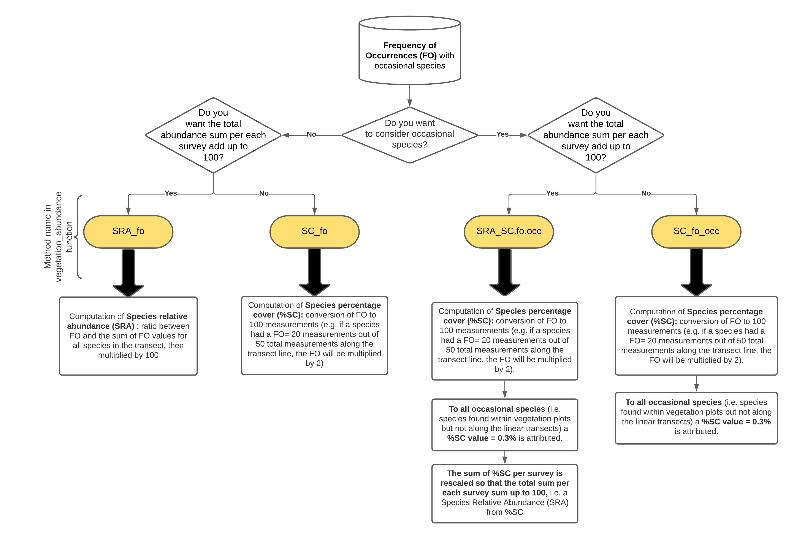

<!-- README.md is generated from README.Rmd. Please edit that file -->

# iPastoralist

<!-- badges: start -->
<!-- badges: end -->

## **When to use it**

-   Botanical composition of grasslands was surveyed with the vertical
    point-quadrat / pinpoint (or point‐intercept) method, i.e. plant
    species are recorded at fixed interval along a **linear transect**
    (Daget and Poissonet, 1971)
-   (Optional) Since occasional species are often missed by the vertical
    point-quadrat / pinpoint (or point‐intercept) method, a list of all
    other plant species included within a buffer area around the
    transect line (i.e. **vegetation plot**) was carried out.

## **What it does**

*iPastoralist* allows you to:

1.  Transform **Frequency of occurrences (FO)** of species identified
    along a linear transect (either with or without occasional species)
    to:
    -   **Species relative abundance (SRA)** : ratio between frequency
        of occurrence and the sum of frequency of occurrences values for
        all species in the transect, then multiplied by 100;
    -   **Species percentage cover (%SC)**: conversion of frequency of
        occurrence to 100 measurements (e.g. if a species had a FO= 20
        measurements out of 50 total measurements along the transect
        line, the FO will be multiplied by 2). To all occasional species
        (i.e. species found within vegetation plots but not along the
        linear transects) a %SC value = 0.3% is attributed. More details
        are provided in the **vegetation\_abundance** function, which
        process FO data with the following workflow:



2.  Compute:
    -   **Biodiversity indexes**: Species richness, Shannon diversity
        index, Shannon max, Equitability. (see “**biodiversity**”
        function)
    -   **Forage Pastoral Value (PV)** (see “**pastoral\_value**”
        function)
    -   **Ecological indexes**: Landolt, Ellenberg (either weighted or
        not weighted with plant species abundance and either considering
        or not considering occasional species). (see
        “**ecological\_indexes**” function)
3.  Extract for each survey the firt ten species, ordered decreasingly
    by their abundance (useful with dendrograms). (see
    “**first\_ten\_species**” function)

## Installation

You can install the development version of *iPastoralist* by running the
following code:

    install.packages("devtools")
    library(devtools)
    install_github("MarcoPittarello/iPastoralist")

## **Data input format**

-   **Rows**: species
-   **Columns**: surveys
-   **Values** are Frequency of occurrence (FO)
-   **Occasional species** are coded as 999
-   Leave other cells empty (i.e NA)
-   database class MUST BE a **dataframe**

| Species    | Survey\_1 | Survey\_2 | Survey\_3 |
|------------|-----------|-----------|-----------|
| species\_1 | 12        | 1         |           |
| species\_2 |           | 3         |           |
| species\_3 |           |           | 4         |
| species\_4 | 9         | 18        | 999       |
| …          |           |           |           |

## **Examples**

The dataframe setting should looks like the below one:


-   Columns in GREEN are the Landolt indicator values of each plant
    species
-   Column in BLUE contains the Index of Specific Quality (ISQ) for each
    species.
-   Column named Rxx are the vegetation survey codes

In this database, the total number of measurements along the transect
line is **25**.

We can import the dataframe in R environment:

    data <- read_excel("~/yourdata.xlsx")
    View(data)

|        species.name        | species.name.code | F\_Landolt | R\_Landolt | N\_Landolt | ISQ | R1  | R2  | R3  | R4  | R5  | R6  | R7  | R8  | R9  | R10 | R11 | R12 | R13 | R14 | R15 | R16 | R17 | R18 | R19 | R20 | R21 | R22 | R23 | R24 |
|:--------------------------:|:-----------------:|:----------:|:----------:|:----------:|:---:|:---:|:---:|:---:|:---:|:---:|:---:|:---:|:---:|:---:|:---:|:---:|:---:|:---:|:---:|:---:|:---:|:---:|:---:|:---:|:---:|:---:|:---:|:---:|:---:|
|    Achillea macrophylla    |      Achmacr      |    3.0     |     3      |     4      |  1  | NA  | NA  | NA  | NA  | NA  | NA  | NA  | NA  | NA  | NA  | NA  | NA  | NA  |  1  | NA  | NA  | 999 | NA  | NA  | NA  | NA  | NA  | NA  | NA  |
| Achillea millefolium aggr. |      Achmill      |   999.0    |     3      |    999     |  1  | NA  | NA  | NA  | NA  | NA  | NA  | 999 | NA  |  5  | 999 | 999 | 10  | NA  | NA  | NA  | NA  | NA  | NA  | NA  | 999 | NA  | NA  | NA  | NA  |
|     Achillea moschata      |      Achmosc      |    3.0     |     2      |     2      |  0  | NA  | NA  | NA  | NA  | NA  | NA  | NA  | NA  | NA  | 999 | NA  | NA  | NA  | NA  | NA  | NA  | NA  | NA  | NA  | NA  | 999 | NA  | NA  | NA  |
|       Acinos alpinus       |      Acialpi      |    2.0     |     3      |     2      |  0  | NA  | NA  | NA  | NA  | NA  | NA  | NA  | NA  | NA  | 999 |  2  |  2  | NA  | NA  | NA  | NA  | NA  | NA  | NA  | 999 | NA  | NA  | NA  | NA  |
|     Aconitum lamarckii     |      Acolama      |    4.0     |     5      |     4      |  0  | 999 | NA  | NA  | NA  | NA  | NA  | NA  | NA  | NA  | NA  | NA  | NA  | NA  |  1  | NA  | NA  | 999 | NA  | NA  | NA  | NA  | NA  | NA  | NA  |
|   Adenostyles alliariae    |      Adealli      |    3.5     |     3      |     4      |  0  | NA  | 999 | NA  | NA  | NA  | NA  | NA  | NA  | NA  | NA  | NA  | NA  | NA  |  8  | NA  | NA  |  3  | NA  | 999 | NA  | NA  | NA  | NA  | NA  |

Important note: make sure that the database class is **data.frame**. If
not convert it as shown:

``` r
data<-as.data.frame(data)
```

From the whole database, the columns related to plant species names and
all surveys are selected, i.e. as specified in “Data input format”
section

``` r
vegetation<-data[,c(2,7:30)]
```

| species.name.code | R1  | R2  | R3  | R4  | R5  | R6  | R7  | R8  | R9  | R10 | R11 | R12 | R13 | R14 | R15 | R16 | R17 | R18 | R19 | R20 | R21 | R22 | R23 | R24 |
|:-----------------:|:---:|:---:|:---:|:---:|:---:|:---:|:---:|:---:|:---:|:---:|:---:|:---:|:---:|:---:|:---:|:---:|:---:|:---:|:---:|:---:|:---:|:---:|:---:|:---:|
|      Achmacr      | NA  | NA  | NA  | NA  | NA  | NA  | NA  | NA  | NA  | NA  | NA  | NA  | NA  |  1  | NA  | NA  | 999 | NA  | NA  | NA  | NA  | NA  | NA  | NA  |
|      Achmill      | NA  | NA  | NA  | NA  | NA  | NA  | 999 | NA  |  5  | 999 | 999 | 10  | NA  | NA  | NA  | NA  | NA  | NA  | NA  | 999 | NA  | NA  | NA  | NA  |
|      Achmosc      | NA  | NA  | NA  | NA  | NA  | NA  | NA  | NA  | NA  | 999 | NA  | NA  | NA  | NA  | NA  | NA  | NA  | NA  | NA  | NA  | 999 | NA  | NA  | NA  |
|      Acialpi      | NA  | NA  | NA  | NA  | NA  | NA  | NA  | NA  | NA  | 999 |  2  |  2  | NA  | NA  | NA  | NA  | NA  | NA  | NA  | 999 | NA  | NA  | NA  | NA  |
|      Acolama      | 999 | NA  | NA  | NA  | NA  | NA  | NA  | NA  | NA  | NA  | NA  | NA  | NA  |  1  | NA  | NA  | 999 | NA  | NA  | NA  | NA  | NA  | NA  | NA  |
|      Adealli      | NA  | 999 | NA  | NA  | NA  | NA  | NA  | NA  | NA  | NA  | NA  | NA  | NA  |  8  | NA  | NA  |  3  | NA  | 999 | NA  | NA  | NA  | NA  | NA  |

### Example 1

Suppose we want to convert Frequency of occurrence (FO) to Species
percentage cover (%SC), considering also occasional species. As the %SC
for each survey will (likely) be greater than 100, we want to rescale
%SC of each species per each survey to obtain a sum of 100 (i.e. a
proportion of %SC). As the total measurements per transect was 25, FO
should be multiplied by **4** so that they refer to 100 measurements.

``` r
library(iPastoralist)
vegetation.sc<-vegetation_abundance(database = vegetation,
                                    species.cover.coefficient = 4,
                                    method = "SRA_SC.fo.occ")
```

    head(vegetation.sc)

|         |    R1     |    R2     | R3  | R4  | R5  | R6  |    R7     | R8  |    R9    |   R10    |    R11    |    R12    | R13 |    R14    | R15 | R16 |    R17    | R18 |   R19    |    R20    |    R21    | R22 | R23 | R24 |
|:--------|:---------:|:---------:|:---:|:---:|:---:|:---:|:---------:|:---:|:--------:|:--------:|:---------:|:---------:|:---:|:---------:|:---:|:---:|:---------:|:---:|:--------:|:---------:|:---------:|:---:|:---:|:---:|
| Achmacr | 0.0000000 | 0.0000000 |  0  |  0  |  0  |  0  | 0.0000000 |  0  | 0.000000 | 0.000000 | 0.0000000 | 0.000000  |  0  | 2.643754  |  0  |  0  | 0.1544004 |  0  | 0.000000 | 0.0000000 | 0.0000000 |  0  |  0  |  0  |
| Achmill | 0.0000000 | 0.0000000 |  0  |  0  |  0  |  0  | 0.0918555 |  0  | 6.118079 | 0.103484 | 0.0927357 | 11.289867 |  0  | 0.000000  |  0  |  0  | 0.0000000 |  0  | 0.000000 | 0.0884434 | 0.0000000 |  0  |  0  |  0  |
| Achmosc | 0.0000000 | 0.0000000 |  0  |  0  |  0  |  0  | 0.0000000 |  0  | 0.000000 | 0.103484 | 0.0000000 | 0.000000  |  0  | 0.000000  |  0  |  0  | 0.0000000 |  0  | 0.000000 | 0.0000000 | 0.1133359 |  0  |  0  |  0  |
| Acialpi | 0.0000000 | 0.0000000 |  0  |  0  |  0  |  0  | 0.0000000 |  0  | 0.000000 | 0.103484 | 2.4729521 | 2.257973  |  0  | 0.000000  |  0  |  0  | 0.0000000 |  0  | 0.000000 | 0.0884434 | 0.0000000 |  0  |  0  |  0  |
| Acolama | 0.0971817 | 0.0000000 |  0  |  0  |  0  |  0  | 0.0000000 |  0  | 0.000000 | 0.000000 | 0.0000000 | 0.000000  |  0  | 2.643754  |  0  |  0  | 0.1544004 |  0  | 0.000000 | 0.0000000 | 0.0000000 |  0  |  0  |  0  |
| Adealli | 0.0000000 | 0.1612903 |  0  |  0  |  0  |  0  | 0.0000000 |  0  | 0.000000 | 0.000000 | 0.0000000 | 0.000000  |  0  | 21.150033 |  0  |  0  | 6.1760165 |  0  | 0.172117 | 0.0000000 | 0.0000000 |  0  |  0  |  0  |

we can check that the sum of %SC for each survey is 100

``` r
colSums(vegetation.sc)
#>  R1  R2  R3  R4  R5  R6  R7  R8  R9 R10 R11 R12 R13 R14 R15 R16 R17 R18 R19 R20 
#> 100 100 100 100 100 100 100 100 100 100 100 100 100 100 100 100 100 100 100 100 
#> R21 R22 R23 R24 
#> 100 100 100 100
```

### Example 2

In this case we want to compute the average Landolt indicator values for
each survey, weighted with species abundance.

If the occasional species are not considered, the SRA will be used.
Conversely, if we would like to keep into account also occasional
species, the SRA will be calculated with the %SC rescaled to 100 (more
detail in “vegetation\_abundance” function).

In this case we will consider also occasional species.

The input database is the one with the Frequency of occurrences,
i.e. the dataframe used in this tutorial named “vegetation”.

``` r
ec.index<-ecological_indexes(database.vegetation = vegetation,
                             database.indexes = data[,c("F_Landolt","R_Landolt","N_Landolt")],
                             occasional.species = TRUE,
                             species.cover.coefficient = 4,
                             weight = TRUE)
#> [1] "INDEX WEIGHTED WITH OCCASIONAL SPECIES"
```

Notes about the “ecological\_indexes” function:

-   **database.indexes** = database with Ecological indicators, without
    the column of species names. NA values must indicated as 999
-   **occasional.species** = Logical. TRUE if you want to take into
    account occasional species.
-   **species.cover.coefficient** = only if “occasional.species=TRUE”.
    Coefficient that multiplies FO so that the number of total touches
    refer to 100
-   **weight**: Logical. TRUE if you want to weight Ecological
    indicators with abundance.

the output will be as follow:

``` r
ec.index
#>    survey F_Landolt R_Landolt N_Landolt
#> 1      R1  2.971600  2.253535  2.649474
#> 2      R2  3.716373  3.265993  2.867099
#> 3      R3  3.215537  2.981710  3.898948
#> 4      R4  3.537678  2.765013  3.392741
#> 5      R5  2.943190  2.734974  3.177504
#> 6      R6  2.926874  2.671846  2.978367
#> 7      R7  2.970695  2.635527  3.145236
#> 8      R8  3.362342  3.126754  4.306474
#> 9      R9  3.071611  2.824006  3.469644
#> 10    R10  2.612803  2.806719  2.820766
#> 11    R11  2.519994  2.808848  2.687676
#> 12    R12  2.812606  2.856213  3.017767
#> 13    R13  3.386566  2.210897  2.851104
#> 14    R14  3.417881  2.941060  4.184106
#> 15    R15  2.996712  2.227660  2.680000
#> 16    R16  3.073070  1.668550  2.091525
#> 17    R17  3.597692  2.285484  3.584541
#> 18    R18  2.464270  2.142214  2.375730
#> 19    R19  3.519828  2.043754  3.045977
#> 20    R20  2.802508  2.937901  3.024198
#> 21    R21  2.739275  2.523727  2.727625
#> 22    R22  2.895071  2.384567  2.791045
#> 23    R23  2.695533  2.274914  2.006186
#> 24    R24  2.683857  1.880419  2.004484
```
