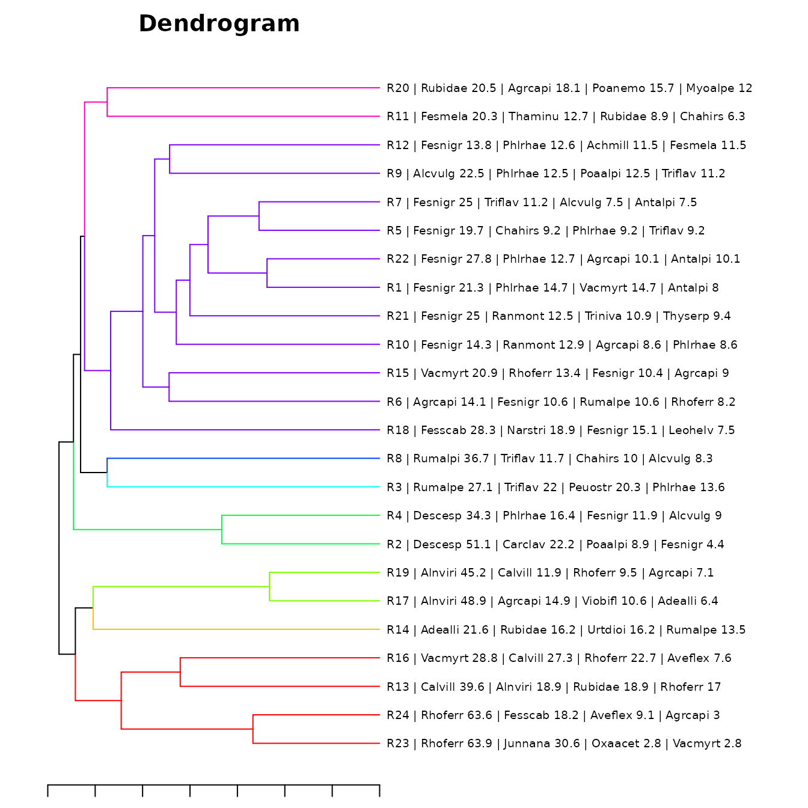

# Examples

``` r
knitr::opts_chunk$set(warning = FALSE, message = FALSE)
library(iPastoralist)
#> Registered S3 method overwritten by 'vegan':
#>   method     from      
#>   rev.hclust dendextend
```

## Example 1 - use of ‘vegetation_abundance’ function

Suppose we want to convert Frequency of occurrence (FO) to Species
percentage cover (%SC), considering also occasional species. As the %SC
for each survey will (likely) be greater than 100, we want to rescale
%SC of each species per each survey to obtain a sum of 100 (i.e. a
proportion of %SC). The dataset used as example is shown in “Data input
format” vignette, where the total measurements per transect is 25.
Therefore, to obtain \$SC FO should be multiplied by **4** (so that they
refer to 100 measurements.)

``` r
library(iPastoralist)
vegetation.sc <- vegetation_abundance(
  database = vegetation,
  species.cover.coefficient = 4,
  method = "SRA_SC.fo.occ"
)
```

    head(vegetation.sc)

|         |    R1     |    R2     | R3  | R4  | R5  | R6  |    R7     | R8  |    R9    |   R10    |    R11    |    R12    | R13 |    R14    | R15 |
|:--------|:---------:|:---------:|:---:|:---:|:---:|:---:|:---------:|:---:|:--------:|:--------:|:---------:|:---------:|:---:|:---------:|:---:|
| Achmacr | 0.0000000 | 0.0000000 |  0  |  0  |  0  |  0  | 0.0000000 |  0  | 0.000000 | 0.000000 | 0.0000000 | 0.000000  |  0  | 2.643754  |  0  |
| Achmill | 0.0000000 | 0.0000000 |  0  |  0  |  0  |  0  | 0.0918555 |  0  | 6.118079 | 0.103484 | 0.0927357 | 11.289867 |  0  | 0.000000  |  0  |
| Achmosc | 0.0000000 | 0.0000000 |  0  |  0  |  0  |  0  | 0.0000000 |  0  | 0.000000 | 0.103484 | 0.0000000 | 0.000000  |  0  | 0.000000  |  0  |
| Acialpi | 0.0000000 | 0.0000000 |  0  |  0  |  0  |  0  | 0.0000000 |  0  | 0.000000 | 0.103484 | 2.4729521 | 2.257973  |  0  | 0.000000  |  0  |
| Acolama | 0.0971817 | 0.0000000 |  0  |  0  |  0  |  0  | 0.0000000 |  0  | 0.000000 | 0.000000 | 0.0000000 | 0.000000  |  0  | 2.643754  |  0  |
| Adealli | 0.0000000 | 0.1612903 |  0  |  0  |  0  |  0  | 0.0000000 |  0  | 0.000000 | 0.000000 | 0.0000000 | 0.000000  |  0  | 21.150033 |  0  |

we can check that the sum of %SC for each survey is 100

``` r
colSums(vegetation.sc)
#>  R1  R2  R3  R4  R5  R6  R7  R8  R9 R10 R11 R12 R13 R14 R15 R16 R17 R18 R19 R20 
#> 100 100 100 100 100 100 100 100 100 100 100 100 100 100 100 100 100 100 100 100 
#> R21 R22 R23 R24 
#> 100 100 100 100
```

## Example 2 - computation of ecological indexes

In this case we want to compute the average Landolt indicator values for
each survey, weighted with species abundance.

If the occasional species are not considered, the SRA will be used.
Conversely, if we would like to keep into account also occasional
species, the SRA will be calculated with the %SC rescaled to 100 (more
detail in “vegetation_abundance” function).

In this case we will consider also occasional species.

The input database is the one with the Frequency of occurrences,
i.e. the dataframe used in this tutorial named “vegetation”.

``` r
ec.index <- ecological_indexes(
  database.vegetation = vegetation,
  database.indexes = data[, c("F_Landolt", "R_Landolt", "N_Landolt")],
  occasional.species = TRUE,
  species.cover.coefficient = 4,
  weight = TRUE
)
#> [1] "INDEX WEIGHTED WITH OCCASIONAL SPECIES"
```

Notes about the “ecological_indexes” function:

- **database.indexes** = database with Ecological indicators, without
  the column of species names. NA values must indicated as 999
- **occasional.species** = Logical. TRUE if you want to take into
  account occasional species.
- **species.cover.coefficient** = only if “occasional.species=TRUE”.
  Coefficient that multiplies FO so that the number of total touches
  refer to 100
- **weight**: Logical. TRUE if you want to weight Ecological indicators
  with abundance.

the output will be as follow:

``` r
ec.index
#>    survey F_Landolt R_Landolt N_Landolt
#> 1      R1  2.971600  2.253535  2.649474
#> 2      R2  3.716373  3.265993  2.867099
#> 3      R3  3.215537  2.981710  3.898948
#> 4      R4  3.537678  2.765013  3.392741
#> 5      R5  2.943190  2.734974  3.177504
#> 6      R6  2.926874  2.671846  2.978367
#> 7      R7  2.970695  2.635527  3.145236
#> 8      R8  3.362342  3.126754  4.306474
#> 9      R9  3.071611  2.824006  3.469644
#> 10    R10  2.612803  2.806719  2.820766
#> 11    R11  2.519994  2.808848  2.687676
#> 12    R12  2.812606  2.856213  3.017767
#> 13    R13  3.386566  2.210897  2.851104
#> 14    R14  3.417881  2.941060  4.184106
#> 15    R15  2.996712  2.227660  2.680000
#> 16    R16  3.073070  1.668550  2.091525
#> 17    R17  3.597692  2.285484  3.584541
#> 18    R18  2.464270  2.142214  2.375730
#> 19    R19  3.519828  2.043754  3.045977
#> 20    R20  2.802508  2.937901  3.024198
#> 21    R21  2.739275  2.523727  2.727625
#> 22    R22  2.895071  2.384567  2.791045
#> 23    R23  2.695533  2.274914  2.006186
#> 24    R24  2.683857  1.880419  2.004484
```

## Example 3 - Matching a dendrogram with vegetation data

The aim of this example is to generate a cluster analysis of vegetation
data, with associated to the dendrogram the species of each survey
ordered by their abundance. This approach would help where to cut the
dendrogram.

From the dataset shown in ‘Data input format’ vignette, the columns
related to plant species names and all surveys are selected.

``` r
vegetation <- data[, c(2, 7:30)]
```

| species.name.code | R1  | R2  | R3  | R4  | R5  | R6  | R7  | R8  | R9  | R10 | R11 | R12 | R13 | R14 |
|:-----------------:|:---:|:---:|:---:|:---:|:---:|:---:|:---:|:---:|:---:|:---:|:---:|:---:|:---:|:---:|
|      Achmacr      | NA  | NA  | NA  | NA  | NA  | NA  | NA  | NA  | NA  | NA  | NA  | NA  | NA  |  1  |
|      Achmill      | NA  | NA  | NA  | NA  | NA  | NA  | 999 | NA  |  5  | 999 | 999 | 10  | NA  | NA  |
|      Achmosc      | NA  | NA  | NA  | NA  | NA  | NA  | NA  | NA  | NA  | 999 | NA  | NA  | NA  | NA  |
|      Acialpi      | NA  | NA  | NA  | NA  | NA  | NA  | NA  | NA  | NA  | 999 |  2  |  2  | NA  | NA  |
|      Acolama      | 999 | NA  | NA  | NA  | NA  | NA  | NA  | NA  | NA  | NA  | NA  | NA  | NA  |  1  |
|      Adealli      | NA  | 999 | NA  | NA  | NA  | NA  | NA  | NA  | NA  | NA  | NA  | NA  | NA  |  8  |

Then, we need to compute the Species Relative Abundance

``` r
sra <- vegetation_abundance(database = vegetation, method = "SRA_fo")
```

    head(sra)

|         | R1  | R2  | R3  | R4  | R5  | R6  | R7  | R8  |  R9  | R10 |   R11    |    R12    | R13 |    R14    | R15 |
|:--------|:---:|:---:|:---:|:---:|:---:|:---:|:---:|:---:|:----:|:---:|:--------:|:---------:|:---:|:---------:|:---:|
| Achmacr |  0  |  0  |  0  |  0  |  0  |  0  |  0  |  0  | 0.00 |  0  | 0.000000 | 0.000000  |  0  | 2.702703  |  0  |
| Achmill |  0  |  0  |  0  |  0  |  0  |  0  |  0  |  0  | 6.25 |  0  | 0.000000 | 11.494253 |  0  | 0.000000  |  0  |
| Achmosc |  0  |  0  |  0  |  0  |  0  |  0  |  0  |  0  | 0.00 |  0  | 0.000000 | 0.000000  |  0  | 0.000000  |  0  |
| Acialpi |  0  |  0  |  0  |  0  |  0  |  0  |  0  |  0  | 0.00 |  0  | 2.531646 | 2.298851  |  0  | 0.000000  |  0  |
| Acolama |  0  |  0  |  0  |  0  |  0  |  0  |  0  |  0  | 0.00 |  0  | 0.000000 | 0.000000  |  0  | 2.702703  |  0  |
| Adealli |  0  |  0  |  0  |  0  |  0  |  0  |  0  |  0  | 0.00 |  0  | 0.000000 | 0.000000  |  0  | 21.621622 |  0  |

Now we can generate a dendrogram using the **hclust** function of the R
‘stats’ base package.

``` r
db.dendro <- t(sra) #for the cluster analysis the database has to be transposed so to have surveys on rows and species on columns

library(vegan) #package for computing a distance matrix
d <- vegdist(db.dendro, method = "chord") #distance matrix
cluster <- hclust(d, method = "average") # clustering method

#plotting the dendrogram
par(cex = 0.5, mar = c(5, 8, 4, 1)) #set label size
plot(
  cluster,
  cex = 0.8,
  hang = -1,
  main = paste0("dMatrix: Chord", "---", "clustMet: UPGMA")
)
```


To extract the first ten species ordered decreasingly by their SRA for
each survey, we can run the **‘first_ten_species’** function:

``` r
firstTenSpecies <- first_ten_species(
  data_SRA_SC = sra, #database with species abundance. In this example is the 'sra' database
  join.dendrogram = TRUE, #LOGICAL. TRUE if species abundance need to be joined with a dendrogram
  cluster.hclust = cluster
) # object of containing the output from 'hclust' function of 'stats' package
```

|     | Survey | Survey.order |      V1      |      V2      |      V3      |      V4      |     V5      |     V6      |     V7      |     V8      |
|:----|:------:|:------------:|:------------:|:------------:|:------------:|:------------:|:-----------:|:-----------:|:-----------:|:-----------:|
| 16  |  R23   |      1       | Rhoferr 63.9 | Junnana 30.6 | Oxaacet 2.8  | Vacmyrt 2.8  |  Achmacr 0  |  Achmill 0  |  Achmosc 0  |  Acialpi 0  |
| 17  |  R24   |      2       | Rhoferr 63.6 | Fesscab 18.2 | Aveflex 9.1  |  Agrcapi 3   |  Arnmont 3  |  Vacmyrt 3  |  Achmacr 0  |  Achmill 0  |
| 5   |  R13   |      3       | Calvill 39.6 | Alnviri 18.9 | Rubidae 18.9 |  Rhoferr 17  | Gymdryo 3.8 | Galtetr 1.9 |  Achmacr 0  |  Achmill 0  |
| 8   |  R16   |      4       | Vacmyrt 28.8 | Calvill 27.3 | Rhoferr 22.7 | Aveflex 7.6  |  Gymdryo 3  |  Rubidae 3  |  Vacviti 3  | Antalpi 1.5 |
| 6   |  R14   |      5       | Adealli 21.6 | Rubidae 16.2 | Urtdioi 16.2 | Rumalpe 13.5 | Alnviri 8.1 | Galtetr 8.1 | Viobifl 5.4 | Achmacr 2.7 |
| 9   |  R17   |      6       | Alnviri 48.9 | Agrcapi 14.9 | Viobifl 10.6 | Adealli 6.4  | Alcvulg 4.3 | Peuostr 4.3 | Verlobe 4.3 | Luzalpi 2.1 |
| 11  |  R19   |      7       | Alnviri 45.2 | Calvill 11.9 | Rhoferr 9.5  | Agrcapi 7.1  | Vacmyrt 7.1 | Antalpi 2.4 | Genpurp 2.4 | Gersylv 2.4 |
| 12  |   R2   |      8       | Descesp 51.1 | Carclav 22.2 | Poaalpi 8.9  | Fesnigr 4.4  | Carechi 2.2 | Luzcamp 2.2 | Narstri 2.2 | Peuostr 2.2 |
| 19  |   R4   |      9       | Descesp 34.3 | Phlrhae 16.4 | Fesnigr 11.9 |  Alcvulg 9   | Verlobe 7.5 |  Peuostr 6  | Rumalpe 4.5 |  Caramar 3  |
| 18  |   R3   |      10      | Rumalpe 27.1 |  Triflav 22  | Peuostr 20.3 | Phlrhae 13.6 | Alcvulg 6.8 | Poaalpi 3.4 | Agrcapi 1.7 | Ranmont 1.7 |
| 23  |   R8   |      11      | Rumalpi 36.7 | Triflav 11.7 |  Chahirs 10  | Alcvulg 8.3  | Phlrhae 8.3 | Poaalpi 6.7 | Rumalpe 6.7 |  Myoalpe 5  |
| 10  |  R18   |      12      | Fesscab 28.3 | Narstri 18.9 | Fesnigr 15.1 | Leohelv 7.5  | Antalpi 5.7 | Phlrhae 5.7 | Agrcapi 3.8 | Poaalpi 3.8 |
| 21  |   R6   |      13      | Agrcapi 14.1 | Fesnigr 10.6 | Rumalpe 10.6 | Rhoferr 8.2  | Silvulg 8.2 | Chahirs 7.1 | Triflav 5.9 | Alcvulg 4.7 |
| 7   |  R15   |      14      | Vacmyrt 20.9 | Rhoferr 13.4 | Fesnigr 10.4 |  Agrcapi 9   | Chahirs 7.5 |  Antalpi 6  |  Phlrhae 6  | Poachai 4.5 |
| 2   |  R10   |      15      | Fesnigr 14.3 | Ranmont 12.9 | Agrcapi 8.6  | Phlrhae 8.6  | Chahirs 7.1 | Fesscab 5.7 | Lashall 5.7 | Bislaev 4.3 |

This output can be graphically merged with the dendrogram. First of all
it is needed to create a database for running the cluster analysis with
(e.g. four) species ordered by abundance as row labels, with the use of
`dendspe` function:

``` r
db.dendroLab <- denspe(
  nspe = 4,
  SpeAbund = firstTenSpecies,
  dbClust = db.dendro
)
```

Then, the cluster analysis can be run again by using the new database
and then plot the dendrogram:

``` r
d.lab <- vegdist(
  db.dendroLab, #database name
  method = "chord"
)
cluster.lab <- hclust(
  d.lab, #distance matrix
  method = "average"
)

cluster.plot <- as.dendrogram(cluster.lab) #coversion of cluster to class 'dendrogram' of 'dendexted' package (which allows a better customisation of the plot)

par(mfrow = c(1, 1), mar = c(1, 2, 2, 18)) #graphical settings
plot(
  cluster.plot %>%
    set("labels_cex", 0.6),
  horiz = T
)
```


From this view, it can be easier to identify survey groups based on
their vegetation composition and abundance. Suppose here to identify 8
groups, that can be visually shown with the following base plotting
functions:

``` r
par(mfrow = c(1, 1), mar = c(1, 2, 2, 18)) #graphical settings
cluster.plot %>%
  set("labels_cex", 0.6) %>%
  set("branches_k_color", k = 8) %>%
  plot(main = "Dendrogram", horiz = T)
```



Now, for each group it would be helpful to compute the average
composition. First of all we can extract the ID group for each survey
with the **‘clustOrder’** function:

``` r
group.id <- clustOrder(
  cluster.hclust = cluster, # object of containing the output from 'hclust' function of 'stats' package
  cluster.group = T, #Logical. TRUE if you want to specify the number of groups of the dendrogram.
  cluster.number = 8
) # Specify the number of groups.
```

| Survey | cluster | Survey.order |
|:------:|:-------:|:------------:|
|   R1   |    1    |      17      |
|  R10   |    1    |      15      |
|  R11   |    5    |      23      |
|  R12   |    1    |      22      |
|  R13   |    6    |      3       |
|  R14   |    7    |      5       |
|  R15   |    1    |      14      |
|  R16   |    6    |      4       |
|  R17   |    8    |      6       |
|  R18   |    1    |      12      |

The ‘cluster’ column is the one according to which the vegetation
surveys will be pooled together. Therefore, we first need to add this
column to the database with the abundances used as input of the
dendrogram (i.e. ‘db.dendro’ dataset)

``` r
dendro.merge <- merge(group.id, db.dendro, by.x = "Survey", by.y = "row.names")
row.names(dendro.merge) <- dendro.merge[, 1] #renaming dataset rows
dendro.merge1 <- dendro.merge[, -c(1, 3)] #deleting useless columns
```

|     | cluster | Achmacr  | Achmill  | Achmosc | Acialpi  | Acolama  |  Adealli  |  Agrcapi  | Ajupyra | Alcalpi | Alcpent | Alcvulg  |  Alnviri  | Angsylv | Antdioi |
|:----|:-------:|:--------:|:--------:|:-------:|:--------:|:--------:|:---------:|:---------:|:-------:|:-------:|:-------:|:--------:|:---------:|:-------:|:-------:|
| R1  |    1    | 0.000000 | 0.00000  |    0    | 0.000000 | 0.000000 | 0.000000  | 6.666667  |    0    |    0    |    0    | 0.000000 | 0.000000  |    0    |    0    |
| R10 |    1    | 0.000000 | 0.00000  |    0    | 0.000000 | 0.000000 | 0.000000  | 8.571429  |    0    |    0    |    0    | 0.000000 | 0.000000  |    0    |    0    |
| R11 |    5    | 0.000000 | 0.00000  |    0    | 2.531646 | 0.000000 | 0.000000  | 5.063291  |    0    |    0    |    0    | 0.000000 | 0.000000  |    0    |    0    |
| R12 |    1    | 0.000000 | 11.49425 |    0    | 2.298851 | 0.000000 | 0.000000  | 6.896552  |    0    |    0    |    0    | 3.448276 | 0.000000  |    0    |    0    |
| R13 |    6    | 0.000000 | 0.00000  |    0    | 0.000000 | 0.000000 | 0.000000  | 0.000000  |    0    |    0    |    0    | 0.000000 | 18.867925 |    0    |    0    |
| R14 |    7    | 2.702703 | 0.00000  |    0    | 0.000000 | 2.702703 | 21.621622 | 0.000000  |    0    |    0    |    0    | 0.000000 | 8.108108  |    0    |    0    |
| R15 |    1    | 0.000000 | 0.00000  |    0    | 0.000000 | 0.000000 | 0.000000  | 8.955224  |    0    |    0    |    0    | 0.000000 | 0.000000  |    0    |    0    |
| R16 |    6    | 0.000000 | 0.00000  |    0    | 0.000000 | 0.000000 | 0.000000  | 0.000000  |    0    |    0    |    0    | 0.000000 | 0.000000  |    0    |    0    |
| R17 |    8    | 0.000000 | 0.00000  |    0    | 0.000000 | 0.000000 | 6.382979  | 14.893617 |    0    |    0    |    0    | 4.255319 | 48.936170 |    0    |    0    |
| R18 |    1    | 0.000000 | 0.00000  |    0    | 0.000000 | 0.000000 | 0.000000  | 3.773585  |    0    |    0    |    0    | 0.000000 | 0.000000  |    0    |    0    |

Lastly, with the **‘clustGroupAggregate2’** function
(clustGroupAggregate() will be deprecated!!!), the average composition
for each group can be computed:

``` r
aggregate <- clustGroupAggregate2(dendro.merge1)
```

Let’s extract the table format of aggregate

    aggregate$table

| 1_species | 1_abundance | 2_species | 2_abundance | 3_species | 3_abundance | 4_species | 4_abundance | 5_species | 5_abundance | 6_species | 6_abundance | 7_species | 7_abundance |
|:---------:|:-----------:|:---------:|:-----------:|:---------:|:-----------:|:---------:|:-----------:|:---------:|:-----------:|:---------:|:-----------:|:---------:|:-----------:|
|  Fesnigr  |  17.557039  |  Descesp  |  42.719735  |  Rumalpe  |  27.118644  |  Rumalpi  |  36.666667  |  Rubidae  |  14.671344  |  Rhoferr  |  41.808414  |  Adealli  |  21.621622  |
|  Phlrhae  |  8.695403   |  Carclav  |  11.111111  |  Triflav  |  22.033898  |  Triflav  |  11.666667  |  Agrcapi  |  11.567790  |  Calvill  |  16.723842  |  Rubidae  |  16.216216  |
|  Agrcapi  |  6.197290   |  Phlrhae  |  9.320066   |  Peuostr  |  20.338983  |  Chahirs  |  10.000000  |  Fesmela  |  10.126582  |  Vacmyrt  |  8.648990   |  Urtdioi  |  16.216216  |
|  Antalpi  |  5.326626   |  Fesnigr  |  8.192372   |  Phlrhae  |  13.559322  |  Alcvulg  |  8.333333   |  Poanemo  |  8.464237   |  Junnana  |  8.017677   |  Rumalpe  |  13.513514  |
|  Chahirs  |  4.379044   |  Poaalpi  |  5.936982   |  Alcvulg  |  6.779661   |  Phlrhae  |  8.333333   |  Thaminu  |  6.329114   |  Rubidae  |  5.474557   |  Alnviri  |  8.108108   |
|  Vacmyrt  |  4.036279   |  Alcvulg  |  4.477612   |  Poaalpi  |  3.389830   |  Poaalpi  |  6.666667   |  Myoalpe  |  6.024096   |  Alnviri  |  4.716981   |  Galtetr  |  8.108108   |
|  Alcvulg  |  3.947029   |  Peuostr  |  4.096186   |  Agrcapi  |  1.694915   |  Rumalpe  |  6.666667   |  Rhoferr  |  4.971786   |  Fesscab  |  4.545454   |  Viobifl  |  5.405405   |
|  Triflav  |  3.866699   |  Verlobe  |  3.731343   |  Ranmont  |  1.694915   |  Myoalpe  |  5.000000   |  Chahirs  |  3.766967   |  Aveflex  |  4.166667   |  Achmacr  |  2.702703   |
|  Ranmont  |  3.817788   |  Rumalpe  |  2.238806   |  Silvulg  |  1.694915   |  Agrcapi  |  1.666667   |  Silvulg  |  3.644960   |  Gymdryo  |  1.700972   |  Acolama  |  2.702703   |
|  Poaalpi  |  3.422911   |  Caramar  |  1.492537   |  Triprat  |  1.694915   |  Fesnigr  |  1.666667   |  Vacmyrt  |  3.164557   |  Arnmont  |  1.136364   |  Fesnigr  |  2.702703   |
