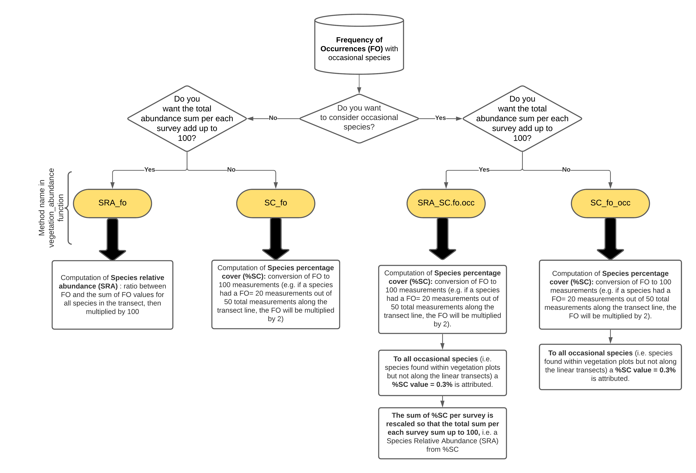

```{r, include = FALSE}
knitr::opts_chunk$set(
  collapse = TRUE,
  comment = "#>"
)

library(iPastoralist)
library(knitr)
library(kableExtra)
```

# **When to use it**

Botanical composition was surveyed either with **phytosociological** or **point-quadrat / pinpoint (or point‐intercept) method** (plant species are recorded at fixed interval along a *linear transect*, Daget and Poissonet 1971). 

If botanical composition was surveyed with the **point-quadrat / pinpoint (or point‐intercept) method**, *iPastoralist* works also when the list of all other plant species included within a buffer area around the transect line (i.e. **vegetation plot**) has been done. Indeed, the point-intercept method often miss rare species.

# **What it does**

## **Point-quadrat / pinpoint (or point‐intercept) method**

*iPastoralist* allows you to:

1. Transform **Frequency of occurrences (FO)** of species identified along a linear transect (either with or without occasional species) to: 
    + **Species relative abundance (SRA)** : ratio between frequency of occurrence and the sum of frequency of occurrences values for all species in the transect, then multiplied by 100;
    + **Species percentage cover (%SC)**: conversion of frequency of occurrence to 100 measurements (e.g. if a species had a FO= 20 measurements out of 50 total measurements along the transect line, the FO will be multiplied by 2). To all  occasional species (i.e. species found within vegetation plots but not along the linear transects) a %SC value = 0.3% is attributed.
    More details are provided in the **vegetation_abundance** function, which process FO data with the following workflow: 

{width=100%}


2. Compute:
    + **Biodiversity indexes**: Species richness, Shannon diversity index, Effective Number of Species (ENS), Shannon max, Equitability. (see "**biodiversity**" function)
    + **Forage Pastoral Value (PV)** (see "**pastoral_value**" function)
    + **Ecological indexes**: Landolt, Ellenberg (either weighted or not weighted with plant species abundance and either considering or not considering occasional species). (see "**ecological_indexes**" function)
 
3. Extract for each survey the firt ten species, ordered decreasingly by their abundance (useful with dendrograms). (see "**first_ten_species**" function)


## **Phytosociological method**

With the '**PhytoCover**' function, *iPastoralist* allows you to transform species cover visually estimated in a phytosociological survey to:

 * Braun-Blanquet cover-abundance scale (Braun-Blanquet,1932) 
 * Van Der Maarel cover-abundance scale (Van Der Maarel, 1978)
 * Dominance percentage (Tasser and Tappeiner, 2005)
 
 **Conversion table**
 
| Visually estimated cover (%)| Braun Blanquet | Van Der Maarel  | Tasser and Tappeiner (%)|
 | :-------------------: |:-------:| :------:|:------:|
 | 0| 0 | 0 | 0 |
 | <1|+| 2 | 0.3 |
 |1 - 5|  1 | 3 | 2.8 |
 | 6 -15| 2a  | 5 | 10 |
 |16-25| 2b | 5 | 20.5 |
 |26-50| 3 |7  | 38  |
 |51-75| 4  | 8 | 63 |
 |76-100| 5  | 9  | 88 |
 

* Braun-Blanquet J (1932) Plant sociology. The study of plant communi- ties. GD Fuller and HS Conard (Eds.). Authorized English translations of 'Pflanzensoziologie'. 1st ed. Printed in the United States of America. New York and London: McGraw-Hill Book Co. Inc.\cr
* Van der Maarel, E. (1979). Transformation of cover-abundance values in phytosociology and its effects on community similarity. Vegetatio, 39(2), 97-114.\cr
* Tasser E, Tappeiner U (2005) New model to predict rooting in diverse plant community compositions. Ecological Modelling 185:195-211.\cr


